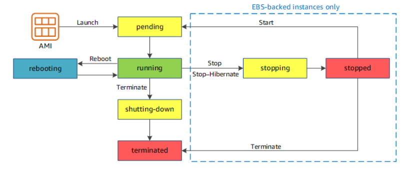

# ec2

## EC2概要

- オンプレミス環境のサーバーのようなものを数分で立ち上げられる仮想サーバー。
- 時間単位で従量課金。
- サーバーの管理は物理面のみがAWS、その他の部分はユーザーが管理する。
- AMIにより様々なOSを選択することができる。
- 独自のAMIを作成することも可能。
- 利用する単位をインスタンスと呼び、AZに設置する。

## EC2のコスト

- 購入形式
  - オンデマンド
    - 通常価格
  - リザーブド/Saving Plan
    - 予約と事前支払いの割引
  - スポットインスタンス
    - 最大90%割り引かれる
- インスタンスタイプ
- 時間課金
  - linuxインスタンスは1秒単位、その他は時間単位

- リージョン毎にも価格が異なる
- データ転送イン
  - 無料
- データ転送アウト
  - インターネット内、S3からAWS内で、双方GBあたりに料金発生
- ボリューム
  - アタッチされたEBSのデータ容量にも課金される
  - インスタンスを停止してもEBSは課金が継続される
  - インスタンスストア(揮発性ストレージ)は課金されない
  - インスタンスを終了した場合、デフォルトはroot volumeに設定されたEBSは削除される。
  - root volume以外は削除されない。

- ステータス
  - インスタンスの終了ではなく、停止でも課金が発生しなくなる。

## EC2起動方法

### AMIの選択

- AMIは以下の３種類がある。(S3に保存されている)
  - AWS提供のAWS
  - 3rd PartyのAMI
  - Custom AMI

- インスタンスタイプ
  - `{ファミリー:世代}.{インスタンス容量}`の形式
  - `t2.nano`など

- インスタンスファミリー
  - 詳細は公式ドキュメント(https://docs.aws.amazon.com/AWSEC2/latest/UserGuide/instance-types.html)

|用途|ファミリー|説明|
|:---|:---|:---|
|汎用|A1 、 M5 、 T3 など|バランスの取れたコンピューティング、メモリ、ネットワークのリソースを提供し、多様なワークロードに使用。ウェブサーバーやコードリポジトリなど、インスタンスのリソースを同じ割合で使用するアプリケーションに最適なインスタンス|
|コンピューティング最適化|C5 、 C6g など|高パフォーマンスプロセッサが必要なコンピューティングバウンドなアプリケーションに利用。ユースケースはバッチ処理ワークロード、メディアトランスコード、高性能ウェブサーバー、ハイパフォーマンスコンピューティング ( 、科学モデリング、専用ゲームサーバーおよび広告サーバーエンジン、機械学習推論|
|メモリ最適化|X1 、 R5 、ハイメモリ、 z1d など|メモリ内の大きいデータセットを処理するワークロードに対して高速なパフォーマンスに最適なインスタンス|
|ストレージ最適化|H1 、 D2 、 I3 、 I3en など|ローカルストレージの大規模データセットに対する高いシーケンシャル読み取りおよび書き込みアクセスを必要とするワークロード用。ストレージ最適化インスタンスは、数万 IOPS もの低レイテンシーなランダム I/O オペレーションに最適|
|高速コンピューティング|P3 、 Inf1 、 G4 GPU ）、 F1 FPGA ）など|高速コンピューティングインスタンスはハードウェアアクセラレーターコプロセッサ ) を使用して、浮動小数点計算、グラフィックス処理、データパターン照合などの機能を CPU で実行するソフトウェアに最適ユースケースに応じてインスタンスタイプを選択する。|

### ユーザーデータの利用

- bashスクリプトなどを設定し起動時に実行するものをあらかじめ定義できる。
- ブートストラップなどとも呼ばれる。

### ストレージの選択

- 以下の２種類が使える。
  - インスタンスストア
    - 物理的なボリュームなので高速
    - 無料
    - 停止とともにクリアされる。
  - EBS(Elastic Block Store)
    - NW経由で接続されたストレージ。
    - 設定によっては、Root Volumeでも保持することが可能。
    - EC2と別途料金が必要。

### タグ設定

- 最大50個設定できる。
- 管理のためにタグ付けする。

### セキュリティグループ設定

- 詳細はVPC参照。

### キーペア作成

- アクセスするための秘密鍵・公開鍵の作成。
- 新規作成してもよいし、使いまわすことも可能。
- VPCにおいて最大5000個まで作成できる。
- キーペアは、リージョン内でしか使いまわしできないため注意する。

## 起動テンプレート

- ここまでの起動設定をテンプレート化できる。
- テンプレートのバージョン管理も可能。
- ソーステンプレートで、別のテンプレートベースに変更することも可能。

## インターネットアドレス

- public IPでアクセスする。
- subnetからDHCPでpublic ipが割り当てられるか、Elastic IPを割り当てる必要がある。
- アクセスできない場合の原因例
  - デフォルトsubnetを使わない自作のsubnetの場合、自動割り当て設定が有効化されてない可能性がある。
    - EC2起動時に有効化されていない場合は、作成をしなおすか、Elastic IPを使う。
  - SGやACLの設定
  - クライアント(オンプレ側)の設定
  - EC2が配置されたsubnetがpublicではない（VPC, subnetにInternet GWが設定されていないなど）

## インスタンスの購入方式

|||
|:---|:---|
|オンデマンドインスタンス|通常の購入方式|
|リザーブドインスタンス(RI)|1年または3年の期間利用を予約することで最大72%割り引かれる購入形式。特定のAZまたはRegionでキャパシティーを予約できる２つのタイプがある。AZで予約すると、AZを変更することはできない|
|スケジュールドリザーブドインスタンス|利用停止となった。今後はSavingPlansとCapacity予約で代用する。|
|スポットインスタンス|AWS管理用に保持している未使用のEC2インスタンス。中断される可能性があったり、実行時間に制約がない場合に利用する|

## Saving Plan

- キャパシティを予約することで価格を抑えるもの
- リザーブドインスタンス場合、同様1年または3年の期間で、さらに特定の処理能力を守る契約を結ぶことで適用される割引。
  - オンデマンドの場合も事前に予約することで費用を抑えることができる。
  - これはSaving Plansではなくキャパシティ予約。
- EC2だけではなく、Fargateやlambdaにも適用可能。
- リージョンやAZを指定した予約ができない。
- ただし特にインスタンス数の制限はない。

## Capacity予約

- たくさんEC2インスタンスが必要なことがわかっている場合にキャパシティの予約を使用する。

- 安くするための設定ではないことに注意。

- リザーブドインスタントセットで利用できる機能。あらかじめキャパシティを予約することで実行時のキャパシティエラーを抑制する。
  - AZあたり20までの制限がある。制限を引き上げる申請も可能。
- またオンデマンドでもキャパシティ予約を実施することができる（リザーブド契約していない場合はこちらを使える）。
  - リージョンごとのインスタンス数に制限がる。

- https://docs.aws.amazon.com/ja_jp/AWSEC2/latest/UserGuide/ec2-capacity-reservations.html

- インスタンスタイプやテナンシー(dedicatedか否か)を選択する。


## 物理対応可能なインスタンス

- 社内のセキュリティーポリシーで、他社と物理的な共有が禁止されている場合などに使用する。

- ファミリーを指定する必要があるが、すべてのインスタンスファミリーで使えるわけではない。
  - t2はどはできない。

- またファミリー内の複数のインスタンスタイプを有効とできるファミリーもあるが、多くはない。

- ハードウェア専有インスタンス(Dedicated Instance)
  - 専用HWのVPCで実行されるEC2インスタンス。
  - VPC構成をする際にdedicatedというのを選ぶと選択することができる。
  - 他のAWSアカウントから分離したインスタンスとなる。
  - 同じアカウント内では共有する可能性がある。

- Dedicated Host
  - 同じアカウント内でも共有しない設定が可能なインスタンス形式。
  - IAMグループなどで閉じたインスタンスにすることができる。
  - 用途としては、オンプレのライセンスサーバーなどをAWSに移行したい場合など。

- Bare Metal
  - サーバーのProcessorやMemoryにアクセス可能なインスタンス。
  - 下層のハードウェアレベルまでアクセス可能。

## リザーブドインスタンスの特徴

- ワークロードが予測可能なユースケースや災害時の対策などの用途が考えられる。
- 2種類あり、スタンダードがより安価で、コンバーティブルは途中で変更可能な要素が多いため、少し高くなっている。

||スタンダード|コンバーティブル|
|:---|:---|:---|
|1年|40%割引|31%割引|
|3年|60%割引|54%割引|
|AZ, Instance Type, NW Type|変更可|変更可|
|Instance family, OS, テナンシー, 支払いオプション|変更不可|変更可|
|マーケットプレイスでの販売|可能|今後可能となる予定|

- 予約の際は、インスタンスタイプを容量まで指定する必要がある。
- 項目を指定したうえで検索を実施する。
- 購入だけではインスタンスは作成されないため、別途起動が必要。

## スポットインスタンスの特徴

- 購入方法が特殊で入札式で利用する。
- 起動に通常よりも時間がかかる。
- 予備用のため、途中で削除される可能性がある。
  - 一時的な拡張として利用

## スポットフリート

- インスタンスタイプや入札価格を指定することで、自動で最安値のインスタンスを選択して起動できる。
- スポットフリートの設定例
  - インスタンス数: 10台
  - 入札価格：
  - インスタンスタイプ： c4.16xlarge or c3.8xlarge

## EC2フリート

- オンデマンドとスポットで構成されるインスタンスグループとして設定を定義する仕組み。
- 設定例
  - 合計: 15個
    - オンデマンド: 10
    - スポット: 5
  - インスタンスタイプの比率
    - c4.large: weight=1
    - c5.large: weight=2

- オンデマンドとスポットの比率、インスタンスタイプの組み合わせ、利用料金上限などを設定可能。

## 拡張ネットワーキング

- 3つのタイプがあり、高い帯域幅、Packet per secを実現する。
- VIF, Intel 82599 VF, Elastic Network Adapterの３タイプ。
- インスタンスタイプによって使用可能なAdapterが異なる。

## Elastic Fabric Adapter

- HPCや機械学習アプリケーションを高速化するためのEC2用ネットワークデバイス。
- 通常は、ENA(Elastic Network Adapter)を使って高速化するが、EFAsはそれに加えてOSバイパス機能がある。
- Libfabric APIを利用して、OSのKernelをバイパスしてEFAデバイスと直接通信できる。

## Run Command

- Management ConsoleからEC2へコマンドを実行できる機能。
- テンプレートから設定する。

## EC2のリカバリー

- OS設定含めたバックアップにはAMI、データのバックアップにはスナップショットを用いる。
- リカバリプロセスの確認を定期的にする。
- 複数AZに重要なアプリケーションをデプロイする。
- CloudWatchによりステータスをモニターする。
  - 失敗になった場合は、アラームアクションを使用して自動復旧させる。
  - 自動復旧の場合は元のインスタンスとIPアドレスが同じとなる。
- インスタンス起動時に動的IPアドレス処理の設定を行っておくこと。

## EC2再起動

- データが消失し、ホストが変更される可能性がある。
- 以下のような場合は再起動できない可能性がある。
  - スナップショットが壊れている。
  - 暗号化されたスナップショットのキーを有していない。
  - EBSボリュームが制限を超過している。
  - インスタンスストア型のAMIの、必要な部分が失われている。

## EC2ライフサイクル


- https://docs.aws.amazon.com/ja_jp/AWSEC2/latest/UserGuide/ec2-instance-lifecycle.html

- 課金されるのは、running中と休止時のstoppping(停止中)の場合となります。
- stoppingとstoppedを使うには、EBS-backedである必要があります。
- 再起動や停止・休止を実施しても、プライベートIPアドレスは保持されます。
- 再起動や停止・休止を実施しても、Elastic IPアドレスは関連付けられたままです。
- Elastic IPアドレスが関連付けられていない場合は、新しいパブリックIPアドレスを取得します。
- terminated時に、Elastic IPは解放されます。
- 再起動をしても、インスタンスストアはクリアされません。停止・休止の場合はクリアされます。
- 再起動・停止の場合、RAMはクリアされますが、休止の場合はクリアされません。

## 休止状態(ハイバネーション)

- RAMの内容をHDDに対比することで、状態を維持して停止する。
- インスタンスタイプに応じて実施可否が決まる。
- 初期では、Amazon Linux 1を実行しているM3～M5, C3～C5, R3～R5のみであった。
- 現在では、Amazon Linux 2やWindowsなども対応している。
- 停止と比較し、再度起動する場合、起動が早くなる。
- 休止動作をする場合は、ルートボリュームを暗号化有効とする必要がある。

- EC2起動直後は(runnningであっても)休止できない。ステータスチェックがOKとなるまで待つ必要がある。

- 休止後インスタンスの状態としては、"停止"となり"休止"にはならないので注意が必要。

## インスタンスのメタデータ取得

- インスタンス内で以下から取得可能。
  - http://169.254.169.254/latest/meta-data/

## CPUクレジット

- t2,t3,t3a,t4gで使える機能です。
- これらのインスタンスタイプは、時間当たりに補填されるクレジットが決まっています。
- 1クレジットでvCPU 1コアを1分間、100%使用できます。
- 使わなかったクレジットは、CPUCreditBalanceとして蓄えることができます。
- 処理負荷が高まった場合は、CPUCreditBalanceを消費することで、必要なリソースを割り当てます。
- CPUCreditBalanceが枯渇した状態のパフォーマンスをベースラインパフォーマンスと言います。
- 枯渇した状態で必要な量だけ自動補填を行うバースト機能もあります。
- t3以降は、バースト機能がアカウントレベルでデフォルト有効(Unlimited)となっています。
- 無効(standard)とした場合でも、起動時に有効化設定はできます。

## EC2シリアルコンソール

- Nitroベースのインスタンスファミリーで、serial portへの接続を行うことができる。
- 使用可能なインスタンスファミリーは以下に記載されている。
  - https://docs.aws.amazon.com/AWSEC2/latest/UserGuide/instance-types.html#nitro-instance-types
- デフォルトでは、オフとなっている。
- 通常は、SSHなどのNW接続をして作業しますが、boot時にトラブルがありNW接続前の段階や、iptablesのルールを誤って、sshを禁止にしてしまった場合などの復旧策として使うことが可能です。

## コンソールの実験

- 実験的な機能の有効化を実施することができます。
  - 大規模データのスナップショット画面の最適化
  - テーブル行を圧縮

## EBS暗号化

- EBS使用時のデフォルト設定の暗号化が可能。
- 実際は、EBS使用時に設定の変更が可能。

## Migrate Server

- 外部の仮想サーバーをAWS(EC2インスタンス)に移行することができる機能。

## EC2 Global View

- すべてのリージョンでのEC2インスタンス数やVPCの情報などを確認することができる。
- Global検索でリソースの検索が可能。
- リソースリストをCSVでダウンロードすることも可能。

## 制限(クォータ)

- インスタンス数などの制限数が記載されている。
- 制限を超過しそうな場合は、AWSサポートに超過申請することも可能。

## EBS(Elastic Block Store)

- EC2インスタンスで使えるストレージで、EC2のマネジメントコンソールで管理する。
- EC2にアタッチして使用する。HDDのようなもの。
- しかし実際にはNW接続されたものとなり、データセンターは同じだが、NW経由でアタッチされる。

### スナップショット

- EBSのバックアップが可能。

### Amazon Data Lifecycle Manager(DLM)

- スナップショットのスケジュール管理をしたり、作成・削除タイミングを管理するツール

- 3つのポリシータイプがある。
  - EBSスナップショットポリシー
  - EBS-backed AMI policy(DLMはEBS用のため、instance storeではできない)
  - アカウント間コピーのイベントポリシー
    - スナップショットを別のアカウントへコピーすることも自動化できる。

- ターゲットリソース
  - リソースタイプ
    - ボリューム・インスタンスいずれかを指定
  - リソースタグ
    - Nameタグなどで一致するものを一括してスナップショットすることも可能。

- IAMロール
  - ロールを指定する。デフォルトでもOK。

- スケジュールの設定
  - 3つ作成することができる。CRON式での指定も可能。

- 保持期間
  - 保持期間以降は自動的に削除される。

- タグ付け
  - ソースからタグを複製することができ、有効とした方が分かりやすい。

- クロスリージョンコピー
  - 他のリージョンにスナップショットをコピーすることができる。

- クロスアカウント共有
  - AWSのアカウント番号を指定して共有できる。

## ネットワーク & セキュリティ

### セキュリティグループ

- EC2のトラフィックを制限するセキュリティグループを作成できる。

### Elastic IP

- IPアドレスを割り当てることができる。
- 割り当て対象は以下の２種類がある。
  - インスタンス
  - ネットワークインターフェース

- 割り当てる際は、関連付けるprivate IPを指定する必要がる。

### プレイスメントグループ

- EC2インスタンスを複数グループ化するという機能。
- パフォーマンスを向上させたり、冗長性・耐障害性を高めたりすることが可能。

- クラスタープレイスメントグループ
  - パフォーマンス向上が目的
  - partitionは一つ。
  - 単一AZないでグループ化し、複数のピアVPCにまたがることも可能。
  - グループ内のインスタンスは、TCP/I{トラフィックのスループット上限が高くなり、インスタンス間通信の速度が向上する。
- パーティションプレイスメントグループ
  - 耐障害性が目的。
  - 複数partitionに分ける。
  - パーティション毎にラックがあり、パーティション同士はラックを共有しない。
  - これによりHW障害による影響を隔離して軽減することが可能。
- スプレッドプレイスメントグループ
  - 耐障害性が目的。
  - 1partitionを1インスタンスずつに割り当てる。
  - 異なるラックにそれぞれのインスタンスを配置できるグループ。
  - 少数のインスタンスを互いに物理的に分離して保持できる。

- 利用できるプレイスメントグループは、適用できるインスタンスタイプが限られている。
  - 例えば、t2.microなどのtファミリーは、クラスタープレイスメントグループを構成できない。

- 既に起動済みのインスタンスをプレイスメントグループに入れることができない。
- インスタンスを作成時に指定する形となる。

### キーペア

- EC2インスタンスのキーペアを管理する。

### ネットワークインターフェース

- IPアドレスをインスタンスに付与することができる。
- 後からIPアドレスをアタッチできたりする。

## ロードバランシング

### ロードバランサ

- 複数のインスタンスでのトラフィック制御をして負荷分散などが可能。

### ターゲットグループ

- ロードバランサ使用時にどれに適用するのかのグループを作成する。

## Auto Scaling

- 負荷が高まった時に追加のEC2インスタンスを自動的に起動しスケーリングする機能。
- 起動設定でどういったインスタンスを起動するのかを設定する。
- ただし起動設定ではなく、起動テンプレートから設定することも多い。
  - 起動設定はバージョン管理ができない。
  - またAMIを更新した場合は、起動設定を作成しなおしたりする必要がある。

### Auto Scaling Group

- 起動設定もしくは起動テンプレートを使って詳細な設定をするのがAuto Scaling Groupとなる。


## EC2起動時の設定項目

## ドメイン結合ディレクトリ

- ?

### EC2のIAMロール

- RDSの接続などは、ネットワーク経由で行うことができるため、IAMロールなどを設定しなくても接続できる。

### CPUオプション

- ?

### 終了保護の有効化

- 誤って終了してしまわないよう、保護（ロック状態）にすることができる。
- 本番環境のアプリケーションなどの大事なもの場合は保護を実施する。

### モニタリング

- CloudWatchの詳細モニタリングを有効化できる。
- これには追加料金がかかる。

### テナンシー

- 専用HWを使うことなどが可能
- こちらも追加で料金が発生する。

### Elastic Inference

- ?

### Credit Specification

- クレジットのバースト機能

### ファイルシステム

- ?

### ネットワークインタフェース

- デフォルトはeth0となっている。基本はこれでOK
- 複数場合とは？
- インターフェイスをアタッチするインスタンスを切り替えることも可能で、デタッチ・アタッチなどの操作で実現する。

### ユーザーデータ

- ソフトウェアのインストールのスクリプト設定などを記載できる。

### ストレージ追加

- volume typeとして以下が選択できる。
  - gp2: 汎用SSD
  - gp3: General Purpose SSD
  - io1: Provisioned IOPS SSD
  - io2: Provisioned IOPS SSD
  - standard: マグネティック

- gp2とgp3の比較
  - https://dev.classmethod.jp/articles/ebs-volume-covert-gp2-to-gp3/

- io1とio2の比較
  - https://dev.classmethod.jp/articles/new-ebs-volume-type-io2/

## IPアドレスの追加

- private IPアドレスはセカンダリなどを追加することができる。

## イメージとテンプレート

- 実行中のインスタンスから、AMIを作成することが可能。
- また実行中のインスタンスから、起動テンプレートを作成することも可能。
- 複製も可能

## CloudWatchとの連携

- インスタンスの画面からアラームを作成することができる。
- トリガー時にSNS(Simple Notification Service)トピックの送信ができる。
- アラーム発生時のアクション（再起動など）を指定できる。
- アラームの閾値など（CPU使用率が一定以上など)も設定する。

## モニタリング

- 様々なメトリクスを確認できる。
  - ディスクIO
  - CPU使用率
  - ネットワーク
  - CPUクレジット

## 公開鍵認証方式

- 秘密鍵: PEMファイル、ダウンロードするもの。
- 公開鍵: AWS側に配置されるキー

## Apacheサーバーインストール

- httpdをインストール
```sh
yum update -y
yum install httpd -y
```

- ページ構築
```sh
cd /var/www/html
nano index.html
...
```

- 起動
```sh
systemctl start httpd
systemctl enable httpd # 常に起動
```

## MySQLサーバー構築

- ３つのアーキテクチャパターン
  - 一つのEC2インスタンスにApacheサーバーやMySQLサーバーを立てる
  - 2層アーキテクチャ
    - EC2インスタンスでApacheサーバー + EC2インスタンスでMySQLサーバー
    - EC2インスタンスでApacheサーバー + RDSのMyQSL
    - 冗長構成などがやりやすくなる。
    - データをprivateに配置できる。

- EC2とRDSの比較
  - RDSはマネージド型
    - スケーリング、バックアップ、メンテナンス(パッチ更新)を実施してくれる。
  - EC2はこれらを手動でやる必要がある。

### EC2起動

- sgにMySQL用を追加(port:3306)
- 他は同じ

### コマンド実行

- rpmからインストールする。
```sh
yum localinstall https://dev.mysql.com/get/mysql80-community-release-el7-5.noarch.rpm -y
yum install mysql-community-server -y 
systemctl start mysqld
systemctl enable mysqld
```

- 初期パスの取得
```sh
cat /var/log/mysqld.log | grep localhost
```

- ログインして設定
```sh
mysql –u root -p
Enter password:
mysql> ALTER USER root@localhost IDENTIFIED BY 'new password';
mysql> create database udemy;
mysql> show databases;
```

## スポットインスタンスのリクエスト

### EC2起動時

- EC2インスタンス作成時に購入オプションとして選択できる。
- 永続的リクエスト
  - 中断された場合に別のものを立ち上げるかどうかのオプション。
- この状態で作成すると、スポットリクエストに登録される。

### スポットフリートリクエスト

- スポットリクエストの作成では、より詳細な設定を実施するフリートを作成できる。
- 起動テンプレートを選択することができる。
- IAMフリートロール設定
  - フリート用のロールが必要。
  - デフォルトのロールを使用できる。
- 入札価格の設定
  - 自動入札が推奨だが、上限価格などを設定できる。
- リクエストの有効期間
  - 期間を指定できるが長期にわたった指定はできない。
- ターゲット容量
  - 容量はインスタンス数やvCPU数、メモリ容量で指定することが可能。
  - ターゲット容量を維持することで、中断されたスポットインスタンを自動で置換できる。
- ネットワーク設定
  - VPCやサブネットを選択する。
  - AZ(サブネット)については複数指定することが可能。
- インスタンスの要件
  - 個々のインスタンスの要件を選択する。
  - 要件の指定と手動選択がある。
    - 手動選択
      - 手動で設定するインスタンスタイプを選択できる。
    - 要件の指定
      - vCPUの範囲などスペックを指定することもできる。
      - 要件に一致するインスタンスタイプがリストで表示される。
- 配分戦略
  - 容量最適化は容量を満たすスペックを優先します。
  - 最低価格は、コストを優先します。
  - またオンデマンドがある場合は、インスタンスタイプの優先順位を決めます。
    - 低価格にすれば、オンデマンドは一番安いインスタンスタイプに優先的に割り当てられます。
- フリート強度
  - インスタンスタイプの種類が少なすぎると、強度が不十分などの警告が表示されます。

## Saving Plans

- ある一定のインスタンスではなく、一定の容量を使うことを予約する。
- タイプが２つある。
  - Compute Savings Plans
    - EC2だけでなく、FargateやLambdaにも使用される。
  - EC2 Instan Savings Plans
    - EC2のみ。
- ファミリーで予約する
  - t2など。largeなどはどれでも後で選択できる。
- 購入コミットメント
  - 時間単位の金額を入力する。(ex. $0.1など)
- 開始日

## AMIの活用

- 以下をAMIとしてバックアップできる。
  - OSの設定情報
  - サーバーの構成情報
  - ルートボリュームに構成されたEBSデータ
    - EBSのスナップショットのデータも含まれる

- AMIを使って同じインスタンスを複製できる。

- AMIはリージョンで一意であるため、他のリージョンではそのまま利用できない。
  - S3に保存されている。
- しかし、他のリージョンにコピーすることは可能。
- コピーされたAMIは別のAMIとして扱われる。
- キーペアはリージョン内でしか使いまわせないため、新規に作成する必要がある。

- ゴールデンイメージ
  - 最適なEC2インスタンス構成をAMIとして保存して、複数利用する。

- AMIの共有
  - AWSアカウント番号を指定することで、他のアカウントにAMIを共有することが可能。
  - AMIの画面のアクセス許可でアカウント番号を指定すればOK

- EC2 Image Builder
  - AMIの変更管理を自動化・効率化することができる。
  - ソフトウェアの更新方法、スケジューリングなどのpipelineを構築できる。

- AMIはmarketplaceなどで購入することもできる。
  - こういった販売サイトをAWS marketplaceという。

### EC2 Image Builder

- パイプラインを作成する。

- 拡張メタデータ収集の有効化
  - AWS Systems Manager Inventoryを使った追加情報を収集する。

- ビルドスケジュール
  - スケジュールビルダー
    - GUIで設定できる。
  - CRON式
    - cronの記法を使う。
  - 手動

- レシピの作成
  - 出力タイプの選択
    - AMIとdockerから選択できる。

- イメージを選択
  - カスタムAMIのIDなどを選択できる。

- ビルドコンポーネント
  - Amazon管理から選んだり、自分でスクリプトを定義できる。
  - Amazon管理の一例としては以下のようなもの。
    - apache-tomcat-9-linux

- テストコンポーネント
  - 出力イメージを検証するためのもの。

- インフラストラクチャ設定を定義
  - 検証テストを実行するためにどういった設定（ロール？）で実施するのかを設定する。

- ディストリビューション設定を定義
  - 配信をどのようにするか、暗号化をするのか、など。

### AMIカタログ

- AMIをいろいろ条件を指定して検索することができる。
- 設定例
  - 無料利用枠のみを表示
  - Linux, Windows指定
  - 32bitを探す

## EBS

- そもそもAWSが提供しているストレージサービスは以下の３種ある。

|||例|
|:---|:---|:---|
|Block Storage|EC2にアタッチして使用する。ブロック形式データを保存。高速・広帯域幅|EBS、インスタンスストア|
|Object Storage|安価かつ高耐久性を持つオンラインストレージ。オブジェクト形式でデータを保存。デフォルトで複数AZに冗長化。|S3、Glacier|
|File Storage|複数のEC2インスタンスから同時にアタッチ可能な共有ストレージ。ファイル形式でデータを保存|EFS|

### EBSとインスタンスストアの違い

|:---|:---|:---|
|インスタンスストア|内蔵ディスクでEC2と不可分なブロックレベルの物理ストレージ。IO性能には優れている。|一時的なデータが保持され、停止・終了とともにデータがクリアされる|無料|
|EBS|ネットワークで接続されたブロックレベルのストレージで、EC2と独立して管理可能。|EC2を終了しても保持可能。スナップショットをS3に保持可能。だたしデフォルト設定ではルートボリュームにEBSが設定されていると、削除されてしまう設定となっている。|別途EBSの料金が必要

### EBSの特徴

- 99.999%の可用性
- サイズは1GB～16TB|
- AZ内で複数のHWにデフォルトでレプリケートされており、冗長化不要。
  - ただしAZ内の障害には弱い。
- NW接続されているがSGによる通信制御の対象外であり、全ポートを閉じてもEBSは利用可能。

- 他のAZのインスタンスにはアタッチできない。
- 複数のインスタンスで共有することが基本的にはできない。
  - ただし、Provisioned IOPSのみは共有が可能となった。(2019年から)
  - IoTなどIO性能が要求される場合は、複数からアクセスできると便利であるためと考えられる。
- 同じAZのインスタンスに付け替えることが可能。

### EBSのボリュームタイプ

- SSD
  - 汎用SSD
    - 仮想デスクトップ、小中規模のDB開発環境など
  - Provisioned IOPS
    - 高いIO性能が要求されるNoSQLやIoT、アプリケーション
    - 最も高性能で高価
      - 10,000IOPSや160MB/s超のワークロード大規模DB用
    - スループット最適化HDDよりも高性能
- HDD
  - ルートボリュームには使用不可。
  - スループット最適化HDD
    - Provisioned IOPSより安価
    - ビックデータ処理、DWH、大規模なETLやログ分析など。
  - コールドHDD
    - ログデータなどのアクセス頻度が低いデータ
    - バックアップやアーカイブ用
    - 通常この用途だとS3を利用することになるが、何らかの理由でEC2インスタンスと一緒に使いたい場合の選択肢。
- マグネティック
  - 旧世代のボリュームで現在は使用しない。

### スナップショットの特徴

- EBSのバックアップを取得する。
- スナップショットから復元する場合は別AZにも展開可能。
- スナップショットのデータはS3に保存される。
  - このS3はAWSが管理するS3である。
  - スナップショットの情報でスタンダードと記載があるが、これはS3 Standardのこと。
- 2世代目以降は増分バックアップとなる。
  - 1世代目を削除しても復元は可能
- ブロックレベルで圧縮して保存するため、圧縮後の容量に対して課金される。
- スナップショット作成中でもEBS自体は利用可能。

### スナップショットからのEBS作成

- 作成時に元の容量よりサイズを大きくしたり、EBSのタイプを変更することが可能。

### スナップショットの管理

- スナップショットは静止点での実行が推奨されているが、いつでも実行可能かつEBS操作には影響がない。
  - データの整合性を保つためという意味合いが強い。
- 保存期間や世代数は無制限
- 世代管理が必要な場合はAWS CLIやAPIを使用して自動化する。
- DLMを使用してスナップショット取得をスケジュールすることも可能。

### スナップショットの共有

- リージョン間でスナップショットを複製できる。
  - そこからEBSをたち上げるげることが可能
- アカウント間での共有
  - 別アカウントに権限を移譲することで可能となる。

### ルートボリュームのEBS保持

- EBS-backed AMIインスタンスの場合、ルートボリュームがEBSである。
- DwlwrwOnRweminrion属性を非有効化することで、EC2インスタン削除時に、EBSボリュームを保持したままにすることが可能。

### EBSの暗号化

- EBSはAWS KMSのCMK(Customer Master Key)を利用して、ボリューム作成時とスナップショット作成時に暗号化を実施する。
- 暗号化の処理自体はAWS側が管理して実施してくれる。
- 暗号化の対象は以下。
  - EBS内の保存データ
  - EC2インスタンスとEBS間の転送データ
  - EBSから作成されたすべてのスナップショット
  - スナップショットから作成されたすべてのボリューム。

### EBSのステータス

- OK
  - 通常通り
- warning
  - パフォーマンスが想定を下回っている(degraded)、あるいはかなり下回っている(Severely Degraded)状態。
- impaired
  - 障害が発生している状態(Stalled)あるいは、Not Available。
- insufficient-data
  - ステータスが取得できなかった場合。

### RAID構成

- RAID:O
  - パフォーマンス向上。ストライピング
- RAID:1
  - 冗長構成
- EBS同士

### 高速スナップショット

- AZ毎に高速復元の有効化を選択できる。
- スナップショットから復元時に毎分課金が発生する。

### アーカイブのスナップショット

- 保存先をS3 standardではなくすることで、安価にスナップショットを取得できる。

### ルートボリュームの付け替え

- EC2インスタンスを停止して、強制デタッチする。(ルートボリュームの場合通常のデタッチは実施できない)
- スナップショットからボリュームを復元(EBS作成)
- EBSをアタッチする。
- その際デバイス名を`/dev/xvda`とする必要がある。
  - これがルートボリュームのパスとなるため。

### EBS Snapshots Archite

- 90日以上保持するアクセス予定がないスナップショットをアーカイブし、コストを最大75%削減できる。
- 全量スナップショットのみが対象(増分スナップショットでは利用できない)
- 標準的なスナップショットにリストアするのに24～72時間必要。その後通常のボリューム復元処理が必要
- 標準的なスナップショットと比較すると、料金は1/3程。
- ただしArchiveは復元時に有料化されるため、注意が必要。

### ごみ箱(Recycle Bin)機能

- ゴミ箱管理者が保持と回復を管理
- 削除プロセスをより細かく制御できる。
- 保持するルールを設定する
  - 特定のスナップショット、または指定したタグを含むスナップショットへの適用。
  - スナップショットが完全に削除されるまでの保存期間の指定。

## NW-IFネットワークインターフェース

### NW-IFについて

- IPアドレスなどはインスタンスに付与されているのではなく、NW-IFに付与されている。
- これがEC2インスタンスにアタッチされることにより割り当てられている。

- アドレスを複数割り当てたい場合は、NW-IFを複数アタッチすれば実現できる。

- NW-IFの作成
  - サブネットを指定
  - プライベートIPv4アドレス
  - sgの付与
    - sgはNW-IFに付与されていた(EC2インスタンスではない)
    - NW-IFを付け替えると、sgも変わる。

- Primary Networkのデタッチ不可
  - EC2インスタンス作成時にアタッチされるPrimary Networkに対してはデタッチすることができない。

### Elastic Fabric Adapter

- HPCやMLに最適な高速処理するためのNW-IF。
- NW-IF作成時にElastic Fabric Adapterを有効化できる。
- 通常のt2ファミリーなどにはアタッチできず、アタッチできるインスタンスは限られている。

- サポート対象のAMI
  - https://docs.aws.amazon.com/ja_jp/AWSEC2/latest/UserGuide/efa.html#efa-amis

- サポート対象のインスタンスタイプ
  - https://docs.aws.amazon.com/ja_jp/AWSEC2/latest/UserGuide/efa.html#efa-instance-types

- EFAはEC2にアタッチする際に、sgグループのすべてのトラフィックをオープンにしておく必要がある。
- これはEFAを利用するためのソフトウェアをインストールするために必要。

- またEFAを付け替える場合、一旦EC2インスタンスを停止する必要がある。(通常のNW-IFと異なる点)

- EFAは基本的に一つしかつけれない。
  - `p4d.24xlarge`のみ４つまでサポートしている。
  - `p4d.24xlarge`はそもそも使うために制限の緩和申請が必要。

### フローログの作成

- NW-IFを介して実施するトラフィックの情報をフローログを取得できる。
- EC2のトラフィックをキャプチャできる。
- 集計間隔は10分と1分から選択。
- 送信先は、CloudWatch LogsとS3 bucketを選択できる。
- Hive互換S3プレフィックス
  - BigData解析などが実施しやすいくなる。
- フォーマットは、テキストとparquetから選択可能。

