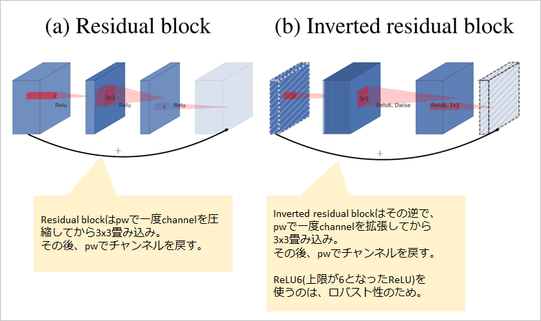
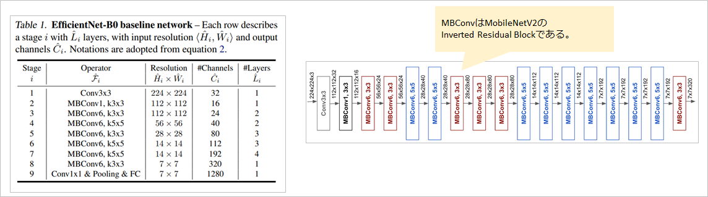

# CNNの歴史をひも解く

## Classification

- LeNet @1989 (https://direct.mit.edu/neco/article-abstract/1/4/541/5515/Backpropagation-Applied-to-Handwritten-Zip-Code?redirectedFrom=fulltext)
- AlexNet @2012.09 (https://dl.acm.org/doi/pdf/10.1145/3065386)
- VGGNet @2014.09 (https://arxiv.org/pdf/1409.1556.pdf)
- Inception @2014.09 (https://arxiv.org/pdf/1409.4842.pdf)
- ResNet @2015.12 (https://arxiv.org/pdf/1512.03385.pdf)
- 【W.I.P.】Inception-v4 @2016.02 (https://arxiv.org/pdf/1602.07261.pdf)
- 【W.I.P.】SqueezeNet @2016.02 (https://arxiv.org/pdf/1602.07360.pdf)
- 【W.I.P.】DenseNet @2016.08 (https://arxiv.org/pdf/1608.06993.pdf)
- 【W.I.P.】Xception @2016.10 (https://arxiv.org/pdf/1610.02357.pdf)
- 【W.I.P.】ResNeXt @2016.11 (https://arxiv.org/pdf/1611.05431v2.pdf)
- MobileNet @2017.04 (https://arxiv.org/abs/1704.04861)
- 【W.I.P.】ShuffleNet @2017.07 (https://arxiv.org/pdf/1707.01083.pdf)
- MobileNetV2@2018.01 (https://arxiv.org/pdf/1801.04381.pdf)
- 【W.I.P.】Big-Little Network @2018.07 (https://arxiv.org/pdf/1807.03848.pdf)
- 【W.I.P.】Octave Convolution @2019.04 (https://arxiv.org/pdf/1904.05049.pdf)
- EfficientNet@2019.05 (https://arxiv.org/pdf/1905.11946.pdf)
- 【W.I.P.】MixNet @2019.07 (https://arxiv.org/pdf/1907.09595.pdf)
- 【W.I.P.】Vision Transformer@2020.09 (https://openreview.net/forum?id=YicbFdNTTy)

## Semantic segmentation

- 【W.I.P.】U-Net @2015.05 (https://arxiv.org/pdf/1505.04597.pdf)
- 【W.I.P.】SSD @2015.12 (https://arxiv.org/pdf/1512.02325.pdf)
- 【W.I.P.】Stacked Hourglass Networks @2016.03 (https://arxiv.org/pdf/1603.06937.pdf)
- 【W.I.P.】FPN: Feature Pyramid Networks @2016.12 (https://arxiv.org/pdf/1612.03144.pdf)
- 【W.I.P.】M2Det @2018.11 (https://arxiv.org/pdf/1811.04533.pdf)
- 【W.I.P.】Deep High-Resolution Representation Learning for Human Pose Estimation @2019.02 (https://arxiv.org/pdf/1902.09212.pdf)
- 【W.I.P.】High-Resolution Representations for Labeling Pixels and Regions @2019.04 (https://arxiv.org/pdf/1904.04514.pdf)
- 【W.I.P.】YOLO
- 【W.I.P.】DeepLab
- 【W.I.P.】FCN
- 【W.I.P.】Lraspp

## Instance segmentation

## 未分類

- 【W.I.P.】GoogLeNet
- 【W.I.P.】SENet
- 【W.I.P.】MobileNetV3
- 【W.I.P.】Noisy Student
- 【W.I.P.】ConvNet
- 【W.I.P.】Mnasnet
- 【W.I.P.】RegNet
- 【W.I.P.】ShuffleNetV2

## LeNet @1989

- 原論文
  - https://direct.mit.edu/neco/article-abstract/1/4/541/5515/Backpropagation-Applied-to-Handwritten-Zip-Code?redirectedFrom=fulltext

- 概要
  - 元祖CNN論文。
  - LeNetと言えばLeNet-5を指し、2層のCNNと3層のLinearから構成される。
  - 名前はこのネットワークを研究したYann LeCunの名前から取られているが、当時はこの呼び名ではなかったと考えられる。

- アーキテクチャ図

  
  (出典: https://ja.wikipedia.org/wiki/AlexNet#/media/%E3%83%95%E3%82%A1%E3%82%A4%E3%83%AB:Comparison_image_neural_networks.svg)

## AlexNet @2012.09

- 原論文
  - https://dl.acm.org/doi/pdf/10.1145/3065386

- 概要
  - 画像認識がDeep Learningモデルに移行するきっかけとなったモデル。
  - 5層のCNNと3層のLinearから構成される。
  - 名前はfirst authorのAlex Krizhevskyからとられている。
  - なお、Alex KrizhevskyはCIFAR-10やCIFAR-100を作成した人物でもある。
  - 以下のような今日でも見られる主要な方法は、この時点で実施されている。
    - ReLU
    - 活性化関数後の正規化処理(LRN: Local Response Normalization)
    - Data Augmentation
    - dropout
    - GPUを利用した学習の高速化

- アーキテクチャ図

  
  (出典: https://ja.wikipedia.org/wiki/AlexNet#/media/%E3%83%95%E3%82%A1%E3%82%A4%E3%83%AB:Comparison_image_neural_networks.svg)

- 実装例
  - pytorch公式
    - https://pytorch.org/hub/pytorch_vision_alexnet
    - ただし、LRNは実装されてないように見える。

- 参考
  - LRNについて
    - 詳細はこちら
      - https://agirobots.com/blog-lrn-cnn/
      - 同じポジションにある近傍チャンネルの数値を使って正規化する。

## VGGNet @2014.09

- 原論文
  - https://arxiv.org/pdf/1409.1556.pdf

- 概要
  - Convの形を3x3に固定することによりシンプルにしたモデル。
  - 3x3をたくさん重ねることによって、いろんなkernel sizeのConvは不要になった。
    - 例えば、3x3を5層重ね合わせると、11x11と同じ領域の情報を見ることができる。
    - 3x3に固定することで、モデル学習側に最適な範囲の参照を任せることができる。
  - VGG16(16層)やVGG19(19層)代表的だが、現在の手法と比較すると、パラメータ数がかなり大きい(140万個など)。
  - ちなみに学習の際は、レイヤの少ないモデル(後述するA)を最初に学習し、後で層を増やして学習するなどが行われており、少し工夫が必要となる。
  - 名前は、Visual Geometry Groupという研究グループから取られている。

- アーキテクチャ図
  - DがVGG16, EがVGG19となる。

  
  (出典: 原論文より)

- 実装例
  - pytorch公式
    - https://github.com/pytorch/vision/blob/main/torchvision/models/vgg.py
    - この時代に、BN(BatchNormalization)が存在しなかったため、bn無しが当時通りのモデルではあるが、BNあり版も用意されている。

## ResNet @2015.12

- 原論文
  - https://arxiv.org/pdf/1512.03385.pdf

- 概要
  - ポイントはshortcut connection(skip connectionとも)によるresidual learning(残差学習)と、bottleneckアーキテクチャ。
  - residual learningは、以下のように入力を加算することで、weight layerに差分を学習させる仕組みである。
    - これにより、残差のみを学習していくため、深い層を構成しても情報がつぶれにくくなる。
    - BatchNormalizationも実装されており、Convの直後に必ず実施する。(加算前には実施しない)
    - 加算後に活性化関数を適用することにも要注意。

  
  (出典: 原論文より)

  
  - 次にこのweight layer側の構成が考えられ、その中で現在採用されているのがbottleneckアーキテクチャである。
    - 下図右側がbottleneck。ちなみに左側は plain アーキテクチャと論文内で呼ばれる。

  
  (出典: 原論文より)

  - これらにより従来と比べて、50～152層など大規模化したネットワークの学習が可能となった。
  - 種類としては、ResNet50, ResNet101, ResNet152などがある。
  - VGGよりパラメータ数が少ないのは、最終段で4096のLinear層が挟まらないこと、1000層のLinearの前にGlobalAveragePoolingにより大きく削減されていることの影響が大きい。

- アーキテクチャ図
  - 50-layerがいわゆるResNet50そこから右に、ResNet101、ResNet152が記載されている。

  
  (出典: 原論文より)

  - 原論文で図示されていないが、各ブロックの切れ目では、加算するときのチャンネル数が合わない。
    - 例えばconv3_xの入力は256だが、出力は512なので、加算できない。
  - この場合は以下のように入力側に 1x1 のConvを導入することにより、チャネルを合わせる必要がある。
    - このConvにももちろん、BatchNormalizationが後続する。

  
  (出典: 中村が作成)

- 実装例
  - pytorch公式
    - https://github.com/pytorch/vision/blob/main/torchvision/models/resnet.py

## ResNeXt @2016.11

- 原論文
  - https://arxiv.org/pdf/1611.05431v2.pdf

- 概要
  - ResNetにGrouped Convolutionをすることで並列処理を実行する手法。

- アーキテクチャ図

  

## MobileNet @2017.04

- 原論文
  - MobileNets: Efficient Convolutional Neural Networks for Mobile Vision Applications(Google Inc.)
  - https://arxiv.org/abs/1704.04861

- 概要
  - Mobileアプリケーション向けに効率的なNetworkを研究したアーキテクチャ。
  - CNNをdepthwise(dw)とpointwise(pw)に分割して効率的な畳み込みを実現した。
    - 通常の畳み込みのパラメータ数
      - ksize x ksize x InputChannelSize x OutputChannelSize
    - dw + pw
       - ksize x ksize x InputChannelSize + InputChannelSize x OutputChannelSize
  - 層数は、CNNが14個相当(モジュールとしては、dwとpwなので28個ある)、Linear層が1個である。

  
  (出典: 中村が作成)

- アーキテクチャ図
  - 以下のブロックをスタックすることで実現する。
  - CNN以外には、BatchNormalizationとReLUが使われている。

  
  (出典: 原論文より)

  - 上記のブロックを最終的なスタックは以下のようになっている。

  
  (出典: 原論文より)

- 実装例
  - pytorch非公式
    - https://github.com/wjc852456/pytorch-mobilenet-v1

## MobileNetV2 @2018.01

- 原論文
  - MobileNetV2: Inverted Residuals and Linear Bottlenecks(Google Inc.)
  - https://arxiv.org/pdf/1801.04381.pdf

- 概要
  - MobileNetV1のさらなる効率化のために、pwのチャンネル数を削減する工夫が施されている。
  - 具体的には、ResNetに登場したResidual blockを応用し、Inverted residual blockを実装した。

    
    (出典: 原論文より。注釈等は中村が追加。)

  - (a)より(b)の方が計算量が多いように見えるが、これは考え方の話である。
    - (a)が実装されたResNetは、もっと大規模なモデルの話なので。
  - 実際は、V1の計算量を削減するためにpwのチャンネル数を減らしたいが、単純に減らすと、表現力が失われるため、一旦内部で拡張してdwを実施した後に圧縮する。
    - 表現力が失われる仕組みは、多様体仮説に基づいており、詳細は以下を参考。
      - https://deepsquare.jp/2020/06/mobilenet-v2/
      - https://metrica-tech.hatenablog.jp/entry/2019/08/03/000000
  - これにより最終的に出力channelの数が減っても、表現力が維持できる。
  - また、ResNetと同様に入力を出力に加算するskip connectionも存在する。
  - 層数は、CNNが19個相当(モジュールとしては、dwとpwとdwなのでもっと多い)、最終層がLinearの代わりにCNNが1個となっている。
  - 活性化関数にはReLU6と上限付きReLUとなっているが、低頻度だが大きな値に引っ張られないようなロバスト性向上のために上限付きで行われている。
    - 詳細はここら辺を参考
      - https://yoheikikuta.github.io/relu6/

- アーキテクチャ図
  - V1とV2の比較は以下の通り。

  
  (出典: 原論文より。注釈等は中村が追加。)

  - 最終的な構造が違うため比較が難しいが、V1が14x14の画像の時にchannel数が512なのに対し、V2は14x14の画像の時に、channel数が96もしくは160で収まっている。
  - 通常、CNNの層数を増やすにつれてchannel数が増える構造となるが、拡張により表現力を落とさずにスタックすることが可能なため、V2のほうが層数が多くても、チャンネル数が減っている。

- 実装例
  - pytorch公式
    - https://github.com/pytorch/vision/blob/main/torchvision/models/mobilenetv2.py
    - 最終層がLinearになっているので、厳密には論文と異なる。

## Big-Little Network @2018.07

- 原論文
  - https://arxiv.org/pdf/1807.03848.pdf

- 概要
  - ResNetの解像度をblock内で複数の解像度を扱って効率的に処理する手法。
  - 最初の段階で低解像度のパス、高解像度のパスをアルファというバランスで分離する。
  - その後はクロスさせながらスタックするイメージ。

## Octave Convolution @2019.04

- 原論文
  - https://arxiv.org/pdf/1904.05049.pdf

- 概要
  - 複数の解像度の入力を混ぜて構成するblockをつかって処理する方法。

## EfficientNet @2019.05

- 原論文
  - EfficientNet: Rethinking Model Scaling for Convolutional Neural Networks
  - https://arxiv.org/pdf/1905.11946.pdf

- 概要
  - 現在でもその汎用性と性能の高さから、主流となっているCNNモデル。
  - 大筋としては効率よく精度を上げるためには、モデルをどのように複雑にしていけばよいかという研究。
  - 結論としては、以下３点を独立して上昇させるのではなく、同時に拡張するのが最も効果的(Efficient)。
    - 層数の増大
    - チャネル数の増大
    - 入力画像の高解像化
  - B0からB7まで存在し、基準のB0に対して上記をそれぞれどのような比率で増大させるかが与えられている。
  - B0は、Neural Architecture Searchという探索で得られた構造。
  - 活性化関数にはSwishが用いられる。
    - Swishの原論文はこちら。
      - https://arxiv.org/pdf/1710.05941.pdf
    - Swishはあらゆるタスクで精度が上昇するが、関数が複雑であるため、計算速度の面では低下する。
  - 拡張率の実験など、詳細はこちらなどを参照。
    - https://kikaben.com/efficientnet

- アーキテクチャ図(B0のみ)
  - B0の構造のみを示す。層数は18個相当に加え、Linear層が1個である。
  - MBConv6は、MobileNetV2のInverted residual blockの拡張6のみのもの(つまりMobileNetV2とほぼ同じ)。
  - 規模もほぼMobileNetV2と同等。

(出典: 原論文より。注釈等は中村が追加。)

- 実装例
  - pytorch公式
    - https://github.com/pytorch/vision/blob/main/torchvision/models/efficientnet.py
  - NVIDIA公式
    - https://github.com/NVIDIA/DeepLearningExamples/tree/master/PyTorch/Classification/ConvNets/efficientnet

  - 実装してみた
    - https://tzmi.hatenablog.com/entry/2020/02/06/183314

## MixNet @2019.07

- 原論文
  - https://arxiv.org/pdf/1907.09595.pdf

- 概要
  - Mix Convolutionを導入。
  - channel方向に複数分割し、それぞれで異なるksizeのConvを行ってconcatする手法

## Vision Transformer @2020.09

- 原論文
  - https://openreview.net/forum?id=YicbFdNTTy

## 参考

- [2019.10.30] 2019年最強の画像認識モデルEfficientNet解説
  - https://qiita.com/omiita/items/83643f78baabfa210ab1

- [2020.09.09] MobileNet(v1,v2,v3)を簡単に解説してみた
  - https://qiita.com/omiita/items/77dadd5a7b16a104df83

- [2021.04.17] EfficientNet B0〜B7で画像分類器を転移学習してみる
  - https://zenn.dev/kleamp1e/articles/202104-efficientnet

- [2021.07.30] EfficientNet: 複合スケールによる効率的な画像分類器
  - https://kikaben.com/efficientnet/

- Neural Network Console
  - https://www.youtube.com/channel/UCRTV5p4JsXV3YTdYpTJECRA

- 6つのモデルでのSwish関数の実験
  - https://ichi.pro/6-tsu-no-moderu-de-no-swish-kansu-no-jikken-265570078399001

- [2019.10.14] 【深層学習】CNNを用いた画像分類手法まとめ（VGG, ResNet, Inceptionなど）
  - https://ys0510.hatenablog.com/entry/cnn_backbone

- ResNetおよびDenseNetの解説
  - https://deepsquare.jp/2020/04/resnet-densenet/

- ResNetからResNextまで
  - https://cvml-expertguide.net/terms/dl/cnn-backbone/resnet/

- 古めな記事だが、ResNetの詳細が記載
  - https://deepage.net/deep_learning/2016/11/30/resnet.html

- 各種モデルサイズの比較表がある。
  - https://keras.io/ja/applications/

- YOLOのv1～v5まで
  - https://qiita.com/tfukumori/items/519d84bf3feb8d246924

- YOLO9000
  - https://qiita.com/miyamotok0105/items/1aa653512dd4657401db

- [2021.05.03] 画像認識の大革命。AI界で話題爆発中の「Vision Transformer」を解説！
  - https://qiita.com/omiita/items/0049ade809c4817670d7

- [2020.03.07] 画像認識の最新SoTAモデル「Noisy Student」を徹底解説！
  - https://ai-scholar.tech/articles/treatise/noisy-student-ai-379

- [2021.04.13] 2021年最強になるか！？最新の画像認識モデルEfficientNetV2を解説
  - https://qiita.com/omiita/items/1d96eae2b15e49235110

-
- SSD
  - https://blog.negativemind.com/2019/02/26/general-object-recognition-single-shot-multibox-detector/

- Semantic Segmentation
  - https://www.youtube.com/watch?v=Eu7EKQ--Rvk&list=RDCMUCRTV5p4JsXV3YTdYpTJECRA&index=21

- Alammar氏によるTransformerのvisual解説
  - http://jalammar.github.io/illustrated-retrieval-transformer/