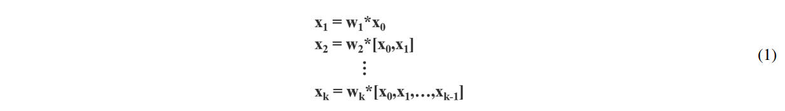
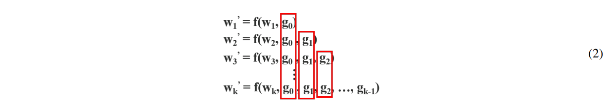
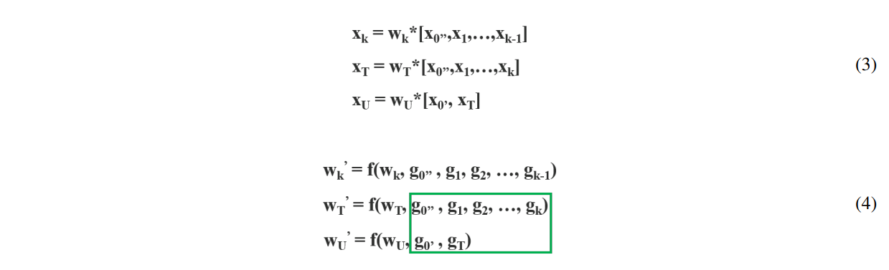
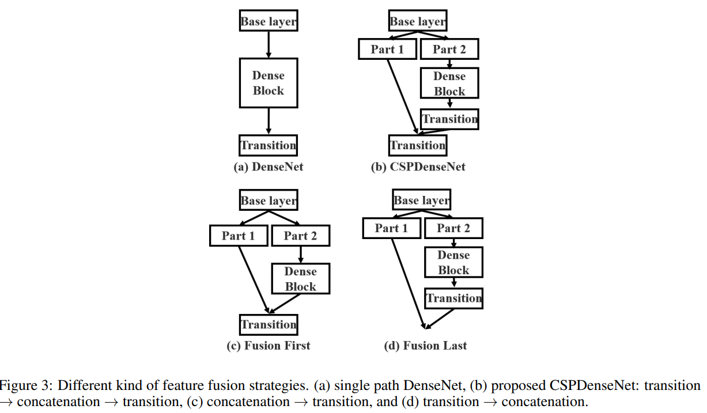
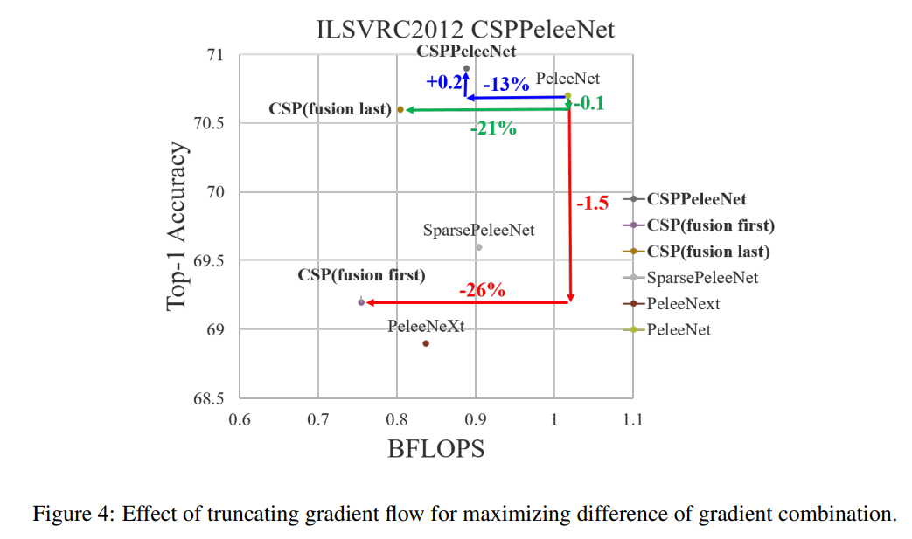
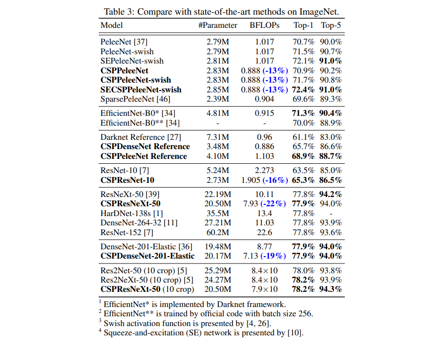

# CSPNet

- 題名: CSPNET: A NEW BACKBONE THAT CAN ENHANCE LEARNING CAPABILITY OF CNN
- 論文: [https://arxiv.org/abs/1911.11929](https://arxiv.org/abs/1911.11929)
- 実装例:
  - 著者のリンクにはシェルしかない。
    - https://github.com/WongKinYiu/CrossStagePartialNetworks

## 概要

- DenseNetの更なる高速化。安価なGPUで動作することを念頭に改良。
- ベースレイヤを2つに分割し、2つのパスで伝搬する情報を効率化している。
- これは他のネットワークに容易に適用可能で、計算量を10～20%削減し、さらに精度を向上させることができた。

## 特徴

### 改良点

- DenseNetの場合、同じ勾配が様々なパラメータの更新に重複して使用される。

- CSPNetの場合、ベースの入力をすることで、勾配の重複するチャンネルを削減する。

- 正直、微分の話は理解ができていないが、以下に分割していると理解。
  - x_0'': ブロック全体をスキップするチャンネル
  - x_0': ブロック内をDenseNetで通過するチャンネル

- 分割方法は、単純にチャンネルを半分にするものと考えられる。

### CSPNetの構成

- CSPNetでは以下の３パターンを定義している。( (a)は従来のDenseNetと同じ)

- 実験の結果、(d) Fusion Lastは、計算コストを大幅に下げ、top-1精度が0.1%程度しか低下しなかった。

### CSPNetの適用

- CSPNetは、ResNetやResNeXtにも適用できる。
- チャンネル数が半分となるためボトルネック層も不要となる。

### 物体検知向け

- EFMという特徴量のfusionを提案しているが、割愛。

## 結果

## 参考

- 解説とPyTorch実装例
  - https://pystyle.info/pytorch-densenet/

- 解説、その後の使われ方についても言及有
  - https://cvml-expertguide.net/terms/dl/cnn-backbone/densenet/

- 解説
  - https://ichi.pro/kurosu-sute-ji-bubun-nettowa-ku-cspnet-64805303419044
  - https://qiita.com/mshinoda88/items/c7e0967923e3ed47fee5#4-cross-stage-partial-networkcspnet

- CIOについての論文
  - https://arxiv.org/pdf/1909.00948.pdf
  - なんかCSPNetの論文と少し計算方法が違う気がするが...
  - 等差数列の和になっているのは確か
    - https://www.kwansei.ac.jp/hs/z90010/sugakua/suuretu/tousasum/tousasum.htm