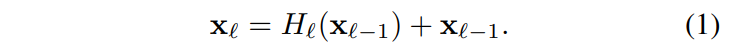
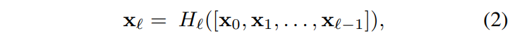
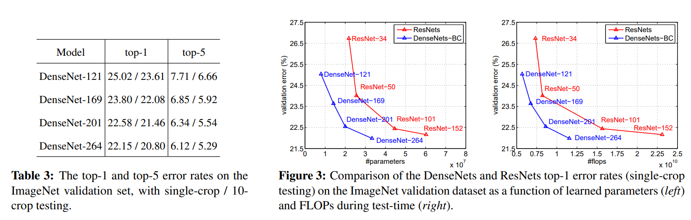
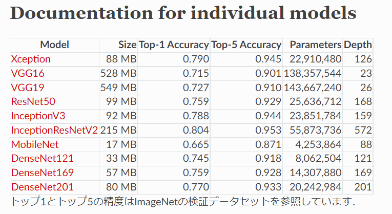

# DenseNet

- 題名: Densely Connected Convolutional Networks
- 論文: [https://arxiv.org/abs/1608.06993](https://arxiv.org/abs/1608.06993)
- 実装例:
  - 著者実装(lua + torch): https://github.com/liuzhuang13/DenseNet

## 概要

- ResNetを進化させ、より効率的に深くまで情報を伝搬させるDense blockを構成。
- Dense blockはそのレイヤまでのblock内すべての出力を入力として用いる。
- また連結方法は加算ではなく、concatenateすることにより情報が消えることを防ぐ。
- ResNetよりモデル規模を縮小し、性能も改善。

## 特徴

### ResNetの課題

- ResNetはスキップ接続により深いレイヤまで情報を伝達させることが可能になった。
- しかし、入力と出力を加算しているため、まざりあい、入力の情報が失われている懸念がある。

### dense connectivity

- 課題改善のために、ブロック内の過去の出力をすべて入力として扱うような構成とする。

- 具体的にこれは、ResNetと異なり、addではなくチャネルのconcatenateで実装される。
- これらをまとめてdense blockと呼ぶ。

### 合成関数

- Hはbatch normalization -> ReLU -> conv3x3の合成関数として実装する。

### Pooling layers

- ブロック間では従来通りpoolingを行う。
- これをtransition layerと呼び、batch normalization -> ReLU -> conv1x1 -> average poolingで構成する。

### Growth rate

- ブロックの入力チャンネル数をk0、各合成関数Hにより生成されるチャンネル数をkとする。
- するとブロック内の層数がlの場合、ブロックの出力チャンネル数は、k0 + k x lとなる。
- このkをgrowth rateと呼ぶが、このgrowth rateは小さな値でも良好な結果が得られている。
  - 論文では、ImageNet向けにはk=32を採用している。

### Bottleneck layers

- 合成関数Hの別のバージョンとして、以下をDenseNet-Bと呼ぶ。
  - BN -> ReLU -> conv1x1 -> BN -> ReLU -> conv3x3
- 実験では、conv1x1で4k個の特徴量マップに拡大し、conv3x3でkに縮小する。

### Compression

- モデルをさらにコンパクトにするための圧縮処理。
- dense blockの出力数mを、transition layerで m x Θに圧縮する。(Θは0.0～1.0)
- 実験ではΘ=0.5とする。
- このモデルをDenseNet-Cと呼び、前段と併用する場合をDenseNet-BCと呼ぶ。

## アーキテクチャ

- ImageNet向けには以下の構成を使用。
  - DenseNet-BCを使用。
  - grouth rateはk=32、compressionはΘ=0.5である。
  - 最初のconv7x7は特殊で、stride=2でチャンネル数を2k(=64)で実行する。

- CIFARとSVHNでも実験をしているが、その場合は小規模な構成となっている。詳細は論文参照。

## 結果

- ResNetよりも高速で高性能を達成している。

- kerasでの比較も記載しておく。ResNetよりパラメータ数が減っていることもよくわかる。

## 参考

- 解説とPyTorch実装例
  - https://pystyle.info/pytorch-densenet/

- 解説、その後の使われ方についても言及有
  - https://cvml-expertguide.net/terms/dl/cnn-backbone/densenet/

- その他
  - https://qiita.com/koshian2/items/01bd9f08444799625607
  - https://deepsquare.jp/2020/04/resnet-densenet/