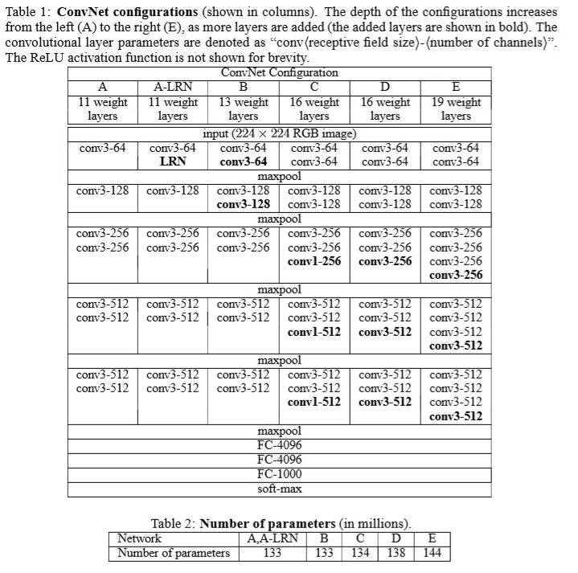

## VGGNet @2014.09

- 原論文
  - https://arxiv.org/pdf/1409.1556.pdf

- 概要
  - Convの形を3x3に固定することによりシンプルにしたモデル。
  - 3x3をたくさん重ねることによって、いろんなkernel sizeのConvは不要になった。
    - 例えば、3x3を5層重ね合わせると、11x11と同じ領域の情報を見ることができる。
    - 3x3に固定することで、モデル学習側に最適な範囲の参照を任せることができる。
  - VGG16(16層)やVGG19(19層)代表的だが、現在の手法と比較すると、パラメータ数がかなり大きい(140万個など)。
  - ちなみに学習の際は、レイヤの少ないモデル(後述するA)を最初に学習し、後で層を増やして学習するなどが行われており、少し工夫が必要となる。
  - 名前は、Visual Geometry Groupという研究グループから取られている。

- アーキテクチャ図
  - DがVGG16, EがVGG19となる。

  
  (出典: 原論文より)

- 実装例
  - pytorch公式
    - https://github.com/pytorch/vision/blob/main/torchvision/models/vgg.py
    - この時代に、BN(BatchNormalization)が存在しなかったため、bn無しが当時通りのモデルではあるが、BNあり版も用意されている。