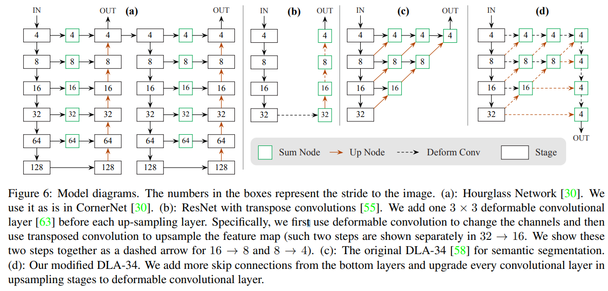
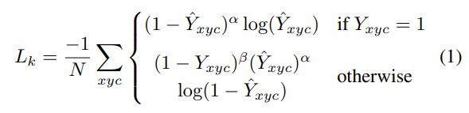
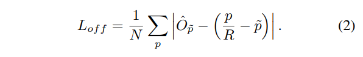
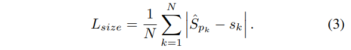
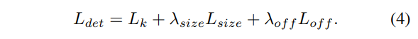
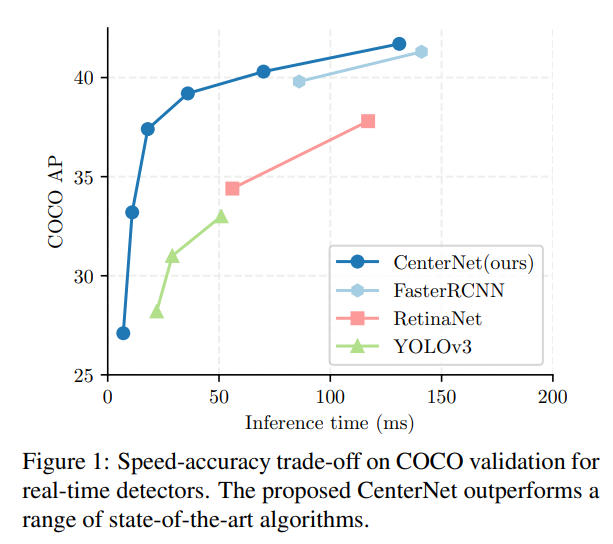
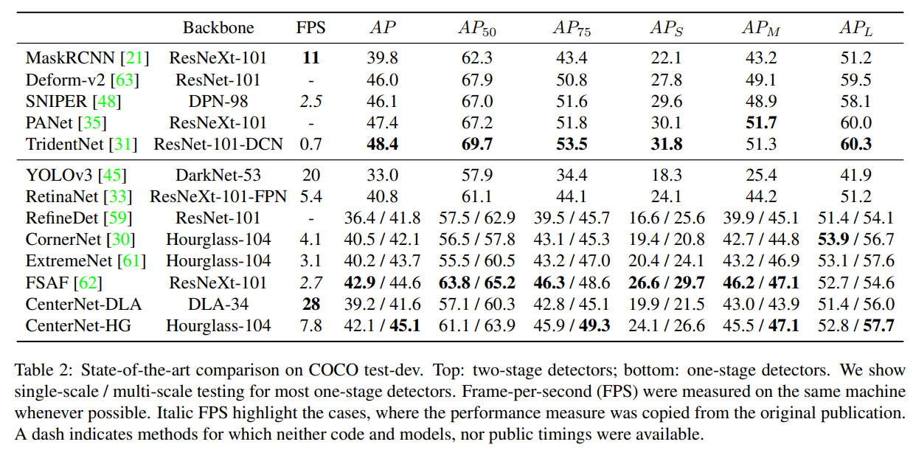

# CenterNet

- 題名: Objects as Points
- 論文: [https://arxiv.org/abs/1904.07850](https://arxiv.org/abs/1904.07850)
- 公式実装: [https://github.com/xingyizhou/CenterNet](https://github.com/xingyizhou/CenterNet)

## 概要

- anchor boxを使用しないアンカーレス方式。
- CornerNetと同様にheatmapを推定するが、中心位置のheatmapを推定する。
- ペアらしさは不要となるためembeddingはなくなる、変わりにboxの高さと幅を推定する。
- オフセットの計算は中心位置のオフセットを推定する。
- heatmapのロス計算はCornerNetと同様にfocal lossが使われている。
- 3Dの物体検知や姿勢推定にも適用可能。

## 特徴

### backbone

- バックボーンは４種類。
  - ResNet18
  - DLA34
  - ResNet101
  - Hourglass104
- 使う特徴量マップはsingle-scaleの高解像な特徴マップを用いる。
  - どのバックボーンも元画像の1/4となるような構成。

- Hourglass104以外は、deformable convolutionを組み合わせる。
  - deformable convolutionの原論文は以下
    - https://arxiv.org/abs/1703.06211

- ResNetはそのままではなく、高解像化のためのupsamplingを伴っている。
  - upsamplingは以下に基づく。
    - https://arxiv.org/abs/1804.06208

- 具体的には、それぞれ以下のようなアーキテクチャとなる。

- (a): HourglassNetwork。そのまま使用。
- (b): ResNet+upsampling。
  - 各upsampingの前に、3×3のdeformable convを1つ追加する。
  - 具体的には、deformable convでチャンネル数を変更し、次にtranspose convで特徴マップをupsampling。
    - この2つのステップは、32→16で別々に示されており、16 → 8 と 8 → 4 では、この2つのステップを一緒に破線矢印で示す。
- (c): semantic segmentationで使われるDLA-34そのままの図。
- (d): 修正後のDLA-34。下の層からさらにスキップ接続を追加し、upsamplingのすべてのconvをdeformable convに変更する。

### heatmap (頂点らしさ)

- 中心らしさを各カテゴリについて計算する。
- 正解データはground truthの頂点となるが、1pixelではなくガウス分布で幅を持たせている。
- ロス関数にはfocal lossを用いる。

### offset

- 特徴量マップは入力よりも解像度が低いためズレが発生してしまう。
- それを補正するoffsetを学習する。
- 特徴量マップの各画素でx方向、y方向のoffsetを推定する。
- ロス関数は以下を用いる。

### object size

- boxのheightとwidthを求める。
- これは各カテゴリ毎ではなく、クラス共通の回帰予測として実行する。
- ロス関数は以下の通りL1ロスを用いる。(offsetと同様)

### ロス関数の結合

- 3つのロス関数を線形和で結合する。
- λ_size=0.1, λ_off=1として実験を行った。

## トレーニング

- 入力画像を512x512に固定する。

## 推論時の後処理

- heatmapから周辺8個の位置の近傍地と同等以上である点をすべて検出し、上位100個を抽出する。
- heatmapの値をその場所の信頼度スコアとし、boxをoffsetとsizeにより生成する。
- NMSなどの後処理は使用せず、heatmapに対して3x3のmax poolingを使用するのみで効率的に実装できる。

- 画像サイズは元の画像を維持したまま、ResNetとDLAでは最大32ピクセル、HourglassNetでは128ピクセルでzero-paddingを実施する。
  - 特徴量抽出の過程で完全に消えないようにするため。

## 実験結果

## 参考

- 解説
  - https://qiita.com/masataka46/items/cb5b05090746c7f3b826
  - https://engineering.dena.com/blog/2019/07/cv-papers-19-keypoint-object-detection/

- 解説と他タスクへの転用
  - https://metrica-tech.hatenablog.jp/entry/2019/12/07/173032
