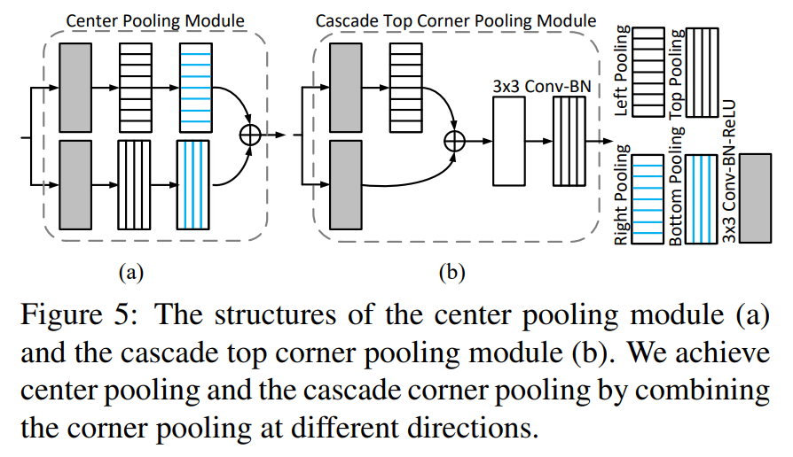
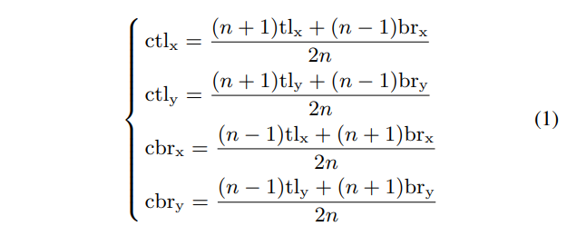
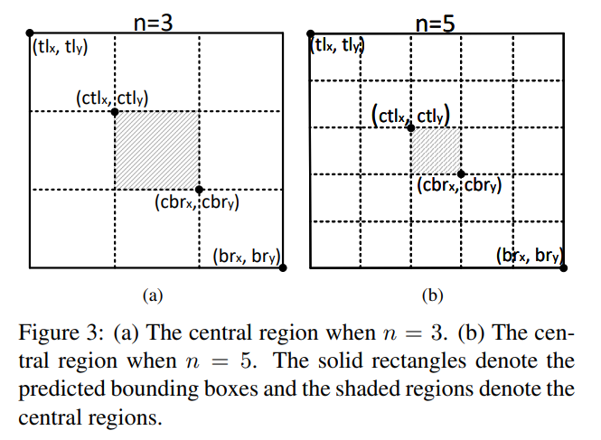
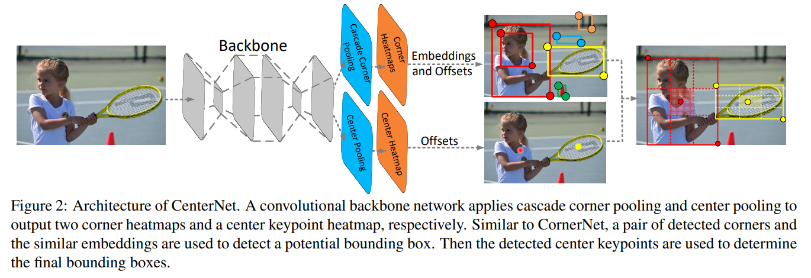
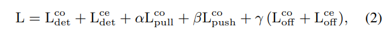
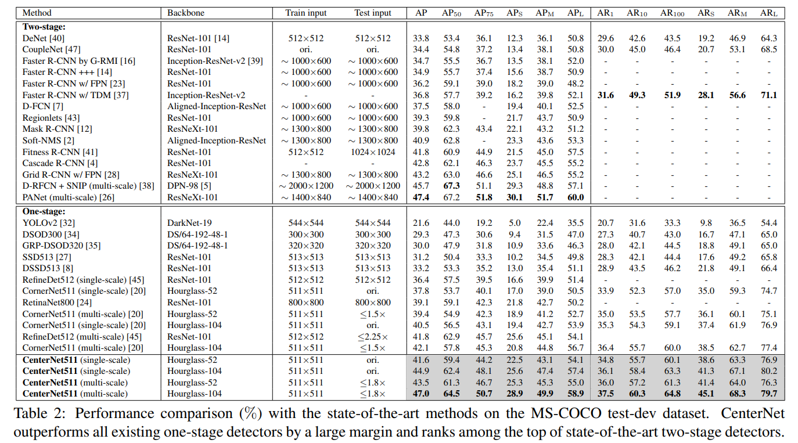
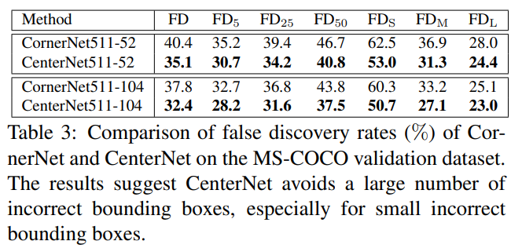

# CenterNet

- 題名: CenterNet: Keypoint Triplets for Object Detection
- 論文: [https://arxiv.org/abs/1904.08189](https://arxiv.org/abs/1904.08189)
- 公式実装: [https://github.com/Duankaiwen/CenterNet](https://github.com/Duankaiwen/CenterNet)

## 概要

- CenterNetは同名のものが2つあるが、こちらはCornerNetの改良版のCenterNet。
- CornetNetはbounding boxの内部を見ていないため、誤検出が多い。
- そこで中心をきちんと見るためのCenter Heatmapを提案。Corner Poolingも改良している。

## 特徴

### Center Pooling

- 中心点キーポイントを得るために特徴量マップにCenter Poolingを実施する。
- 具体的には、水平方向・垂直方向の最大値を全画素に対して計算し、それを加算する。
- 下図の(a)が相当する。
  - 実装上、左右方向のpooling(上段)を直列接続して、水平方向の最大値マップを得る
  - 上下方向のpooling(下段)を直列接続して、垂直方向の最大値マップを得る
  - それぞれを加算して中心らしさを表すCenter heatmapを得る。

### Cascade Corner Pooling

- Corner Poolingを改良する。
- Cornet Poolingは、エッジの影響を大きく受けるという課題があったため、一旦画像の中心情報を見る処理を導入する。
- 具体的には少し複雑で、以下の(b)が相当する。
  - まずこの図は、CornerNetにおけるTop方向のPoolingを置き換える一例である。
    - 実際には、Left方向、Bottom方向、Right方向それぞれを同様のCascade Corner Poolingに置き換える。
  - Top方向を計算する場合、まずはLeft方向のPoolingを実施することがポイント。
    - 間にshoftcutや一段のconv3x3があるが、直感的には少し分かりにくい。
    - しかし本質は、Top方向の前にLeft方向を見るレイヤが入っていること。
    

- CornerPooingを置き換えるため最終的には、左上用として、TopとLeftを加算し、右下用としてBottomとRightを加算する。
- これでCorner Heatmapを得る。

### Embedding

- Corner heatmapは、CornerNetと同様、ペアを判定するためにEmbeddingを計算する。

### Offset計算

- Offsetは、Corner heatmap、Center heatmap双方で使用する。

- 意図としてはCornetNetと同じ以下の通り。
  - 特徴量マップは入力よりも解像度が低いためズレが発生してしまう。
  - それを補正するoffsetを学習する。
  - 特徴量マップの各画素でx方向、y方向のoffsetを推定する。
  - ロス関数は以下を用いる。

### Centerキーポイントの選択

- 信頼度の高い上位k個の中心点キーポイントを選択する
- オフセットにより中心位置を修正する。

### CornerとCenterのマージ

- コーナーのペアにより決められるbounding boxのにおける中心領域を定める。
- その中心領域にCenterのキーポイントが含まれないbounding boxを除外し誤検出を抑制する。
- 中心領域は、bounding boxのサイズに適応的にするため、スケールを考慮した中心領域を使用する。

### スケールを考慮した中心領域の定義

- 大きなbounding boxには比較的小さく、小さなbounding boxには比較的大きくなるようにする。
- 以下の式でcentral regionを計算する。

  

  - bounding boxの左上を(tl_x, tl_y)、右下を(br_x, br_y)
  - central regionの左上を(ctl_x, ctl_y)、右下を(cbr_x, cbr_y)
  - nは150未満のbounding boxの場合は3、150以上の場合は5とする。

- 式では分かりにくいが、n=3,n=5の場合それぞれ以下のような領域がcentral regionとなる。

  

### backbone

- バックボーンには、以下を用いる。
  - Hourglass-52
  - Hourglass-104

## アーキテクチャ

- これらを踏まえた全体のアーキテクチャは以下の通りである。

## トレーニング

### ロス関数の結合

- ロス関数は以下のような線形和とする。
  - L^co_detは、cornerキーポイントのfocal lossである
  - L^ce_detは、centerキーポイントのfocal lossである
  - L_pullとL_pushはembeddingのロスとなる。(CornerNetを参照)
  - L^co_offsetとL^ce_offsetは、それぞれのオフセットであり、L1ロスを用いる(CornerNet参照)
  - 実験では、α=0.1、β=0.1、γ=1で実験を行った。

### 入力画像のサイズ

- 511x511を用いる。これにより特徴量マップは128x128となる。

## 推論時の後処理

- オリジナルと水平方向を反転した画像を入力する。
- heatmapから、上位70点をそれぞれ検出し、bounding boxを決定する。
- 反転したものをまぜ、softNMSを用いて冗長なboundinb boxを削除する。
- 検出されたbounding boxのスコアの上位100個を最終的な検出結果とする。

## 実験結果

- 実験結果は以下の通り。1stageのなかでは最良に見える。ただし処理能力(fps)についてはどうかわからない。

- CornerNetより誤検出を減らすという目的は達成できている。

- 推論時間は同じバックボーンでは、CornerNetより低くなっている。
  - CornerNetは1画像あたり300ms
  - CenterNet(Hourglass-104)は1画像あたり340ms
  - CenterNet(Hourglass-52)は1画像あたり270ms
- ただしCenterNet(Hourglass-52)はCornerNetより性能が良いため、優れていると主張。

## 参考

- 一番詳しい
  - https://metrica-tech.hatenablog.jp/entry/2019/08/17/000000

- 簡易な解説
  - https://engineering.dena.com/blog/2019/07/cv-papers-19-keypoint-object-detection/
