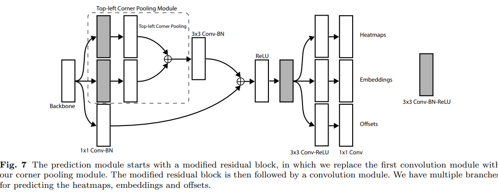
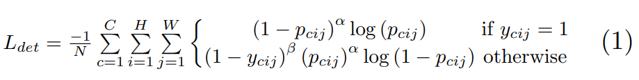
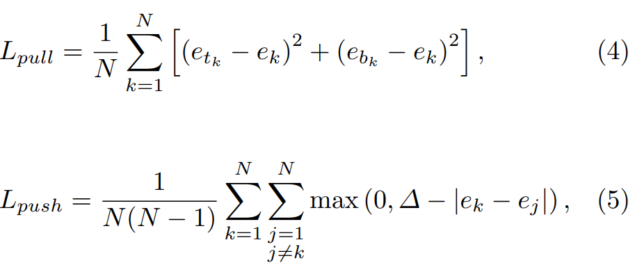
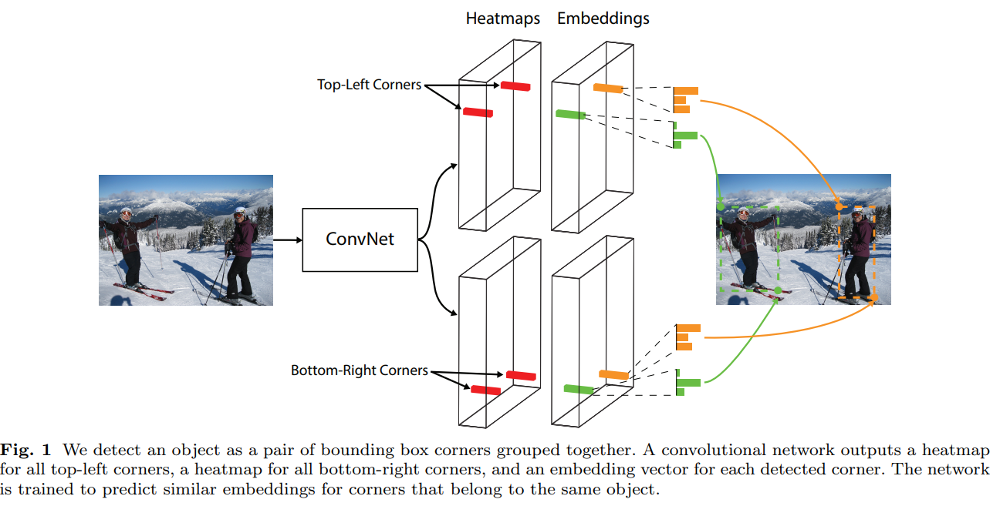
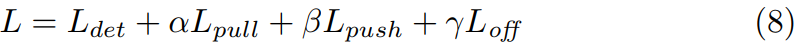
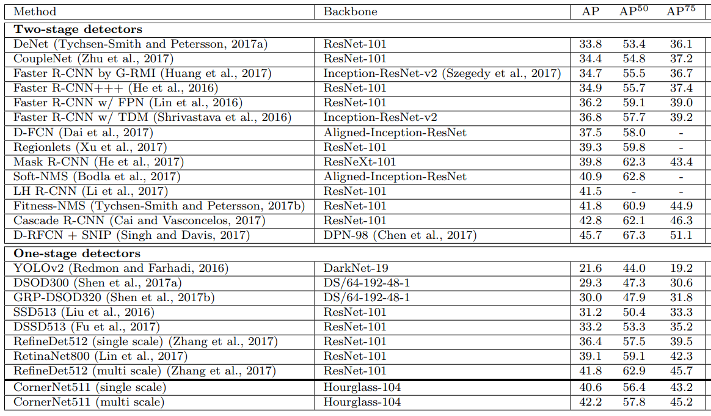

# CornerNet

- 題名: CornerNet: Detecting Objects as Paired Keypoints
- 論文: [https://arxiv.org/abs/1808.01244](https://arxiv.org/abs/1808.01244)

## 概要

- anchor boxを使用しないアンカーレス方式。
- corner poolingを導入し、bounding boxの左上・右下のコーナーを検出。
- corner pooling結果から頂点らしさ(heatmap)、ペアらしさ(embedding)、オフセットを計算する。
- backboneやembeddingの実装で姿勢推定の影響がみられる。
- heatmapのロス計算にfocal lossが使われている。

## 特徴

### backbone

- バックボーンは姿勢推定で使われるHourglass Networkを用いる。
- Hourglass Networkは、特徴量マップの縮小・拡大を繰り返す砂時計形状となっている。
- ResNetと同様にskip connection構造を持っている。
- 大域的なskipとミクロ的なskipで構成されている。

### corner pooling

- 頂点は通常背景画像であるためそのままで直接推定が困難である。
- そこで左上を見つけるために以下の組み合わせでcornerを見つける。
  - 右から左へmaxを計算しながら操作する。
  - 下から上へmaxを計算しながら操作する。
  - 得られたものを合計すると頂点が大きな値となる。
- これを右下に対しても同様に行う。

### heatmap (頂点らしさ)

- 頂点らしさを各カテゴリについて計算する。
- 正解データはground truthの頂点となるが、1pixelではなくガウス分布で幅を持たせている。
- ガウス分布の広がりの程度は、ground truthのサイズに依存する。
  - 大きいboxは広がりも大きくとる。
  - この広がりは、ground truthとのIoUがt=0.3となる範囲までをradiusとして決定した。
  - radiusの1/3が偏差σとなるような2次元のgaussian分布を正解ヒートマップとする。

- ロス関数にはfocal lossを用いる。
  - p_cijが予測値、y_cijが正解のヒートマップである。
  - α=2、β=4を論文では採用。

### embedding (ペアらしさ)

- 頂点候補からどの点がペアらしいかを計算する。
- 各クラス共通のベクトルで数値が近いものをペアらしいとする。
  - ユークリッド距離で計算する。
- ベースの着想は姿勢推定において各関節の関連付けなどで用いられるアルゴリズムである。
- ロス関数はpush損失とpull損失を組み合わせた以下のような式となる。
  - pullは左上e_tkと右下e_bkの平均e_kにそれぞれe_tkとe_bkが近くなるようなロス関数。
  - pushはペアではない組み合わせの平均がΔ以上離れるように学習する。
    - Δは1を論文で採用。

- なお論文内でeは1次元のベクトルを用いているが、多次元でもよい。

### offset

- 特徴量マップは入力よりも解像度が低いためズレが発生してしまう。
- それを補正するoffsetを学習する。
- 特徴量マップの各画素でx方向、y方向のoffsetを推定する。
- ロス関数は以下を用いる。

## アーキテクチャ

### backbone

- 図としては記載がなく、hourglassの数は2で、max-poolingの代わりにstride=2のconvを使用するなど、いくつかの修正がある。
- 層数としては104層のため、Hourglass-104と記載されている。

- Hourglassの詳細は下記も参照
  - https://yusuke-ujitoko.hatenablog.com/entry/2017/07/22/000523

### for detection

## トレーニング

- CornerNetは事前学習を特に行わない。
- 学習時は入力を511x511、出力を128x128とする。
- 標準的なData Augmentationを実施する。
- 最後に入力画像にPCAを用いる。

- ロス関数は複数あるため線形和で最終的なロス関数とする。
  - αとβは0.1とし、γは0.1とする。

## 推論時の後処理

- heatmapに対して3x3のmax poolingを使用してNMSを適用する。
- heatmapから最大血を持つ左上100個と右上100個を選択する。
- それぞれの埋め込み間のL1距離を計算し、0.5より大きいペアや異なるカテゴリのコーナーが含まれるペアを棄却する。
- 左上と右下のコーナーの平均スコア(ヒートマップ値？)を検出スコアとして用いる。

- 入力時はリサイズせず、元の画像の解像度のまま、0を埋め込んで入力している。
- また元画像と反転した画像も入力し、soft-NMSを使用して冗長な検出を抑制します。
  - soft-NMSは重なり具合で抑制するのではなく、重なり具合でスコアを補正する。

- Titan Xで平均推論時間は1画像あたり244msecである。

## 実験結果

## 参考

- 神解説です
  - https://blog.albert2005.co.jp/2020/01/10/advanced-technology-section-cornernet/

- soft-NMSについての解説
  - https://qiita.com/mshinoda88/items/c7e0967923e3ed47fee5

- HourglassNetwork
  - https://yusuke-ujitoko.hatenablog.com/entry/2017/07/22/000523