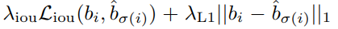
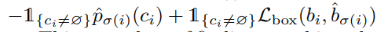
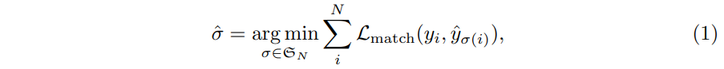
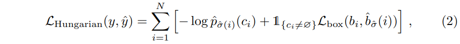
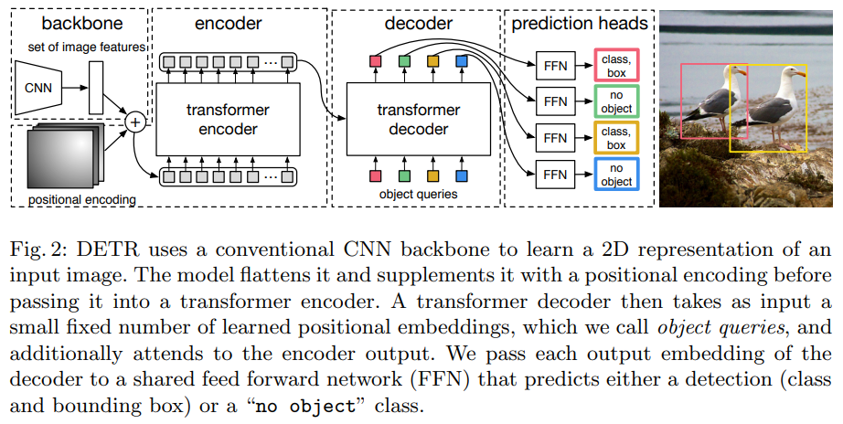

# DETR

- 題名: End-to-End Object Detection with Transformers
- 論文: [https://arxiv.org/pdf/2005.12872.pdf](https://arxiv.org/pdf/2005.12872.pdf)
- 実装例:
  - 公式(Facebook AI)
    - [https://github.com/facebookresearch/detr](https://github.com/facebookresearch/detr)

## summary

- Transformerをネックとして使用。
- これによりanchor boxやNMSなどのハンドメイドな設計部分を排除。
- またanchor lessに対応するために、固定数のbboxにhungarian algorithmで割り当てを実施するロス関数を提案。
- 比較対象はFaster R-CNNなので、まだまだこれからという印象。

## 特徴

- 以下２点がポイントである。
  - 予測されたbboxとground truthを対応付けて計算するためのロス関数
  - オブジェクトの集合をEnd-to-Endで予測するアーキテクチャ

### Object detection set prediction loss

- DETRはN個の予測されたbboxを出力する。
- Nは１つの画像中の典型的なオブジェクト数より大きく設定する。
- N個のbboxはクラス数+1(no object分で、ラベリングされる。
  - ground truthの物体数は、そのクラスに割り当てる
  - 物体ではない残りのbboxはno objectに割り当てる。
- この最適なペアのマッチングを二部マッチング問題とみなし、 Hungarian algorithmでラベルを割り当てる。

- 具体的なロスの流れは以下の通りである。

- まず、bbox回帰L_boxのロスにはGIoUを用いる。

- これによりマッチングのロスL_matchを以下のように計算する。
  - p^をどう計算するのかまだわかってない。
  - p^はモデルが出力するconfidenceかな...？
  - no objectは計算には含めない。

- L_matchを使い、Hungarian algorithmで割り当てを決める。

- この割り当て結果から以下を計算する。
  - 対数化は、L_boxとのバランスが目的らしい...？
  - クラス不均衡対策のため、no objectの場合は、class lossの項を10の固定値としている。

### DETR architecture

- ネットワーク構成の全体像は以下である。

- backboneから出力される特徴量マップ(H, W, C)をconv1x1でd次元に圧縮。
- その後、空間方向をflattenとして(HW, d)をencoderの入力とする。
- encoder-decoder構成は通常のtransformerと同じ構成。

- object queriesの数がNであり、N個の候補が出力される。

- decoderの出力は、N個のd次元ベクトルとなるため、それぞれに対して全結合層からなる２つのヘッドを付ける。
  - bboxの４軸（相対値）
  - クラス数+1個のconfidence（softmaxにより計算）

### Auxiliary decoding loss

- Auxiliary lossを効果があったので使ったと記載がある。
- 以下が参考となるが、途中層のにhead部をくっつけてロスを計算する。
  - https://magattaca.hatenablog.com/entry/2021/09/19/003636#1-Auxiliary-loss

- DETRでは、decoder layersのそれぞれの層に、head部をつけて計算する。

- また、異なるdecoder layerからの予測FFNへの入力を正規化するために、追加のlayer-normを使用する。

### backbone

- ResNet-50とResNet-101を用いる。
- これらをDETRとDETR-R101と呼ぶ。

- また小さな物体を検出するために、convのstage5にdialeted convを入れる。
- これにより解像度を倍とすることができるが、計算コストも倍増する。
- これらのモデルをDETR-DC5、DETR-DC5-R101と呼ぶ。

## 参考

- 二部マッチング問題について
  - https://qiita.com/drken/items/e805e3f514acceb87602

-  Hungarian algorithm
  - https://qiita.com/m__k/items/8e2cb9067ec5d720c30d

- 解説は豊富
  - https://qiita.com/sasgawy/items/61fb64d848df9f6b53d1
  - https://deepsquare.jp/2020/07/detr/
  - https://qiita.com/DeepTama/items/937e13f6beda79be17d8
  - https://club.informatix.co.jp/?p=1265

- Auxiliary lossについて
  - https://magattaca.hatenablog.com/entry/2021/09/19/003636#1-Auxiliary-loss
