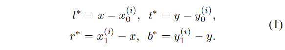
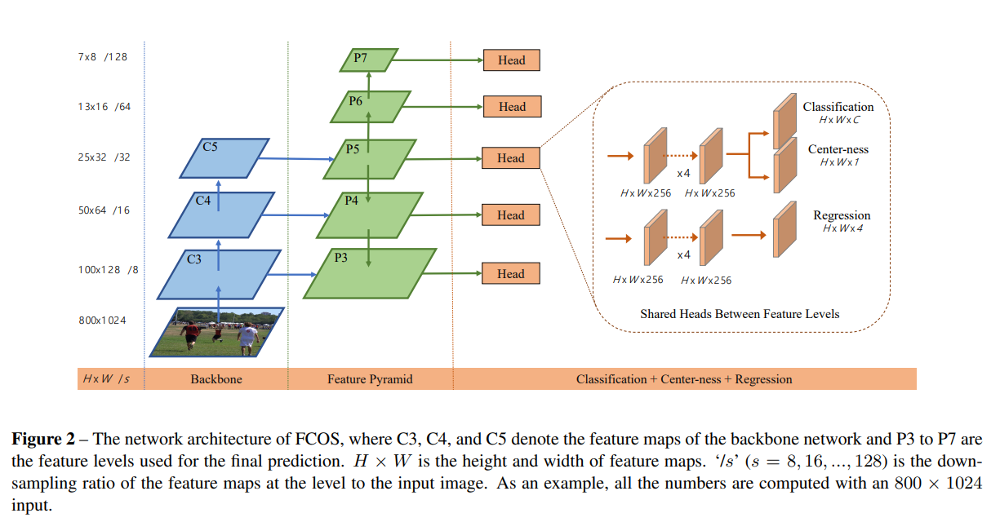
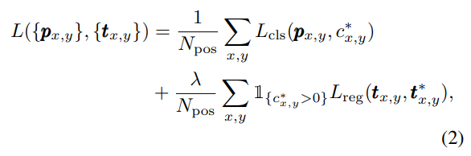
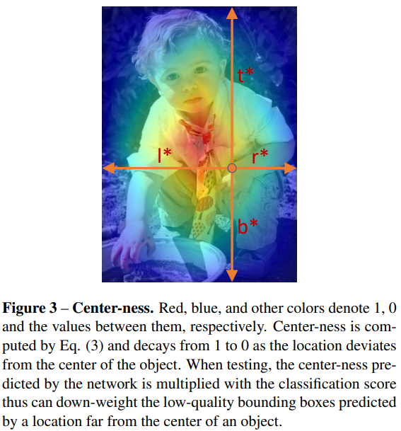
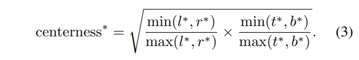
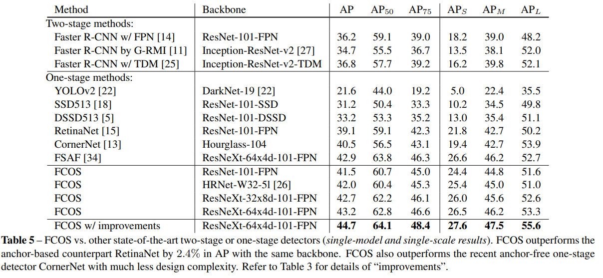
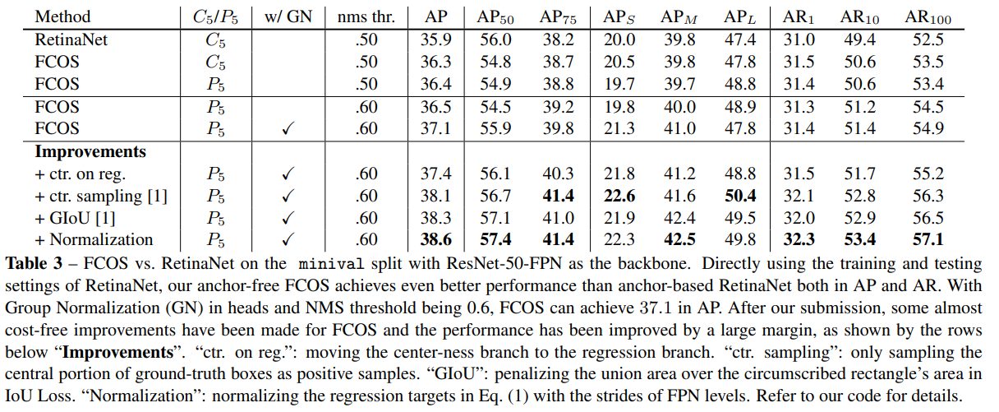

# FCOS

- 題名: FCOS: Fully Convolutional One-Stage Object Detection
- 論文: [https://arxiv.org/abs/1904.01355](https://arxiv.org/abs/1904.01355)
- 公式実装
  - [https://github.com/tianzhi0549/FCOS](https://github.com/tianzhi0549/FCOS)

## 概要

- セマンティックセグメンテーションに類似した、ピクセル単位の予測方式を提案。
- FCOSは、1stageでありanchor less方式。
- あらかじめ定義されたanchor boxを排除することで、関連する複雑な計算を完全に回避可能。
- さらに重要なことは、最終的な検出性能に大きく影響するanchor boxに関するハイパーパラメータをすべて回避可能。
- ResNeXt-64x4d-101を用いたFCOSでは、後処理であるNMSにより、AP値44.7%を達成。
- 従来の1段検出器をはるかに凌駕する簡便な検出器を実現することができました。

## Introduction

- anchor box方式の課題
  1. チューニングの必要性
    - 検出性能はanchor boxのsize, aspect ratio, numberに敏感。
    - 例えばRetinaNetでは、これらの値を変化させるとCOCOのAPにおいて最大4%まで性能に影響がある。
    - そのためこれらの値を慎重にチューニングする必要がある。
  2. 形状変化の大きいまたは小さい物体の検出が困難
    - scaleやaspect ratioが固定されているため、検出が難しい物体がある。
    - 新たな検出課題に対して再設計が必要
  3. 学習時のバランス問題
    - recall向上のためanchor boxが密に配置される必要があり、FPNでは180k以上のanchor boxが必要。
    - これらの多くは学習時に負例となる。
  4. gtとの対応付け
    - gtとのIoU計算によるラベル付けなど複雑になる。

- 他の画像タスクとの差異
  - semantic segmentationや深度推定(dense prediction)、keypoint detectionなどはFCNが成功してきた。
  - object detectionはこれらのピクセル単位の予測モデルと異なる唯一のタスクである。
  - なのでobject detectionもピクセル単位の予測問題として解けないか？という研究である。

## 特徴

- 以下のステップで改良を行う。
  - 物体検出を画素単位で予測する方式に変更。
  - multi-level predictionを用いて、bboxの重なりによる曖昧さを解消し、再現率を向上させる方法を示す。
  - 検出されたbboxの低品質を抑制し、全体性能を向上させる、centernessブランチを紹介する。

### 基本構成

- FPNの各特徴量マップをF_iとする。F_iの各点を(x,y)とする。s_iは、F_iのストライドとする。
- gtのbboxはB_iとして定義し、B_i = {xi_0, yi_0, xi_1, yi_1}と、_0をleft-top、_1をright-bottomの座標とする。
- F_iの各点(x,y)は入力画像上のreceptive fieldの中心としてマッピングすることができる。
- anchor box方式は、このreceptive fieldの中心を、anchor boxの中心とみなし、そこからregressionを行う。
- 一方で、提案方式では、この中心位置からbboxを直接regressionを行う。

- クラスラベル付けとしては、gtのbbox内に入る(x,y)を正例とする。それ以外を負例とする。
- またクラスラベルとは別に、(x,y)からbboxまでの距離(l,t,r,b)の4次元実数ベクトルを推定する。
- (x,y)によっては、複数のgtに入る点が存在し、あいまいなサンプルと位置づける。
- あいまいなサンプルは、その場合は最小の面積となるbboxを回帰対象とする。
- 実際には、複数のレベルの特徴量を使うため、あいまいなサンプルの発生は最小限に減らすことができる。

- (l,t,r,b)の回帰目標は単純に以下の式となる。

- anchor box方式の場合、gtとのIoUが十分に高いものしか正例に使用しなかった。
- FCOSではすべての正例をregressorの学習に使用することができる点が優れている理由の一つである。

### Network Output

- 分類ラベルのC次元(COCOの場合、80個)と4次元ベクトルt = (l,t,r,b)を出力する。

- head部はclassification用とregression用で分離し、それぞれ4つの畳み込み層を追加する。

- また、regressionの出力は常に正の数であるため、exp(x)で処理して0～∞の値に対応させる。

- 注目すべきことは、anchor box式に比べて出力するチャネル数が大幅に少ないことである。

### Loss function

- 以下で定式化する。
  - L_clsはfocal lossを用いる。
  - L_regはIoU-lossとする。
  - N_posは正例の総数。
  - λはバランスをとる係数であり、本論文では1とする。
  - L_regは、background以外で有効となる。

### Inference

- 入力画像を処理し、各特徴マップF_i上の各位置(x,y)について、分類スコアと回帰予測値を得る。
- 分類スコアが0.05以上の点を正のboxとして選択し、回帰予測値から式(1)を使い、bboxを得る。

### Multi-level Prediction with FPN for FCOS

- FCOSでは、FPNにしたがって異なるレベルの特徴マップ上で異なる大きさの物体を検出する。
- 具体的には、｛P3, P4, P5, P6, P7｝と定義される5つのレベルの特徴マップを利用する。
  - P3、P4、P5 は以下に示すように、バックボーンのC3、C4、C5 に、トップダウン接続によるconv1x1が続くことで生成される。
  - P6 と P7 は、それぞれ P5 と P6 にstride=2の畳み込み層を1回適用して生成する。
  - その結果、特徴レベル P3, P4, P5, P6, P7 は、それぞれ 8, 16, 32, 64, 128 のストライドを持つ。

- anchor box方式は、特徴量レベルごとに異なる大きさのアンカーボックスを割り当てる。
- FCOSの場合は、各レベルのbbox回帰の範囲を制限する。
- 具体的には、
  - まず、全ての特徴レベルにおいて、各位置の回帰目標値(l,t,r,b)を計算する。
  - 次に、(l,t,r,b)の最大値がm_iより大きい、もしくはm_i-1より小さい場所は負例とした。
  - ここで、mi は特徴量F_iが回帰する必要のある最大距離である。
    - m_2, m_3, m_4, m_5, m_6, m_7 をそれぞれ 0, 64, 128, 256, 512, ∞とした。
  - これを実施してもある位置(x,y)が複数のgtに割り当てられる場合は、単純に面積が最小のgtをtargetとする。
- この制限により、あいまいなサンプルは大幅に緩和し、FCOSをanchor box方式と同程度に改善することが可能である。

- 最後にhead部は、他の論文に従って共有して扱う。
- ただし、回帰の範囲は特徴量レベルによってことなるための工夫を行う。
- 具体的には、exp(x)の代わりにexp(s_i*x)という学習可能なスカラー値s_iを乗算して、検出性能を改善することに成功した。

### Center-ness for FCOS

- この時点ではFCOSとアンカーベース検出器の間には、まだ性能差が残っている。
- これは、物体の中心から離れた場所にある低品質なbboxが多く検出されることに起因していると考えられる。
- そこで、これをハイパーパラメータを導入することなく、低品質なbboxを抑制するための手法を提案する。

- 具体的には、classificationの並列に、Center-nessを推定するheadを追加する。
- Center-nessは以下に示すように、その場所が担当する物体の中心からの距離を正規化したものである。

- ある場所の回帰目標値(l,t,r,b)が与えられたとき、中心性の目標値は次のように定義される。

- ここでcenter-nessの減衰を緩やかにするためにsqrtを用いている。
- center-nessは、0～1の範囲であるため、binary cross entropyで学習し、損失関数に追加する。

- inference時には、最終スコアは、予測されたcenter-nessを対応するclassificationスコアと乗算して計算する。
- これにより、center-nessによって、オブジェクトの中心から離れたbboxのスコアを重み付けすることができる。
- その結果、最終的なNMS処理により、これらの低品質なbboxは高い確率でフィルタリングされる

- center-nessの代替案としては、他論文と同様にハイパーパラメータを1つ追加して、gtの中心付近のみを正のサンプルとして使用する方法がある。
- 結果的には両手法の組み合わせにより、より良い性能を達成できることが示された。

## 実験結果

- improvementsは以下の方法を使用したものである。

- 具体的には以下である。
  - "ctr. on reg.":
    - centernessブランチをregressionブランチに移動。
  - "ctr. sampling":
    - gtの中央部分のみを正例としてサンプリング
  - "GIoU":
    - IoUロスで外接矩形の面積以上の連合面積にペナルティーをかける。
  - "Normalization":
    - 式(1)の回帰式をFPNの各ストライドで正規化する。（詳細はコードを参照）

## 参考

- https://medium.com/lsc-psd/fcos-%E3%82%A2%E3%83%B3%E3%82%AB%E3%83%BC%E3%83%95%E3%83%AA%E3%83%BC%E7%89%A9%E4%BD%93%E6%A4%9C%E5%87%BA%E6%B3%95-dd18147dc822
