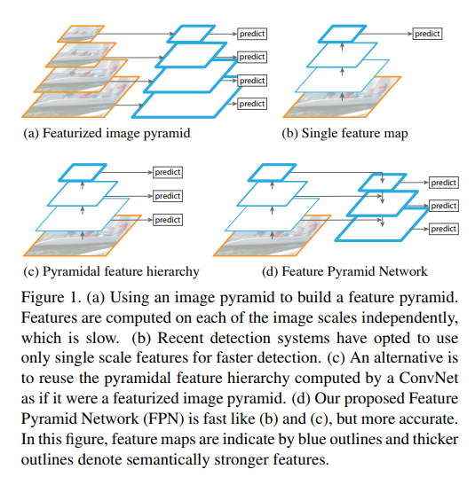
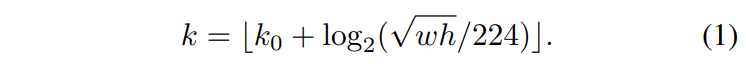

## FPN

- 説明
  - FPN: Feature Pyramid Networks
  - 最終層を検出に使う手法(b)では、特徴量マップの解像度が低い。
    - Faster R-CNNやYOLOなど
  - 一方で、途中層を検出に使う手法(c)は、特徴量抽出が弱い。
    - SSDなど
  - そこでupsamplingで段階的に解像度を戻すのような構造にして深い層でも高解像情報を維持する手法(d)を提案。

  

  - 図の(d)における左側をbottom-up, 右側をtop-downと呼ぶ。
  - bottom-up側はConvNetsであり何を使ってもよいが、論文中ではResNetを使う。

  - ResNetのうち、Residual blockの最後の出力が最も強い特徴をもつので、その部分を使う。
    - 具体的には、活性化関数後の出力を使う。
    - conv1はメモリのフットプリントが大きくなるため、conv2,3,4,5を使う。{C2,C3,C4,C5}と表記する。
    - {C2,C3,C4,C5}は入力画像に対してそれぞれ、{4,8,16,32}画素単位で値を持つことに注意する。
  
  - 以下でそれぞれ特徴量マップを作成する。
    - P5
      - C5の2048チャンネルをconv1x1で256に変換
    - P4
      - P5をダウンサンプルしたものと + C4の1024チャンネルをconv1x1で256に変換したものを加算
      - それに対してconv3x3でスムージングをする。
    - P3,P2は同様。
    - P6
      - P5をstride=2でmax poolingしたもの。RPNのみに使用。
  
  - RPN(Region proposal network)の階層化
    - Faster R-CNNまでは、RPNも単一解像度の特徴量マップを使っていた。
    - FPNでは、RPNも様々な解像度の特徴量マップを使う。
    - P6, P5, P4, P3, P2それぞれについて、共有された以下を実行する
      - 512-dのconv3x3畳み込み
      - 上記を以下２つに接続
        - 0,1判定の2k-dのconv1x1畳み込み
        - bounding box推定用の4k-dのconv1x1畳み込み
      - ここでkはanchor boxの個数である。
    - anchor boxは、各階層で固定のpixelをもつanchor boxを以下のようにする。
      - それぞれ {P2, P3, P4, P5, P6} に {322 , 642 , 1282 , 2562 , 5122} pixelのbbを割り当てる。
      - アスペクト比は {1:2, 1:1, 2:1} を使う。
    - 正例は以下のルールで決める。
      - 与えられたground truthに対して最も高いIoUを持つanchor box
      - 任意のground truthに対して0.7以上のIoUを持つanchor box
    - 負例は以下のルールで決める。
      - 全てのground truthに対して0.3以下のIoUを持つanchor box
    - 各解像度のconvでパラメータを共有しない代替案も評価したが精度は同等であった。
    - パラメータを共有しても良好な性能な理由は、ピラミッドの全てのレベルが類似の意味レベルを共有していることを示している。

  - Fast R-CNNの階層化対応
    - RPNに決められたRoIサイズに応じて、どのピラミッドの特徴量マップを使うか決定する。
    - それは以下の式でkを与えられ、Pkを使う。

    

    - k0=4とし、w,hは入力画像におけるRoIのサイズである。224はImageNetの入力サイズである。
    - RoIが小さくなるとkが小さくなるため、より高解像なPkが使用される。
    - PkからRoI領域に対応する特徴量マップに対して、7x7グリッドのRoI Poolingを実施し、サイズによらない特徴量に変換する。
    - それに対して以下の層を接続する
      - 1024-dのlinear層
      - 1024-dのlinear層
    - これをclassifierとbounding box回帰にそれぞれ入力する。
    - RPNと同様、pyramidの各階層で同じパラメータを共有したlinear層を接続する。

- 参考
  - 非公式実装例
    - https://github.com/jwyang/fpn.pytorch
  - 解説
    - https://qiita.com/TaigaHasegawa/items/653abc81ac4ee1f0d7b8
