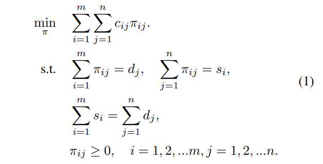
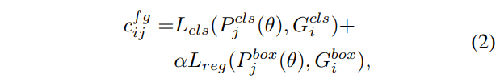
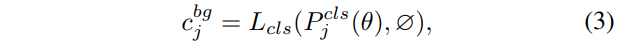

# OTA

- 題名: OTA: Optimal Transport Assignment for Object Detection
- 論文: [https://arxiv.org/abs/2103.14259](https://arxiv.org/abs/2103.14259)
- 公式実装
  - [https://github.com/Megvii-BaseDetection/OTA](https://github.com/Megvii-BaseDetection/OTA)

## 特徴

- ラベルの割り当てを、最適輸送(Optimal Transport)問題としてとく。
  - DETRの最適割当問題と似ているが少し異なる。
  - ペア間のロスだけでなく、需要と供給のバランスが指標として存在する。

- 最小化するのは以下である。
  - c_ijはiとjの輸送コスト
  - π_ijは割り当てられた流量
  - d_jはjに必要な需要量
  - s_iはiが提供可能な供給量
  - iはsupplierの番号であり、jはdemanderの番号である。

- この問題は多項式時間で解くことが可能であるが、Sinkhorn-Knopp法で高速に説くことができる。

- ラベル割り当てでは、1画像内のm個のgtをsupplier、n個のbboxをdemanderとする。
- 各gtをk単位の正ラベルを持つとし、（つまり、s_i=k | i=1,2,...,m）
- 各bboxを1単位のラベルを必要とする（すなわち d_j=1 | j=1,2,...,n）として見ることにする。
- gt_iからbbox_jに1単位の正ラベルを輸送するコストc_ijは、それらのclsロスとregロスの加重和として定義する。

- ここでθはモデルのパラメータセットであり、P^cls_jは予測されるclassスコア、P^box_jはbbox回帰である。
- L_clsはCE_lossであり、L_regはIoU-lossである。
- L_regには、Focal-loss、GIoU、SmoothL1 Lossに置換が可能。
- αはバランス用の係数である。

- また最適輸送問題は通常、総供給量と総需要量が等しい必要がある。
- そのため、bgラベルを供給するsupplierも用意し、その供給量 n - m k として定義する。
- また輸送コストは正ラベルとは別に以下のように定義する。

- L_clsはCE_lossとなる。

- 問題設定が完了したため、 off-the-shelf Sinkhorn-Knopp Iterationで最適輸送問題を解く。

- 最適化処理にはGPUで高速化可能な行列計算があるため、層トレーニング時間の増加は20%以下に収まり、推論時には全くコストは掛からない。

### Center Prior

- 各FPNから各gtと中心距離が近い(r x r)個のanchorを選択する。
- 選択に含まれないanchorには追加の定数コストを課す。

### Dynamic k Estimation

- OTAにおけるs_i=k（各gtが持つ正解ラベルの数）は一定値にすることができる。
- しかし、gtの大きさやgt同士のオクルージョンなどで可変させる方がより自然である。
- ただしこれらを直接モデル化することは困難であるため、予測されるbboxとgt間のIoUに基づき、kを推定する方法を提案する。

- 具体的には、各gtに対してのIoUについて、上記q個を選択し、それらのIoUを合計することでs_i=kとする。

- OTAの公式実装では、q=20となっているらしい。

## 参考

- 5分まとめ
  - https://zenn.dev/takoroy/articles/dd511b8f8710f3

- OTAの元論文
  - https://arxiv.org/abs/2103.14259

- OTAの解説
  - https://zenn.dev/takoroy/articles/dd511b8f8710f3

- 最適割当問題と最適輸送問題の違い
  - https://qiita.com/maskot1977/items/995588c4eedf2a7b3a01