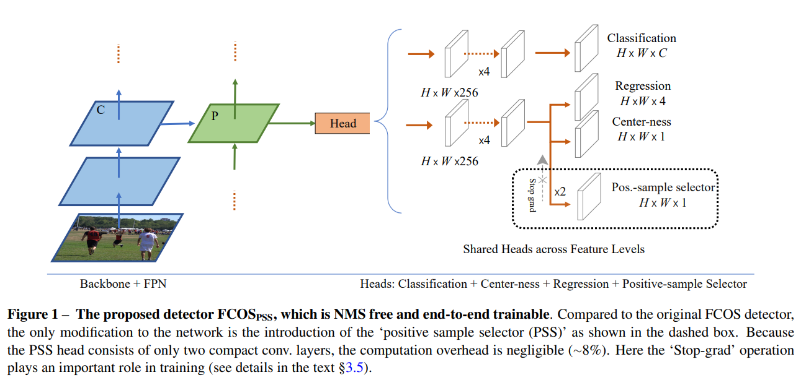
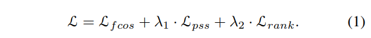
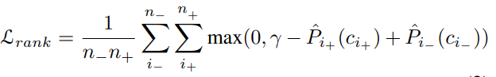

# PSS

- 題名: Object Detection Made Simpler by Eliminating Heuristic NMS
- 論文: [https://arxiv.org/abs/2101.11782](https://arxiv.org/abs/2101.11782)
- 公式実装
  - [https://github.com/damo-cv/FCOSPss](https://github.com/damo-cv/FCOSPss)

## 特徴

- NMSフリーなEnd-to-Endを実現するため導入されるヘッドをPSSヘッドと呼ぶ。
- また学習例によってはラベルに矛盾が生じ、学習が困難になるケースがあるため、stop-gradient operationを用いることで対処する。

- PSSのロス関数は以下のようにL_pssとL_rankを足し合わせたものとなる。
  - λ_2=0.25と設定した。

- L_fcosはFCOS論文と同様に、classificationのfocal loss、regressionのIoU-loss、centernessのlossを足し合わせたものである。

- L_pssはPSSのキーである。
- ヘッドの出力をσ(pss)とし、これはひとつのgtに対して1つだけ正例を活性化するようなセレクタである。
- これを使いσ(pss)とclassficationの推定結果σ(s)、centernessσ(ctr)を乗算した以下を定義する。

- このfocal lossをL_pssとして定義する。

- またL_rankは以下で定義される。

- ここでγは正のアンカーと負のアンカーのマージンを表すハイパーパラメータである。(詳細は未調査)