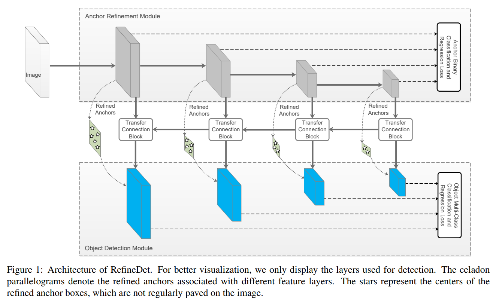

# RefineDet

- 題名: Single-Shot Refinement Neural Network for Object Detection
- 論文: [https://arxiv.org/abs/1711.06897](https://arxiv.org/abs/1711.06897)

## ポイント

- SSDの改良版。課題設定は、RetinaNetなどと同じ。

- ARM(Anchor Refinement Module)とODM(Object Detection Module)の２つのモジュールからなるアーキテクチャとした。

- 構成は2段階モデルと同じイメージを意識しているが、ネットワークが相互に接続されているため、1stageで学習できる点が異なる。

- ARMとODMの間はtransfer connection block(TCB)で接続する。

- 損失関数としては、ARM(classifier)とODM(classifer + regressor)の3つを考慮したものとなっている。

## 参考

- 概要レベル
  - https://metrica-tech.hatenablog.jp/entry/2019/07/20/000000_1
