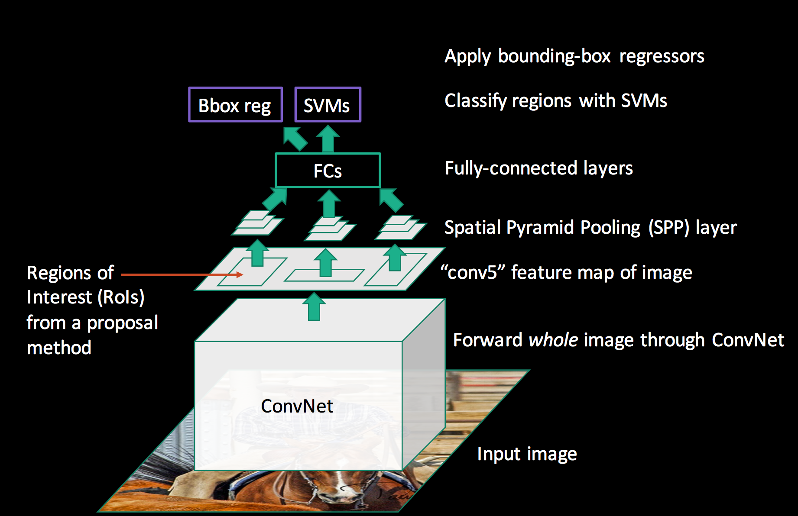
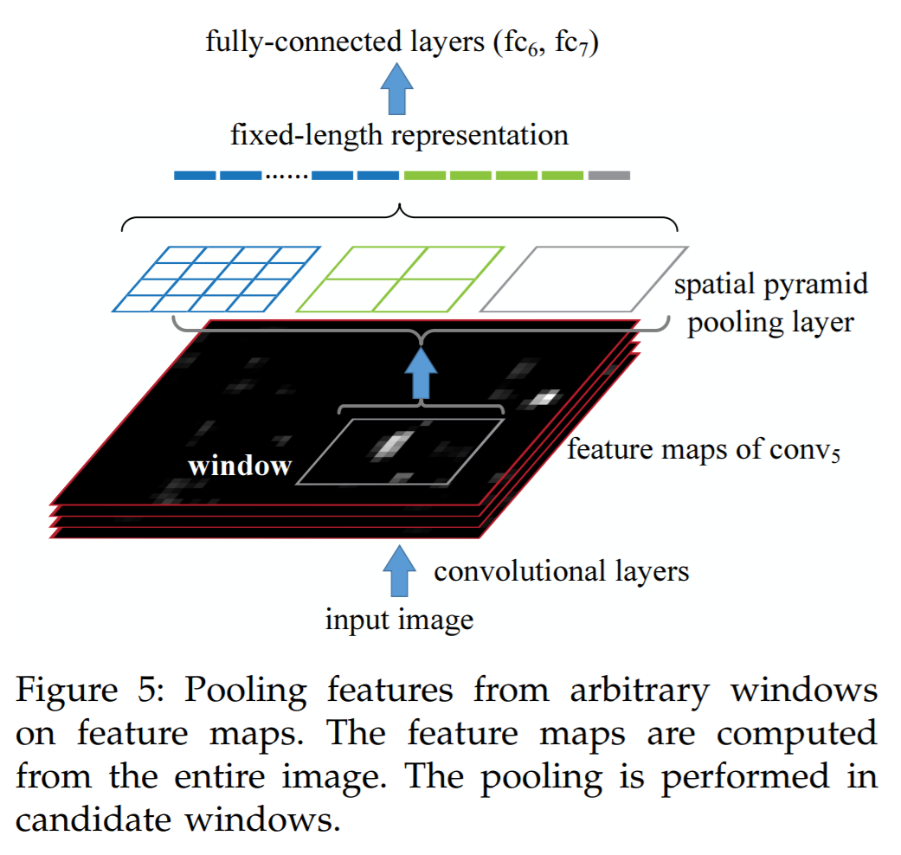

## SPP-net @2014.06

- 原論文
  - https://arxiv.org/pdf/1406.4729v4.pdf

- 概要
  - 入力画像に対する1回のCNNで画像内のすべてのregion proposalを処理できるようにした物体認識モデル。
  - R-CNNは最大で2000枚の画像をCNNで処理する必要があったが、これを1枚で可能とした。
  - 入力画像のregion proposalに対応する、出力層の特徴量マップを使い、これをSPP(spatial pyramid pooling)で固定長の特徴量に変換する。
  - その後は、R-CNNと同様にone-class SVMとbownding boxの回帰モデルで、処理をする。

  

  - SPP(spatial pyramid pooling)部分の詳細は下記。

  
  
  - CNN(AlexNet等、いくつか種類あり)のpre-trainingをR-CNNと同様に行うが、パラメータを更新するのは、SPP以降のみとした。
    - Fast R-CNNの論文では、CNNが多層ではない場合はこれで十分だが、多層の場合はすべてのパラメータをfine-tuningした方がよいと言及している。
  - R-CNNと異なり画像のリサイズ等は不要で処理が可能。
  - region proposalの領域は、出力層でつぶれない程度に大きさに下限が設けられている。

- 手順
  - 原論文参照。