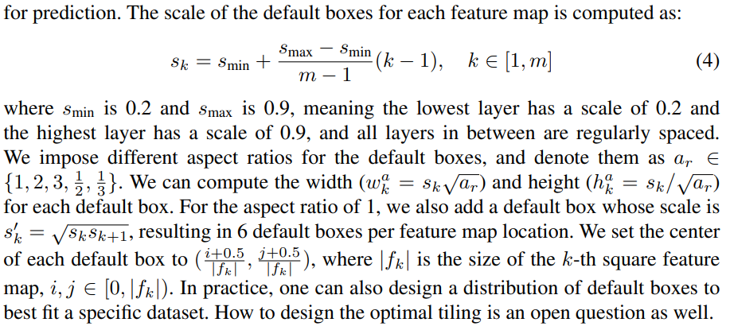
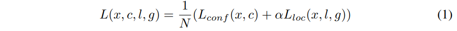
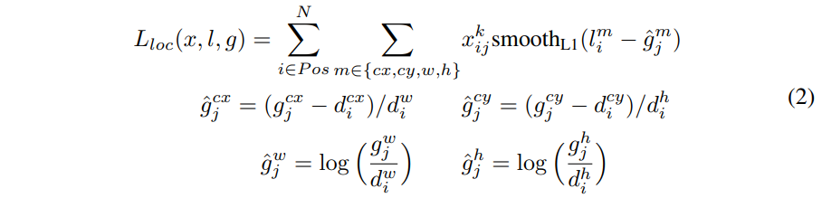
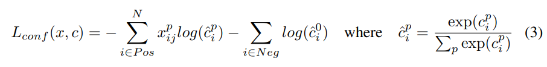

## SSD

- 原論文
  - https://arxiv.org/pdf/1512.02325.pdf

- 概要
  - YOLOと異なり、ベースのCNNの出力層ではなく、様々な解像度の特徴量マップを使用する。
    - VGG16の場合、conv4_3を使用。この特徴量マップは元画像が300x300の場合、38x38となる。
    - その後、VGG16のconv5_3まで処理し、Convを2層重ねて、これも特徴量マップとして使う。
    - あとはその後に2層重ねて、特徴量マップを抽出して、これを繰り返し、合計６層からの特徴量マップを使う。
    - この追加する層をextra layerと呼んでいる。

  

  - 特徴量マップの層毎にdefault boxというbounding boxの候補を考える。
  - default boxの数は層毎に以下のように違うので注意が必要。
    - VGG16の場合、以下で合計8732個のdefault boxとなる。
      - (38,38, 512) ... 4個, 38x38x4で5776個のdefault box
      - (19,19,1024) ... 6個, 19x19x6で2166個のdefault box
      - (10,10, 512) ... 6個, 10x10x6で 600個のdefault box
      - ( 5, 5, 256) ... 6個,  5x 5x4で 150個のdefault box
      - ( 3, 3, 256) ... 4個,  3x 3x4で  36個のdefault box
      - ( 1, 1, 256) ... 4個,  1x 1x4で   4個のdefault box

  - 各default boxについて正解bounding boxまでのoffset(localization)と、クラス数分の信頼度(confidence)を計算する。
    - 各特徴量マップ単位に、localization用のconvとconfidence用のconvを接続する。
      - 普通の3x3のconvでlocalization用の出力チャンネル数が、default box数 x 4、confidence用の出力チャンネル数がdefault box数 x クラス数となる。
      - confidence側は信頼度を連続値として推定するのでこちらもregressorになる。
    - YOLOは、boxの信頼度と各クラス確率を独立に推定していた。
    - SSDは、box毎にクラス確率を持っている点も異なる。

  - default boxは深い部分ほど大きくなるよう設計されている。
    - wkとhkは元画像を1.0とした場合の相対的なwidthとheightとなる。
    - つまり300x300の場合で、一番深いレイヤによるdefault boxは、ar=1の時で270x270のサイズとなるイメージ。

  

  - ロス関数は、localization lossとconfidence lossの線形和である。
    - 最終的なロス関数
    

    - localizationのロス関数は、Faster R-CNNと同様の下式。

    

    - confidence lossは、softmax lossとなる。

    
  
  - Hard negative mining
    - box数はかなり多いため、そのまま実行すると負例がとても大規模となる。
    - そのため、confidence lossを降順にソートして、上位から正例：負例が1:3となるよう抽出。
      - より負例らしいものを負例として扱う。

- 実装例
  - pytorch公式
    - https://github.com/pytorch/vision/blob/main/torchvision/models/detection/ssd.py

## 参考

- SSDの解説は@xu1718191411さんのQiita記事がもっとも丁寧
  - 物体検出SSD詳しく紹介
    - https://qiita.com/xu1718191411/items/6ffdd2a65329b5b11704
    - https://qiita.com/xu1718191411/items/997190c6183114fcb343
    - https://qiita.com/xu1718191411/items/442e58f24e6608b6173c
    - https://qiita.com/xu1718191411/items/56002e07fe7618aef1d6
    - https://qiita.com/xu1718191411/items/cac5dd4e6d60038aaffb