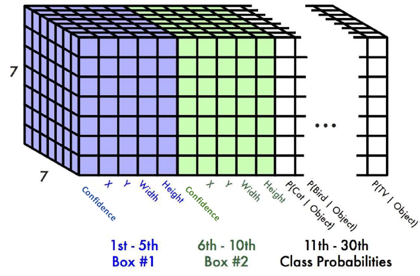
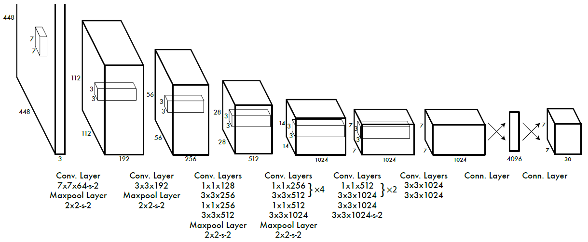
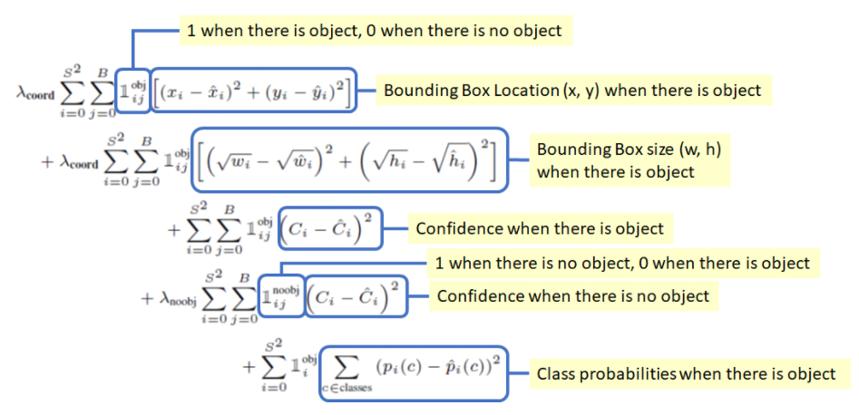

## YOLO

- 原論文
  - https://arxiv.org/pdf/1506.02640.pdf

- 概要
  - Faster R-CNNまではlocalizationとclassificationするモデルが別々であった。
  - それを一つのモデルで推定可能とした。
  - 以下がそのフローである。
    - 画像全体をSxSのグリッドで分割(論文では、S=7)。
    - グリッド毎にB個(論文では、B=2)のbounding boxがあるとして、その中心座標x,yとw,hと信頼度を以下で求める。
      - x,yはグリッド境界を基準とした位置
      - w,hは画像全体に対する相対値
      - 信頼度は、ground truthとの差
    - 物体のクラス数C個分(論文では、C=20)の確率値もこのグリッド単位で求める。
    - 信頼度と各確率値の掛け算でbounding box毎の各クラスの信頼度が得られる。
  - これらを同じCNNモデル出力のchannelとして以下のように表現する。

  

  - これを出力するCNNモデルには以下のようなものが使用される。

  

  - 出力channelには複数の指標が混ざっているため、ロス関数は以下のような工夫がされている。

  

  - 最終的には、信頼度を元にNMSで重複を削除する。
  - 1つのグリッドに対して2つのboundingboxと1つのクラスしか予測できないため、小さい物体などが複数ある場合には検出できない。
  - また速度優先であるため、Faster R-CNNより識別性能が劣る。

- 実装
  - 著者実装はDarkNet(Cライブラリ)となる。
    - https://pjreddie.com/darknet/yolo/
  - 理解のための非公式のpytorch実装はこちらを参照。
    - https://github.com/motokimura/yolo_v1_pytorch/blob/master/darknet.py
    - 最後の2つのconv3x3畳み込みがない点、全結合がglobal average poolingとなり、Fully Convolutionになっている点が違うように見える。

## 参考

- 後だしだが以下は分かりやすい。
  - https://kikaben.com/yolov1/

- YOLOv1の良さげなnotebook
  - https://www.renom.jp/ja/notebooks/tutorial/image_processing/yolo/notebook.html
