# YOLOF

- 題名: You Only Look One-level Feature
- 論文: [https://arxiv.org/abs/2103.09460](https://arxiv.org/abs/2103.09460)
- 公式実装
  - [https://github.com/megvii-model/YOLOF](https://github.com/megvii-model/YOLOF)

## 概要

- FPNの本質的な成功はマルチスケールの特徴量ではなく分割統治法に起因している。
- そのため、より最適化な手法として１レベルの特徴量マップのみを用いた手法を提案する。
- これを実現するために、Dilated EncoderとUniform Matchingという手法を提案する。

## 特徴

### FPNの利点の影響を調査

- FPNの利点は以下２点である。
  - マルチスケールの特徴量融合
  - 分割統治法

- このどちらが優位かを調査するために、RetinaNetの特徴量融合と分割統治機能を分離して実験をする。
  - MiMo: Multiple-in-Multiple-out
  - SiMo: Single-in-Multiple-out
  - MiSo: Multiple-in-Single-out
  - SiSo: Single-in-Multiple-out

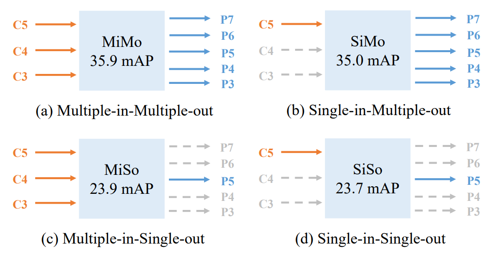

- MiMoとSiMoの差はわずかであるが、MiSoとSiSoはMiMoより大幅に性能が低下した。
- これは、特徴量融合よりも分割統治機能の方がより物体検出に効果があることを示唆している。
- つまり、特徴量としてはC5 featureは十分なコンテキストを持っている。
  - C5 featureは、最も深い低解像の特徴量マップである。

- このことからYOLOFではC5 featureのみを用いた物体検知手法を提案する。
- SiSoとMiSoの性能劣化を補うために、より適切なエンコーダ(ネック部)を設計し、様々なスケールのオブジェクトのコンテキストを抽出する。
- また単一特徴量マップにおける疎な正解のanchor boxを見つけ出すimbalanceな問題を解くために、Uniform Matchingメカニズムを提案する。

- DETRも単一特徴量マップで成功しているが、収束に時間がかかる。YOLOFは収束が早く改良がしやすい。

### SiSoの問題点

- SiSoの問題点
  - C5 featureのreceptive fieldが限られている。
  - 正しいanchor boxが疎な状態となるため。(?)
    - HNMとかで解決しない？

### Dilated Encoder

- receptive fieldを広げるための改良。4回のdilated convolutionでreceptive fieldを拡大する。
  - まず先頭のconv1x1でチャンネルを512-dに圧縮する
  - 次にconv3x3でsemantic-contextを洗練する(FPNと同様)
  - その後、異なる拡張率のdilated convolutionを残差ブロック付きで４回実施する。
    - 残差ブロックのbottleneckは縮小率4で構成する。
  - Residual Blocksは、Conv+BN+ReLUだが、ProjectorはConv+BNのようだ。

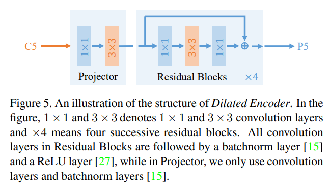

### Imbalance Problem

- RetinaNetでは、anchorとground truthとのmax IoUが0.5より大きい場合に正例としている。
  - 複数のground truthに割り当たるanchorはない。(最大の方に割り当たる)
- これをMax-IoUマッチングと呼ぶ。
- RetinaNetなどの場合、anchor boxは複数の解像度レベルでそれぞれ密に定義されるため、ground truthに対して十分な正例のanchor boxを見つけることができる。
- 一方、今回のように特徴量マップのレベルが単一である場合、anchor boxが100kから5kなど大幅に減少するため疎となる。
- そのため、各ground truthに対して正例がまばらに割り当たる。
- これにより、大きなground truthに対して正例が多くなり、小さなground truthに対しては正例が少なくなる。
- そのため、学習時に大きい物体が優先されることが問題となる。

### Uniform Matching

- 各ground truthに最も近い(近いとは？IoUか？)k個のanchorを正例とする。
  - つまり複数のground truthに割り当たってもいいということ？？
- またmax-IoUマッチングに従い、大きなIoU(>0.7)の負例と小さなIoU(<0.15)の正例は無視するよう閾値を設定する。

### backbone

- ResNetおよびResNeXtを用いる。
  - より具体的には、ResNet-50, ResNet-101, ResNeXt-101である。
- すべてのモデルはImageNetでpre-trainingする。

### head(decoder)

- head部はRetinaNet同様、class subnetとbox subnetを使用する。
- ただし、DETRにならい、２つのheadの層数を異ならせる。
  - box subnetは4つの畳み込みと、それに続くBN+ReLUを用いる。
  - class subnetはそれを2つの畳み込みとする。

- もう一つ、box subnetの各anchor boxに対して、objectness予測を追加する。

- 最終的な分類スコアは、class subnetとobjectnessの乗算により計算する。

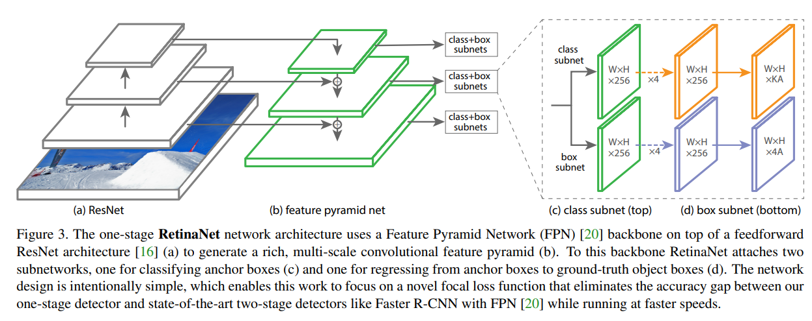

### architecture overall

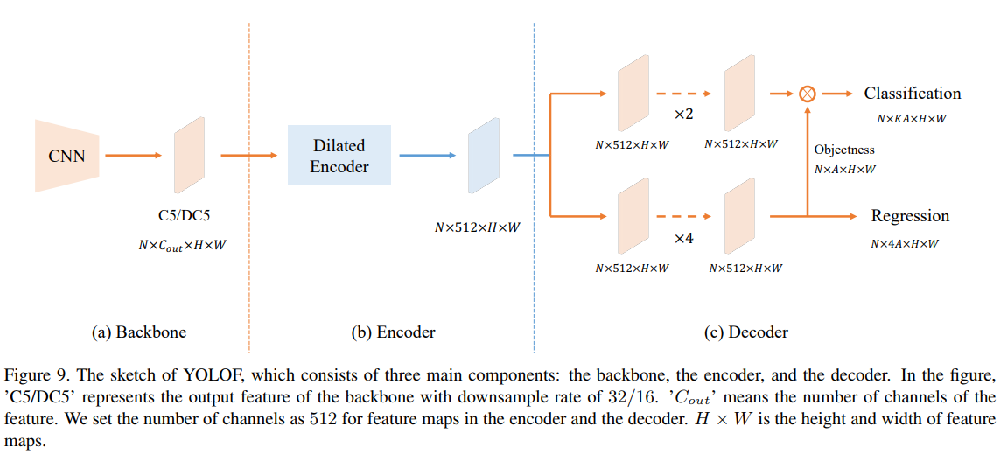

### random shift

- YOLOFではanchor boxが疎であるため、ground truthとのマッチングが難しい。
- この問題を回避するために画像にランダムシフト処理を実施する。
  - 画像を左右上下に32画素ずつランダムシフトする

### restriction on the anchors' center's

- 1レベル特徴量を用いる場合、アンカーの中心の移動量に制限を設けることも最終的な分類に有用であることが分かった。
- すべてのアンカーについて、中心のずれが32ピクセル以下でなければならないという制約を追加した。

### training

- YOLOFは8つのGPUで同期学習する。バッチサイズは64画像(1GPUあたり8画像)とする。

### inference

- NMSを実施する。閾値はIoU=0.6とする。
- その他の設定については、RetinaNetを参考とする。

### YOLOv4との比較用の変更

- エンコーダの拡張残差ブロックの数を4から8に増加。
- 拡張残差ブロックのダイレーションは、実験結果に従って調整。
  - その結果、[1, 2, 3, 4, 5, 6, 7, 8]のダイレーションが最も良い結果
- になることがわかりました。次に、YOLOv4に従い、そのデータ拡張を採用。
- CSPDarkNet-53をバックボーンとして、すべてのバッチ正規化層をその synchronized counterpartに置き換え(?)
- ReLU層の代わりにLeakyReLUをエンコーダとデコーダで適用。
- YOLOF-DC5はYOLOFよりも良い結果であるため、YOLOF-DC5をベースラインモデルとして使用。
- モデル全体の初期学習率を0.04に設定する。
- 最終的なモデルの学習には、3段階の学習を採用する。
  - まず、YOLOF-DC5を「9×」スケジュールで学習させる
  - 次にネガティブアンカーの無視閾値を0.75から0.8に上げ、前モデルに基づく「3×」スケジュールを学習させる
    - このフェーズで0.5mAPのゲインが得られる
  - 最後に[47]のレシピに従って別の「3×」スケジュールを学習させる。
  - 最終結果は、12個のチェックポイントを平均化することで得られるSWAモデルによるものです
    - SWAモデルは約1mAPの改善をもたらします

## 実験結果

- RetinaNetとの比較
  - RetinaNetはYOLOFと設定を合わせるため、GIoU, GN(Group Normalization), objectnessを導入したものを(+)記号として記載する。
  - YOLOFは、RetinaNetと同等性能で高い速度を達成している。

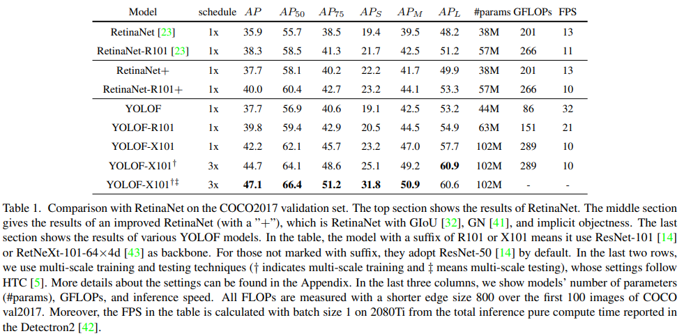

- DETRとの比較
  - DETRは大きい物体に強く、YOLOFは小さい物体に強い。
  - 推論速度はYOLOFが少し速く、学習時の収束は圧倒的にYOLOFが少ない。

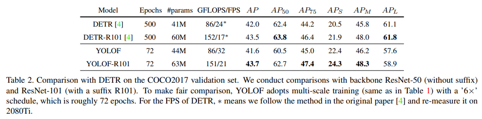

- YOLOv4との比較
  - v4は様々なノウハウを組み合わせて調整されているため、ベースラインを目的としたYOLOFと厳密に比較が難しい。
  - ただし比較のため、ある程度カスタマイズしたYOLOF-DC5を作成した。
  - YOLOF-DC5は、13%高速に推論でき、総合性能もわずかに向上している。
  - 小さい物体はv4より劣り(-2.7 mAP)、大きい物体は良い結果となった(+7.1 mAP)。

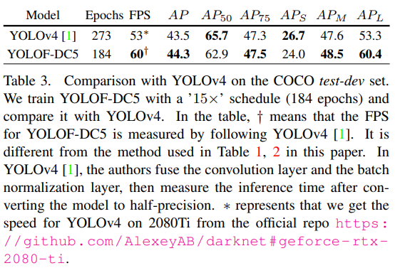

## Ablation Experiments

### ResBlocksの数

- 4個を選択。増やす程よいがバランスをとった。

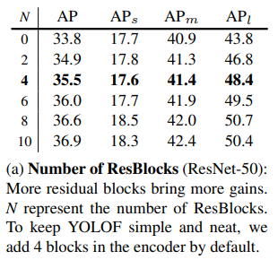

### dilations setting

- 2,4,6,8を採用。

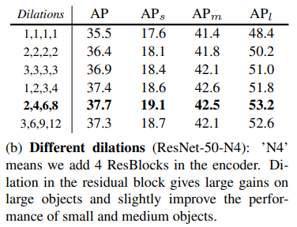

### shortcutの有無

- shortcutがない場合、性能が低下する。

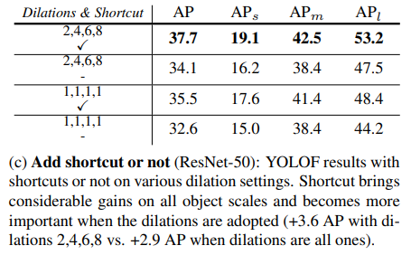

### Uniform Matching

- k=4で性能は頭打ちとなっている。

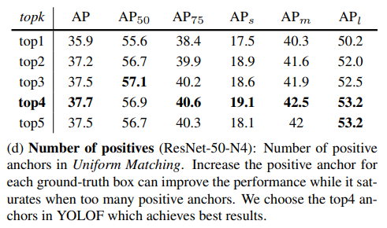

### other matchings

- ATSSは単一スケール特徴量を使う場合は、topk=15が最適であった。
- しかしそのATSSよりもUniform Matchingが優れている。
- またHungarian MatchingはUniform Matchingのtopk=1と同程度である。

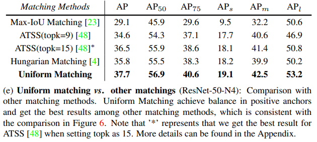

### Number of Anchors

- RetinaNetでは、それぞれ322～5122の面積を持つ複数のレベル特徴（P3～P7）からアンカーが生成
- 各レベル特徴において以下のアンカーを敷き詰める。
  - サイズ｛2^0 , 2^(1/3) , 2^(2/3)｝
  - アスペクト比｛0.5, 1, 2｝
- 一方、YOLOFでは、アンカーを配置するのは1レベルの特徴量のみ。
- そこで、全ての物体のスケールをカバーするために以下とする。
  - 1つの特徴量マップに面積{322 , 642 , 1282 , 2562 , 5122}、サイズ{1}、縦横比{1}のアンカーを追加
  - 各位置に5個のアンカーを配置
- さらに、YOLOFにおいて、アンカーを多くした場合の影響を調査する。
  - RetinaNetにならって、以下を追加し、各位置に45個のアンカーを生成
    - 異なるサイズ（{2 0 , 2 1/3 , 2 2/3}）
    - 多くのアスペクト比（{0.5, 1, 2}）のした。
- 全ての結果を以下に示す。
  - アスペクト比を増やしてもYOLOFの性能は変わらない
  - サイズを増やすと性能が低下する

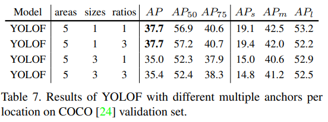

- したがって、YOLOFのアンカーはデフォルトで最小5個を追加することにした。

### YOLOF-DC5について

- YOLOFの性能を上げるために、C5特徴量よりも高分解能の特徴量マップ上で物体を検出する。
- DETRに従い、バックボーンの最終段にストライドを持たず、ダイレーションを持たせたバックボーンを構成。
- バックボーンの出力特徴量をDC5とし、ダウンサンプル率を16とする。
- 以下は、ResNet-50とResNet-101をバックボーンとしたCOCO val splitに対するYOLOF-DC5の結果である。
- YOLOF-DC5はオリジナルのYOLOFよりも高い性能を達成している。
- 一方、特徴の解像度がC5よりも大きいため、動作速度が低下していることがわかる。
- この結果を得るために、以下の変更をしている。
  - まず小さいアンカーを追加して1箇所あたり6アンカーとする
    - {16, 32, 64, 128, 256, 512}
  - 次にtopkを4から8に増やして正アンカーに対する無視閾値を0.15から0.1に変更する。
  - その他のパラメータは従来と同じである。

### エラーの分析

- 近年提案されたTIDEによる評価。
- TIDEはエラーを以下のように分類する。
  - Cls：分類エラー
  - Loc：定位エラー
  - Both：ClsとLocの両方エラー
  - Dupe：重複予測エラー
  - Bkg：背景エラー
  - Miss：欠損エラー
- 円グラフは各エラーの相対的な寄与度を、棒グラフはその絶対的な寄与度を示している。
- FPとFNはそれぞれfalse positiveとfalse negativeを意味する。

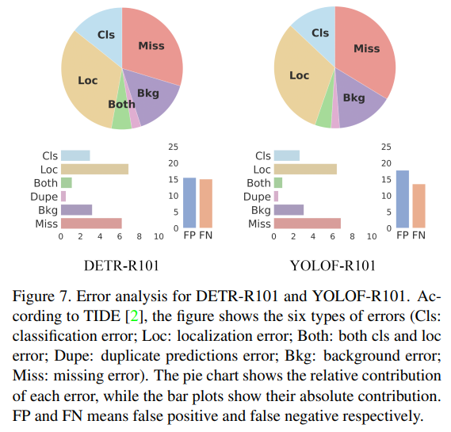

- 結果に対する分析
  - DETRはYOLOFよりもLoc Errorが大きく、これは回帰メカニズムに関係していると考えられる。
  - DETRはオブジェクトをアンカーフリーで回帰し、画像内のグローバルな位置を予測するため、定位が難しい。
  - 一方、YOLOFはあらかじめ定義されたアンカーに依存するため、DETRよりも高い欠損エラーがある。
  - YOLOFのアンカーはまばらであり、推論段階での柔軟性が十分でない。
  - 直感的には、ground truthの近くにあらかじめ定義されたanchorが存在しない状況がある。
  - したがって、YOLOFにアンカーフリー機構を導入することで、この問題を軽減できる可能性があり、今後の課題である。

## 参考

- 全編を読んだ後に気づいたけど、こちらに結構まとまっている。
  - https://www.slideshare.net/ren4yu/you-only-look-onelevel-feature/ren4yu/you-only-look-onelevel-feature
