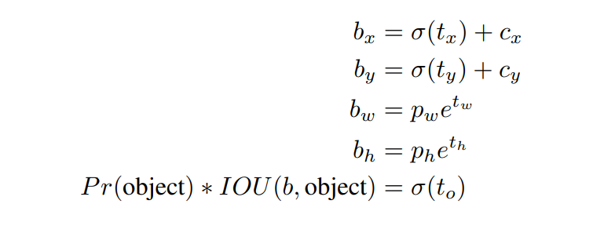
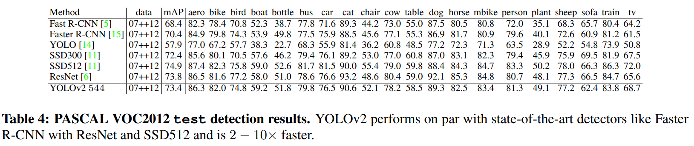
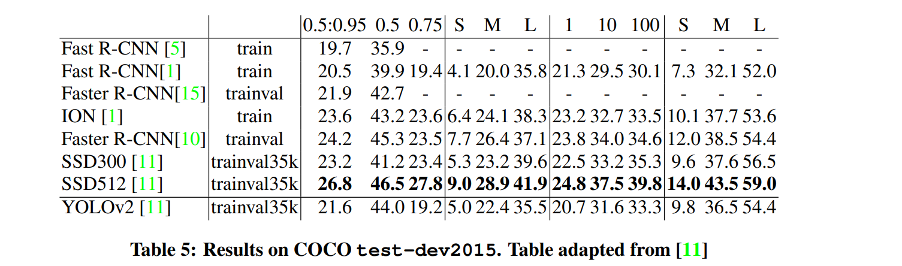
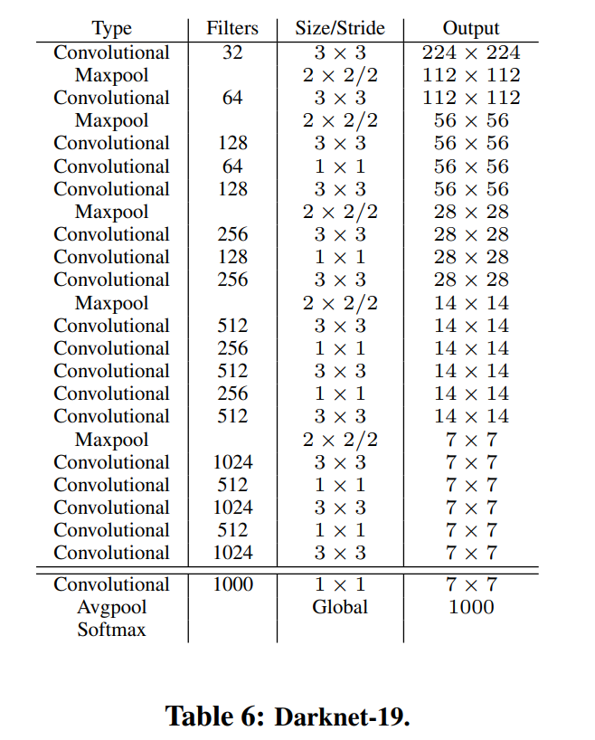
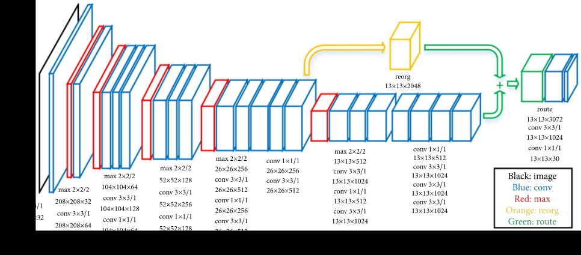

# YOLOv2(YOLO9000)

- 題名: YOLO9000: Better, Faster, Stronger
- 論文: [https://arxiv.org/abs/1612.08242](https://arxiv.org/abs/1612.08242)

## 概要

- YOLOに対して以下の改良を加えています。
  - batch normalizationの導入
  - 高解像化(224x224)
  - anchor boxの導入
  - パススルー層の追加(高解像特徴量の使用)

## 高解像度学習

- v1では、224x224で事前学習していました。
- v2では、448x448のImageNetのフル解像度で学習しています。

## anchor box導入

- YOLOでは、bounding boxの座標を直接求めていた。
- YOLOv2ではその代わりにanchor boxを用い、anchor boxと正解のずれを学習する。
  - Faster R-CNNなどのRPNと同様に。

### 高解像向けの調整

- backboneのネットワークからpoolingを一つ削除し、最終が奇数となるように416x416の入力に変更。
- これにより、特徴量マップは13x13となる。

### anchor boxの導入

- anchor box毎にクラスとobjectnessを予測する。
  - objectnessはYOLOv1でいうところのconfidenceか?
- objectness予測は、ground truthとanchor boxのIoUを予測する。
- クラス予測は、objectがあると仮定した場合の条件付き確率となる。
- anchor boxをk個とすると、最終出力を以下のチャンネル数となるように構成

### anchor boxの決定方法

- v1では手動で個数を選択していたが、今回はk-meansクラスタリングで個数を検討した。
- またクラスタリングには距離指標として以下を用いた。

- centroidは図心のことであるが、この式における意味は論文中に説明がない。
  - centroidはクラスタのことみたいだ。
  - 普通はユークリッド距離をk-meansの距離として使うが、1-IoUを使うところがポイントらしい。
  - クラスタ取るときのIoUとはなんぞや？
    - 中心をあわせてIoU計算するのかな。
    - chainer実装例によればその認識で合っていそう。

- 結果として、モデルの複雑さと再現率のトレードオフとしてk=5を選択。
  
### bounding boxの位置予測

- Faster R-CNNのRPNでは、bounding boxの回帰式に制約がない。
- そのため、どの特徴量マップの点におけるanchor boxでも入力画像の任意の場所に回帰させることができる。
- これをYOLOv2で行うと学習が安定しないなどの問題があったため、制約をつけ、以下のtx, ty, tw, th, toを予測する式とした。

- cx, cyはセルの左上座標で、そこからの相対位置としてbounding boxの中心座標bx,byを計算する。
- sigmoidへの入力tx,tyを予測することで、0～1に限定し、セル内に収まるようにする。

- また、pw,phはanchor boxの幅、高さであり、exp(tw), exp(th)とすることで、スケールを0から無限大にしてtw,thを推定する。

- またobjectness推定のためにはsigmoidにtoを入力した値を使用する。

- その際の正解は、Pr(objectness)とIoU(truth,pred)の掛け算を使用する。
  - PrとIoUの掛け算なので、合計の信頼度かな。

## パススルー層の追加

- また、最後から２番目の層をパススルー層として使い、細かい粒度の特徴を使用できるようにする。
- より細かい物体検知のために高解像度特徴量を使う。
- 最終層は13x13だが、この一つ前の26x26x512の特徴量マップを使う。
- 4倍の位置情報をチャネル方向に変形することで、13x13x2048の特徴量に変換し、元の13x13の特徴量に連結する。
  
## マルチスケール学習

- YOLOv2は、convとpoolのみで構成されるため、様々なサイズの入力画像に対応できる。
- モデルは32倍のダウンサンプルのため、32の倍数の{320, 352, ..., 608}からサイズを選択する。

## 評価

- VOC2012とCOCOを使って評価。

## アーキテクチャ

### backbone

- Darknet-19と呼ぶ独自実装。
- 出力サイズは、imagenetをベースに記載されている。

- トレーニングの際は224x224で最初トレーニングをし、448x448でパラメータを微調整する。

### for Detection

- object detection向けには以下の変更を実施する。
  - 最後のconvolution以降を削除。
  - conv3x3 1024-dを2層重ねる。
  - パススルー層とconcatする。
  - もう一度conv3x3を実施。
  - その後、必要なチャンネル数のconv1x1を実施。

- VOCの場合、5つのanchor box分の5つの座標情報予測をし、5つのbox分の20クラスあるので、出力チャンネルは以下の通り。
  - 5x5 + 5x20 = 125-d

## 実装例

- なつかしのchainer実装だと結構詳細にわかる。
  - https://github.com/leetenki/YOLOv2

  - dimension clusterはここ。
    - https://github.com/leetenki/YOLOv2/blob/master/dimension_cluster.py

## YOLO9000

- 大規模分類のために、階層的なオブジェクト判定を実施。

- WordNet(有向グラフ)からWordTreeに変換してそれを使う。

## 参考

- v2の解説。分かりやすい。特に座標軸については一番わかりやすいかも。
  - https://kikaben.com/yolov2/

- v1～v3の分かりやすい解説
  - https://deepsquare.jp/2020/09/yolo/

- v2のみについて。機械翻訳っぽい？
  - https://qiita.com/miyamotok0105/items/1aa653512dd4657401db

- 実装例
  - https://github.com/AlexeyAB/darknet

- 公式
  - https://pjreddie.com/darknet/yolov2/

- v3の話
  - https://pystyle.info/pytorch-yolov3/

- v2の解説としては結構詳しい。
  - https://qiita.com/exp/items/b485e90fc9a86131078c
