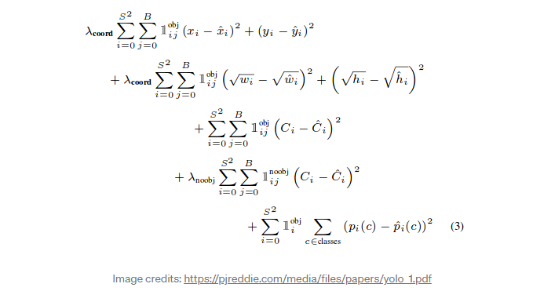
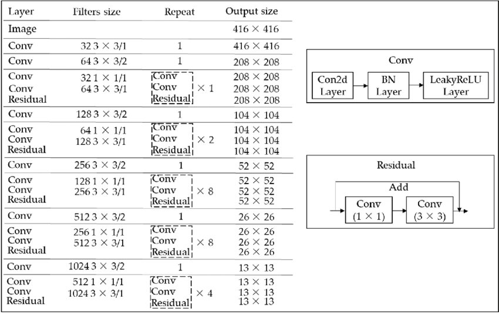
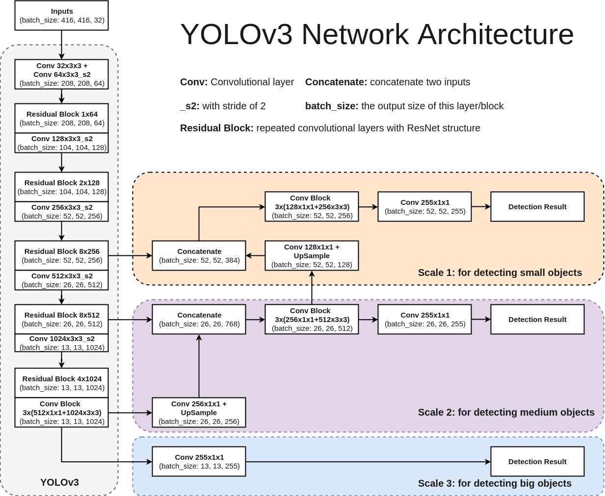
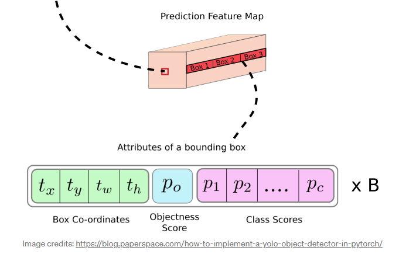

# YOLOv3

- 題名: YOLOv3: An Incremental Improvement
- 論文: [https://arxiv.org/abs/1804.02767](https://arxiv.org/abs/1804.02767)

## 概要

- backboneの多層化(darknet-53)
  - ResNetのskip-connectionなどを取り込み
- 特徴量マップのマルチ解像度対応
  - 最終層をUpsamplingして、backboneの途中のデータと連結。
  - その後、convを重ねる。
- anchor box数Kの増加
- ロス関数の変更(マルチラベル対応)
  - softmaxを削除し、誤差はCrossEntropyで算出。

## 特徴

### Darknet-53

- バックボーンをDarknet-19からDarknet-53に変更。
- より複雑なアーキテクチャとなり、YOLOv2より速度面では低下した。
- ただし、ResNetと同等精度で、高速となった。

### 特徴量マップのマルチ解像度対応

- FPNなどと同様の考え方で、特徴量の最終層をUpsamplingして、backboneの途中のデータと連結。
- その後、convを重ねて最終的な出力層を構成する。

### anchor box数の増加

- v2ではK=5であったが、K=9としてk-means法で選択した。
- それぞれ大きい順に、深い層(低解像度)から割り当てていく。

- v2に対してv3ではbox数がかなり増加する。
  - v2では416x416の画像に対して、13x13x5 = 845個のanchor box数であった。
  - v3では13x13x3 + 26x26x3 + 52x52x3 = 10,647個のanchor box数となる。

- これによりv2よりも処理速度の面で低下しています。

### ロス関数の変更

- YOLOv2までは(v1も)以下のような二乗誤差の線形和で表されていました。

- YOLOv3では、後半の３つの確率部分を二乗誤差ではなくCross Entropyに変更しています。

- 実際の学習においては、ground truthのbounding boxと最大となるanchor boxを正解として割り当てます。

### マルチラベル対応

- YOLOv2までは各クラスのsoftmaxを計算し、最大のクラスをbounding boxに含まれる物体とみなしていました。

- しかし、softmaxを使うということはクラスが相互に排他的であるという過程に基づくため、マルチラベルに対応できません。

- softmaxを使用せずに各クラスの確率値を予測することによって、マルチラベルに対応しています。

- この際、ある閾値より高いオブジェクトは検出として処理します。

## アーキテクチャ

### backbone

- conv層数が53個ある以下のような構造

### for detection

- 後半３つの解像度の特徴量マップを使用して物体検出を行う。

### head

- 最終層のチャンネル数は、(B x (5+C))であり、COCOの場合、B=3、C=80であるため、255となる。

- Bはanchor box数、Cはクラス数、5は4つの座標とオブジェクトconfidence(信頼度)となる。

## 参考

- 理論解説
  - https://towardsdatascience.com/yolo-v3-object-detection-53fb7d3bfe6b

- スクラッチ実装する場合はここを見るとよいかも
  - https://blog.paperspace.com/how-to-implement-a-yolo-object-detector-in-pytorch/

- 日本語であればこちら。著者の苦情についても書いてある。
  - https://kikaben.com/yolov3/#post-title

- YOLOv3を作ってみた
  - https://zenn.dev/opamp/articles/5198d6bf369b8e