# YOLOv4

- 題名: YOLOv4: Optimal Speed and Accuracy of Object Detection
- 論文: [https://arxiv.org/abs/2004.1093](https://arxiv.org/abs/2004.1093)

## 概要

- GPU１個で学習可能で、GPUでリアルタイム推論可能なモデルを提案。
- 例えば、1080 Tiや2080 TiのGPUを使用して、誰でも超高速で正確な物体検出器を学習させることができます。
- 近年の研究成果の中でより効果が高く計算コストが低いものを取り入れている。

## 特徴

### summary

- 以下のように近年や独自の工夫点を整理
  - 推論速度を落とさずに精度が上がる変更をBag of Freebiesと呼ぶ。
  - また推論速度に少し影響があるが精度が上がる変更をBag of Specialsと呼ぶ。

- それを様々な実験を実施し、以下の構成要素とした。

- 基本構造
  - backbone: CSPDarkNet53
  - neck: SPP and PAN
  - head: YOLOv3
- Backbone
  - Freebies
    - CutMix
    - Mosaic data augmentation
    - DropBlock regularization
    - Class label smoothing
  - Specials
    - Mish activation
    - CSP: Cross-stage partial connections
    - MiWRC: Multi-input weighted residual connections
- Detector
  - Freebies
    - CIoU-loss
    - CmBN
    - DropBlock regularization
    - Mosaic data augmentation
    - Self-Adversarial Training
    - Eliminate grid sensitivity
    - Using multiple anchors for a single ground truth
    - Cosine annealing scheduler
    - Optimal hyper parameters
    - Random training shapes
  - Specials
    - Mish activation
    - SPP-block
    - SAM-block
    - PAN: path-aggregation block
    - DIoU-NMS


### Darknet-53 (backbone original)

- バックボーンそのものは、DarkNet-53となり、YOLOv3で使われている。


### CSP: Cross stage partial connections

- Darknet-53にはResidualがあるため、ResNetの派生形とみなせる。
- CSPはResNet系に適用する場合も存在するため、以下のようなブロック構成で適用されていると考えられる。

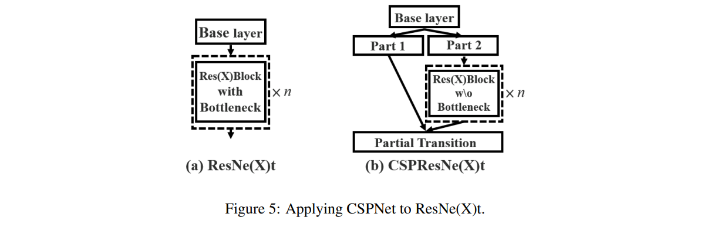

### MiWRC: Multi-input weighted residual connections

- BiFPN(EfficientDet)で実施されていた、複数の入力の重み付き和のことらしい。
  - EfficientDetでは、PANetの修正版としてBiFPNを提案しているので、PANetとの両立方法が不明だが...
  - backboneの工夫としているので、neckではなくbackboneでこれを実施している??

- 以下を参考にすると、ResNetの部分での加算時に重みづけ和をしていると考えられる。
  - https://jonathan-hui.medium.com/yolov4-c9901eaa8e61

### head部

- YOLOv3と同じものを用いる。

- 最終層のチャンネル数は、(B x (5+C))であり、COCOの場合、B=3、C=80であるため、255となる。

- Bはanchor box数、Cはクラス数、5は4つの座標とオブジェクトconfidence(信頼度)となる。


### CutMix

- Data Augmentationの手法。Cutout + Mixupの組み合わせ。
  - 論文はこちら
    - https://arxiv.org/abs/1905.04899

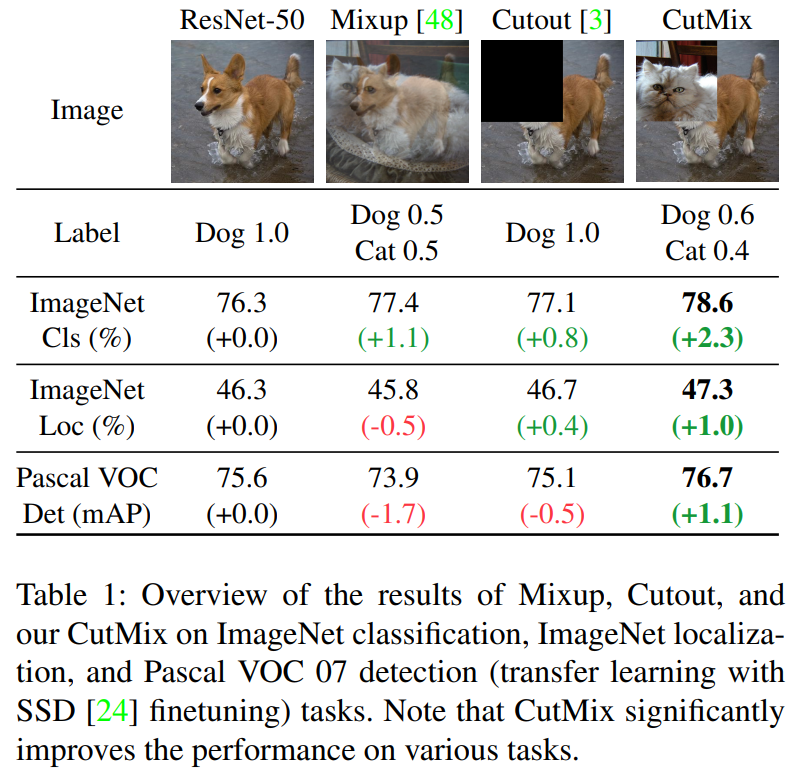

- ここに詳しい
  - https://qiita.com/wakame1367/items/82316feb7268e56c6161
  - Beta分布と書いてあるが、α=1のB(α,α)なので、一様分布としてよい。

- 貼り付ける場所は、元画像の場所から変更しないようだ。
  - アスペクト比が違う画像やサイズ違いはどう扱う？？

### Mosaic data augmentation

- Data Augmentationの手法。YOLOv4で提案された技術。

- CutMixは２つの画像であったが、Mosaicでは４つの画像を特定の比率で合成する。

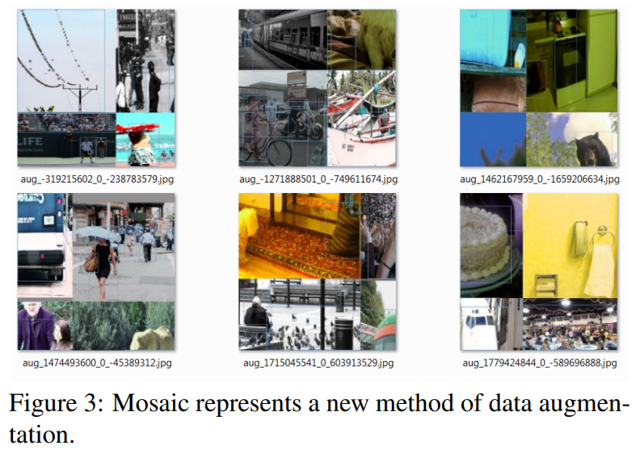

- 通常よりも小さいオブジェクトを識別できるようになる。

- また1画像に様々な要素が入るため、ミニバッチサイズを減らすことが可能。

- 具体的には
  - ４つの画像を固定にリサイズ(416x416など)して接続。
  - 中心を基準に固定サイズ(416x416)を切り出す。
  - リサイズは歪まないようにしている可能性が高い(たぶんpaddingしている)。
  - これを参考にした。
    - https://blog.roboflow.com/yolov4-data-augmentation/

- backboneに適用する場合、ラベルを面積で重みづけしているのかな？

### DropBlock

- Dropoutの改良版。
- Dropoutは、全結合層では有効だが、Convではあまり有効ではないという報告がありました。
- その理由として、空間的に隣り合った画素にコンテキストがあるためと考えられる。
  - 完全なランダムはコンテキストを無視するため。
- そのため、特徴量マップのブロック単位でDropさせる方式がDropBlockとなる。

- 論文
  - https://arxiv.org/abs/1810.12890

- 解説
  - https://qiita.com/tan-z-tan/items/adfcfa0cf1815520560c

### Label smoothing

- 推定する教師データを0,1ではなくノイズを混ぜる。
  - この場合は、たぶんsoftmaxなしのsigmoidで、確率値の回帰問題にするのかな？

- 具体的には、正解クラスで1となるところを0.7くらいにして、残り0.3をK個のクラスで均等に割る
  - 正解クラスは 0.7 + 0.3/K となる。
  - それ以外は 0.3/K となる。

### Mish

- 比較的新しい活性化関数を使用。

- 論文はこちら
  - https://arxiv.org/abs/1908.08681

### PANet

- 各解像度の特徴量の統合にはPANetを使用している。

- 詳細は、PANetの解説を参照。

- 以下の解説によると、PANetは、接続に加算が用いられているが、YOLOv4では加算の代わりにconcatenateで実装されている
  - https://jonathan-hui.medium.com/yolov4-c9901eaa8e61
  - これはDenseNetの思想に近い。

- イメージ図は以下。

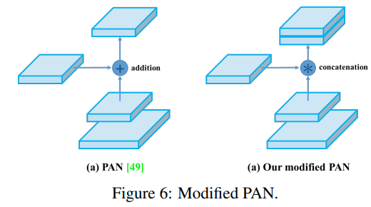

- それに加えて、すべてのレイヤの情報を要素毎の最大値計算で融合する？と書いてある。

### SPP

- SPPNetで用いられた最終的なPooling処理であるが、どのように適用しているのかわかりずらい。
  - SPPNetは2stageモデルであり、RPNにより領域提案されたbboxに対してSPPを計算。
  - それをFlattenにすると固定長になるため、後段の全結合層に渡す。

- YOLOv4は1stageモデルなので、領域提案はないはず。

- なので、特徴量マップ全体について、poolingしているのではと予想される。(strideは1だしね)

- 論文には、YOLOv3の設計に従ってとあるものの、YOLOv3の論文にはこの方法について記載がない...

- poolingのkernelサイズは、YOLOv3と同じであれば、k＝{1、5、9、13}の４パターンとなる。

- ここの解説では、上記と認識が合っているようだ。
  - https://jonathan-hui.medium.com/yolov4-c9901eaa8e61

### SAM (Spatial Attention Module)

- 一般的なSAMは以下の通り
  - SAMは入力する特徴量マップに対して、max poolingとaverage poolingをそれぞれ適用する。
  - その結果を畳み込み、sigmoid関数を用いて0.0～1.0の空間方向のアテンションを作成する。
  - アテンションはチャネル数1のものとなる。

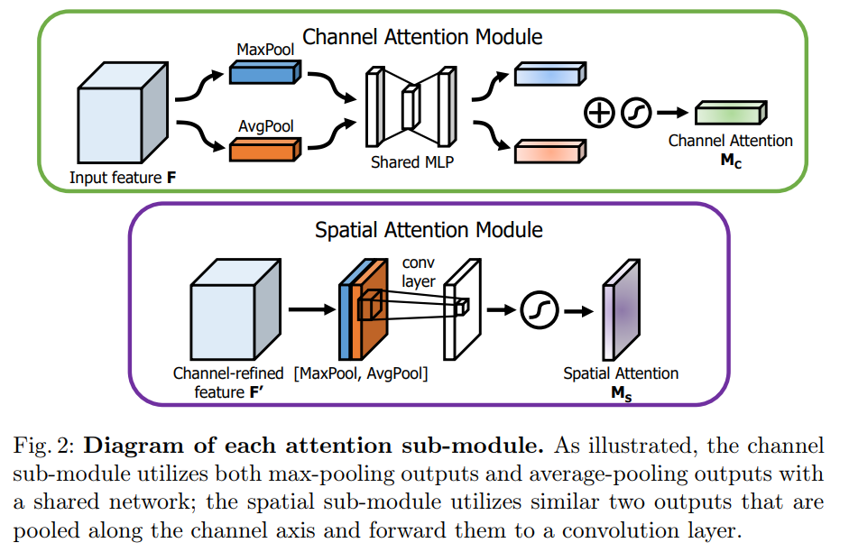

- これを入力マップに乗算することで処理をする。

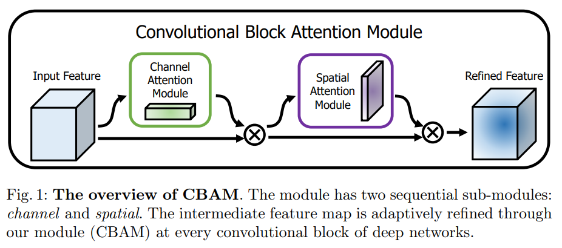

- これについての論文はこちら。
  - https://arxiv.org/pdf/1807.06521.pdf

- YOLOv4では、SAMのみを用い、加えてSAMをpoolingを使わないものに修正して利用する。

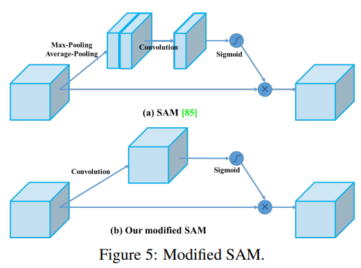

### CIoU-loss

- そもそもbounding boxのロス関数は、x,y,w,hのL1もしくはL2ノルムとなっていた。
- これは、IoUを改善するためにはマッチしておらず、直接IoUを向上させるようなロス関数を用いるべきという提案が近年出ている。
- 通常のIoUをロスとする場合、以下のような関数がロス関数となる。

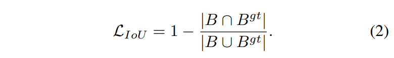

- しかしこの場合、重なってないものは常に同じロスとなる。
- 正解領域から遠いことが、ロス関数に反映されていないため、ロス関数により適切な更新をどうすべきかわからなくなる。

- これを解決するために、GIoUという方式がある。
- これはBとB_gtを含む最小のCというboxを定義して、以下のようにペナルティを計算する。

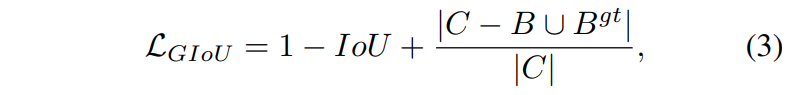

- しかしこれに従う場合、予測するbounding boxを広げて、以下のような戦略で学習される。
  - ground truthに重なるまで広げる。
  - その後、領域を縮小し、IoUを更新する。
- そのため、学習に多くの時間が必要である。

- このため、距離に応じたDistance-IoU Loss(DIoU-loss)をまず考える。

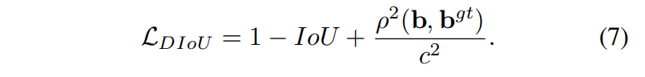

- ここでρ(b,bgt)は、それぞれのboxのユークリッド距離であり、cはCの対角線の長さである。
- これにより、中心の距離をロス関数に反映でき、高速に回帰が可能。
- またGIoUではIoUよりも劣化するケースがあったが、それも改善した。

- それに加え、よりよいbounding box回帰のために縦横比を考慮する。
  - 重なり面積、中心距離、縦横比の３つが幾何学要因として重要である。
  - DIoUはこのうち２つのみ考慮している。

- 以下がそのCIoUとなる。

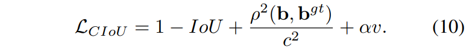

- ここでvは以下のようにアスペクト比から計算される値であり、(範囲は0～1)

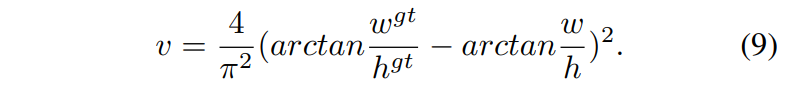

- αはIoUに応じて、アスペクト比に対する重みを調整する以下のようなパラメータである。
  - とりあえずIoUが正解から遠い場合より、近くなった場合にアスペクト比によるロスを考慮する割合が増える。

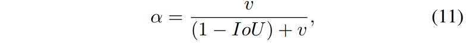

- これをYOLOv4で用いるが、提案している論文はこちらである。
  - https://arxiv.org/pdf/1911.08287.pdf

### CmBN: Cross mini-Batch Normalization

- CBNの改良版。CBNかCross Iteration Batch Normalizationで、以下の論文。
  - https://arxiv.org/pdf/2002.05712.pdf

- そもそもBNとは、ミニバッチ内で計算された統計量により、各層のactivationを標準化する。

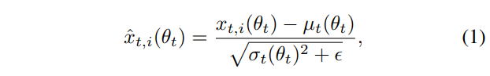

- ここでμ_tとσ_tはt番目のミニバッチで計算される平均と偏差である。

- この標準化されたxに対して最終的には、1次線形変換を通すことで表現力を向上する。
  - γとβは学習するパラメータである。

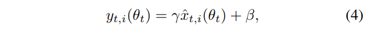

- そのため、バッチ内のサンプルが少ない場合うまく働かない場合がある。
  - 物体検知など高解像な入力や複雑なモデルを用いる場合、batch_size=1,2となることがある。

- その対策としてCBNでは、過去のバッチ(iteration)から安定的な平均・分散を求める。
  - 詳細はよくわかってないが、テイラー多項式を使った近似式となっている。
  - 複数の過去のiterationの情報を使って、現バッチの平均・偏差を求める。

  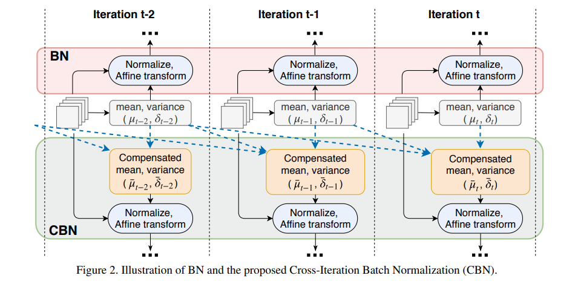

  - ロジックは、論文の A. Algorithm Outlineに記載されている疑似コードが分かりやすい。

  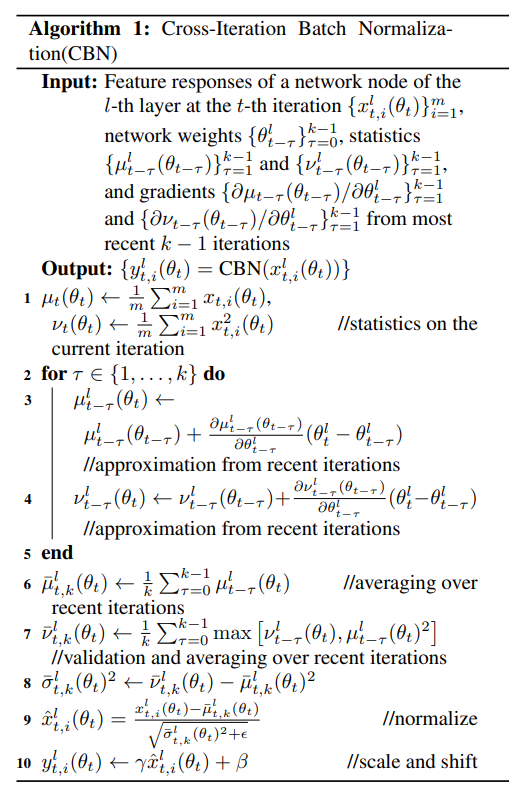

- CmBNはこの修正版だが説明は図しかないため、実装を見るしかなさそう。

```
CmBNは、1つのバッチ内のミニバッチ間でのみ統計量を収集する。
(This collects statistics only between mini-batches
within a single batch.)
```

- 論文の後半ではこう書いてあるので、どっち？となっている。

```
クロスミニバッチ正規化を使用して、単一のミニバッチ内の統計量を収集する代わりに、
バッチ全体の統計量を収集します。
(using Cross mini-Batch Normalization for collecting statistics inside the entire batch, 
instead of collecting statistics inside a single mini-batch)
```

### Self Adversarial Training

- 姿勢推定の以下の論文の技術。
  - https://arxiv.org/pdf/1707.02439.pdf

- GeneratorとDiscriminatorで構成される一般的な敵対的学習。

- Generator側が推定対象で、以下のロスで学習される。

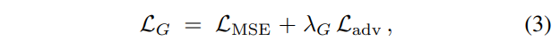

- L_mseは、通常の物体検知用のロス関数である（元論文がMSEを使っている）。

- L_advは、GeneratorとDiscriminatorの結果が同じになるよう学習するロスとなる。

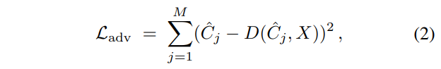

- Discriminatorは、Generatorの出力結果C^_j(元論文ではヒートマップ)と入力画像のconcatenateから、正解のC_jを出力するモデルである。

- また、Discriminatorの学習ロスは以下で定式化されている。
  - L_realは、ground truthの入力C_jと同じ出力をDiscriminatorが出すように学習する。
  - L_fakeは、Generatorによる入力C^_jと誤差が大きくなるような出力をDiscriminatorが出すように学習する。

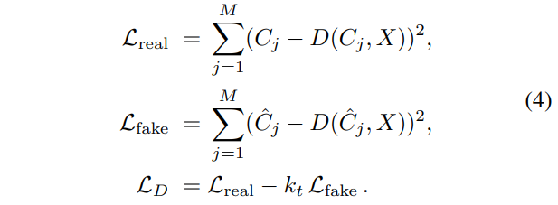

- これにより、GeneratorはDiscriminatorによる監視を受けながら学習することができる。

- 物体検知の場合、このCを何に設定するのかは調べる必要がある。
  - 元論文では姿勢推定のヒートマップなので。

- また、参考文献がないので、YOLOv4の論文では独自やり方をしている可能性がある。

- 論文を何回も読み返すと、分かってきたかも。
- おそらく、
  - 重みの代わりに入力画像を変更する。
  - 具体的には入力画像をパラメータとみなして通常のパラメータのように更新する。
  - そしてそれは誤差が大きくなるように更新する。
  - そうして生成された見かけは変わらない新しい画像を、学習データとして物体検知を学習する。

- これにより、Data Augmentationと同じ作用を得ることができる。

### Eliminate grid sensitivity

- YOLOv2で提案されていた手法を改良。

- YOLOv2では、sigmoidにより回帰する場所をgridの相対座標で求めていた。

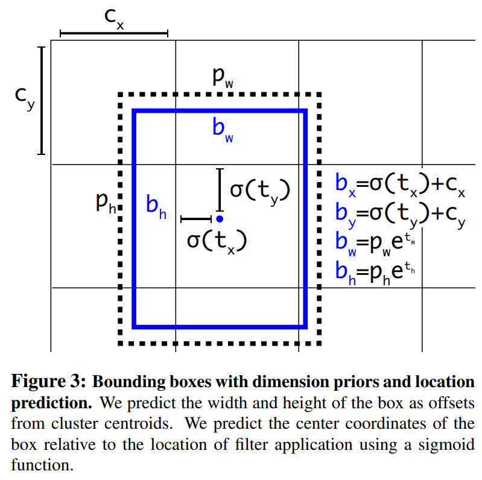

- この場合、グリッドの真上が正解の場合、tx, tyを正負の大きな値に学習する必要がある。

- そのため、sigmoidにscaling補正を実施する。
  - sigmoid * scale - (scale - 1) / 2

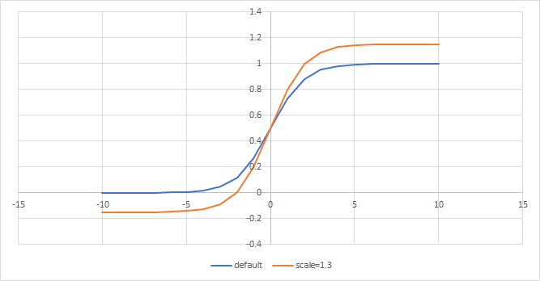

### Multiple anchors for a single ground truth

- anchor boxのうち、ground truthとのIoUが閾値を超えるものが複数あった場合、双方とも正解データとして使う。

### Cosine annealing scheduler

- learning rateを周期的に変化させる手法。

- pytorchなどにも実装されている。
  - https://pytorch.org/docs/stable/generated/torch.optim.lr_scheduler.CosineAnnealingLR.html


### Optimal Hyper parameters (Genetic algorithms)

- 学習の際、最初の10%の時間帯で最適なハイパーパラメータを選択するために遺伝的アルゴリズムを使用する。

- 以下が詳しい。
  - https://jonathan-hui.medium.com/yolov4-c9901eaa8e61
  ```
  Evolutionary Algorithmsは、教育的推測法である。適者生存の概念に従ったものである。例えば、ハイパーパラメータをランダムに100セット選択する。そして、それらを使って100個のモデルを学習する。その後、上位10個のモデルを選択する。選択された各モデルについて、そのオリジナルにしたがってわずかに変異させた10個のハイパーパラメータを作成する。そして、新しいハイパーパラメータでモデルを再トレーニングし、最も良いモデルを再度選択する。繰り返しているうちに、最適なハイパーパラメータのセットが見つかるはずです。あるいは、デフォルトのハイパーパラメータでスタートし、その後、変異を開始することもできます。論文からの引用です。
  ```

### Random training shapes (Dynamic mini-batch size)

- Random training shapesを用いた小解像度学習時にミニバッチサイズを自動的に増加させる。

- 解像度が小さい場合、メモリ上に乗せるデータを増やせるため。

### DIoU-NMS

- NMSをする際に、通常のIoUの代わりにDIoUを使用する。

## 実験結果

- 実時間で動作するモデルで最も精度がよい。
  - EfficientDetとは微々たる差にも見えるが

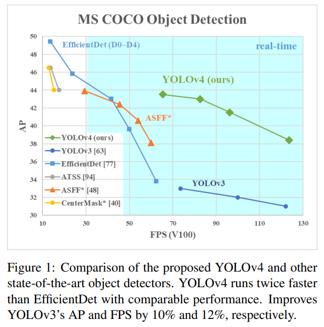

## 参考

- CutMixについて
  - https://arxiv.org/abs/1905.04899
  - https://qiita.com/wakame1367/items/82316feb7268e56c6161

- 概要は分かる。
  - https://kikaben.com/yolov4/#chapter-2.4
  - https://qiita.com/mshinoda88/items/c7e0967923e3ed47fee5#11-yolov4
  - https://qiita.com/hnishi/items/e1b84ecd4025fe4e5ccf

- 英語だけど最も詳しく解説がある。
  - https://jonathan-hui.medium.com/yolov4-c9901eaa8e61

- カスタムする場合は個々も参考になる。
  - https://blog.roboflow.com/training-yolov4-on-a-custom-dataset/