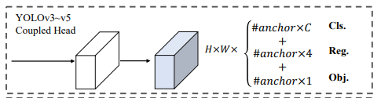
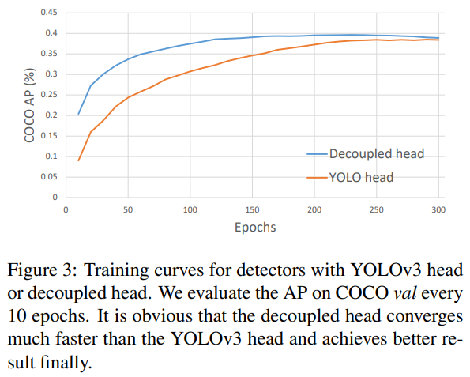
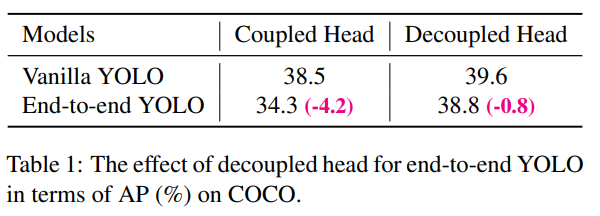
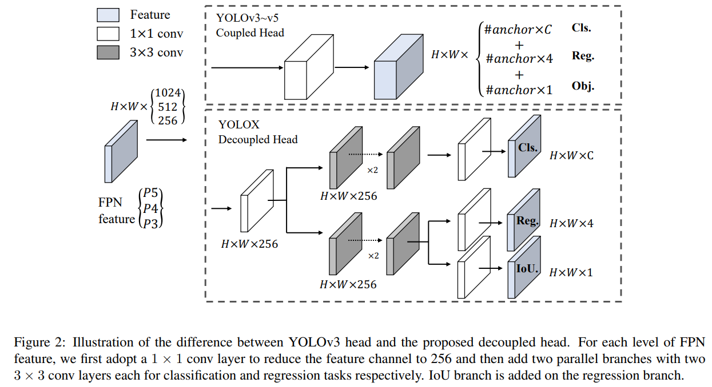
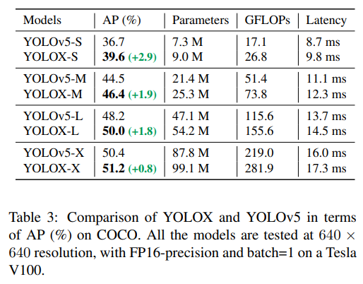
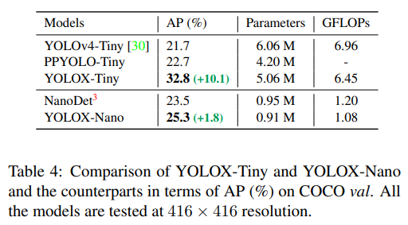
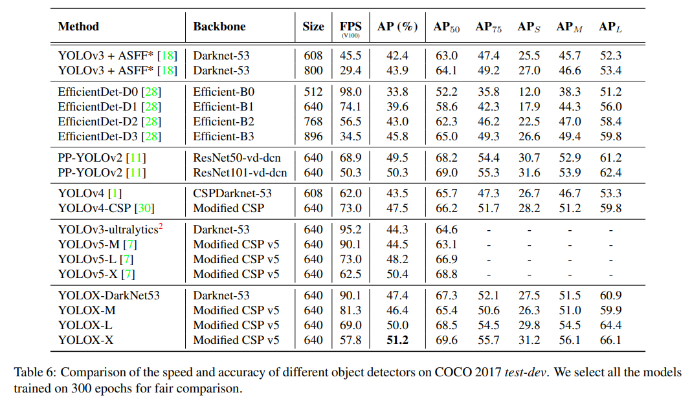

# YOLOX

- 題名: YOLOX: Exceeding YOLO Series in 2021
- 論文: [https://arxiv.org/abs/2107.08430](https://arxiv.org/abs/2107.08430)
- 公式実装
  - [https://github.com/Megvii-BaseDetection/YOLOX](https://github.com/Megvii-BaseDetection/YOLOX)

## 概要

- YOLOのアンカーレス方式。
- その他の高度な技術として、decoupled headや先端のラベル割り当て戦略SimOTAを採用。
- CVPR2021のStreaming Perception Challengeの1位(YOLOX-L)を獲得した。

## 特徴

- YOLOはいまだ最高のトレードオフ性能だが、過去2年間にあった以下の進展がまだ取り入れられていない。
  - アンカーフリー
  - ラベル割り当て戦略
  - NMSなし(End-to-End)
- また、v4,v5はアンカーベース方式に過度に最適化されている可能性がある。
- そのためYOLOv3(YOLOv3-SPP)をベースとして選択。
- 実際、計算リソースが限られている場合などYOLOv3がまだよく使われている検出器でもある。

- 解像度640×640のCOCOにおいて、YOLOv3のAPを47.3%（YOLOX-DarkNet53）まで向上
  - 現在のYOLOv3の最善策（AP 44.3%, ultralytics version2 ）を大きく上回る。
- さらに、高度なCSPNetバックボーンと追加のPANヘッドを採用したYOLOX-LはYOLOv5-Lを上回る。
  - 640×640解像度のCOCOでAP50.0%を達成
  - 対応するYOLOv5-LをAP1.8%上回る
- また、サイズの小さいモデルでも設計戦略を検証
  - YOLOX-TinyとYOLOX-Nano（0.91Mパラメータと1.08G FLOPsのみ）は、
  - 対応するYOLOv4-TinyとNanoDet3に対してそれぞれ10%と1.8%のAP値で優れた性能を示しています。
- これらの成果は、ONNX、TensorRT、NCNN、Openvinoをサポートしたコードを公開している。

### baseline

- Darknet53のYOLOv3をベースラインとした。
- またいくつかの論文で言及されているYOLOv3-SPPのアーキテクチャを採用しています。
- またこれに対して以下を追加しています。
  - EMA weight update？
  - cosine lr schedule
  - IoU loss
  - IoU aware branch？
- clsとobjectnessの学習にはBCE lossを使用、bbox regressionの学習には、IoU lossを使用
  - これらはYOLOXの重要な改良点となるため、ベースラインにしている。
- またデータ拡張として以下を実施
  - RandomHorizontalFlip
  - ColorJitter？
  - multi-scale？
- RandomResiedCropはMosaicと重複するため、削除する。
- これらの工夫により、ベースラインはCOCOで38.5% mAPとなっています。

### Decoupled head

- YOLOシリーズ(v3～v5)は検出のhead部は、クラス確率とbbox回帰、objectnessがチャネル方向に結合された出力となっていた。

- 実験により、この結合された構造が性能を低下させる可能性があることがわかった。
- 非結合構造にすることで収束速度が大幅に改善する。

- またEnd-to-End方式(NMSなし方式)では、Decouple構造の方が良い結果をもたらす。

- そこで、以下のようなDecouple構造を採用した。

### Strong data augmentation

- augmentationとして、mixupとmosaicを追加した。

- 具体的には、yolo_v4の詳細調査結果を参照。

- また、「close it for the last 15 epochs」とあるため最後の15epochsのみ実施していると思われる。

- データ補強を行う場合、ImageNetの事前学習はもう有益でないことがわかったので、ゼロから学習を行った。

### Anchor-free

- Anchorを使う場合、以下のような既知の問題がある。
  - 学習前にanchorをクラスタリングし、事前に決定する必要があるため、汎用性に乏しい。
  - アンカー数が膨大になるだけでなく、head部分の複雑さが増す要因となる。

- Anchor-freeとする方法は非常にシンプルであり、各グリッドごとに4つの値(左隅からのオフセットとH,W)を直接予測する。
  - 3から1に減らす(reduce the predictions for each location from 3 to 1)の意味は？
  - anchor box数が一つのポジションに一つになるってことかな

### Multi positives

- v3の割り当て規則と一致させるため、各オブジェクトに対して一つの正例（中心位置）のみを選択し、他は無視する。

- しかし、これらの他の点での予測を最適化することで、正例負例のアンバランスを緩和する可能性があります。

- FCOSなどの論文において、Center samplingと呼ばれる中央の3x3の領域を正例として割り当てる。

### SimOTA

- 以下に基づいた方式
  - https://arxiv.org/abs/2103.14259
  - 解説はこちら
    - [OTA](./ota.md)

- OTAの研究に基づき、高度なラベル割り当ての重要なポイントを整理した
  - 1). 損失・品質を考慮する
  - 2). Center Prior
  - 3). dynamic top-k(各gtに対するポジティブアンカーの動的設定)
  - 4). グローバルビュー
 
- OTAは上記4つのルールを全て満たしているため、ラベル付与戦略の候補として選択した。

- 具体的には、OTAは以下のような内容である。
  - ラベル割り当てをグローバルな視点から分析
  - 割り当て手順をOptimal Transport (OT) 問題として定式化

- OTAを使用する際、OT問題をSinkhorn-Knoppアルゴリズムによって解くと、25%の学習時間が余分にかかる
  - 300エポックの学習には非常に高価であることがわかった。

- そこで、SimOTAと名付けた dynamic top-k strategy を用いて、近似解を求めるように単純化する。

- SimOTAの内容は以下の通りである。
  - まず、各予測-ground truthペアについて、コストや品質で表される pair-wise matching度合いを計算
  - 具体的に、SimOTAでは、ground truth: giと予測:pjの間のコストは、次のように計算される。

    - λはバランシング係数
    - L_cls_ij と L_reg_ij は gi と pj の間の classficiation loss と regression loss
- そして、giに対して固定された中心領域内で最もコストが低い上位 k 個の予測をその正サンプルとして選択
- 最後に、それらの正予測の対応するグリッドを正とし、残りのグリッドを負とする．
- なお、kの値はground-truthの違いにより異なる。
- 詳細については、OTAのDynamic k Estimation strategyを参照する

- SimOTAは学習時間を短縮するだけでなく、Sinkhorn-Knoppアルゴリズムにおけるsolverのhyperparameterを回避できる。

### End-to-End

- NMSを以下にのっとって取り除く。
  - https://arxiv.org/abs/2101.11782
  - 解説
    - [PSS](./pss.md)

- これにより、End-to-Endモデルが実現できるが、性能と推論速度がわずかに低下する。

- そのため、最終的なモデルには関与しないオプションモジュールとされている。

### other backbones

- DarkNet53の他にも、異なるサイズのバックボーンでYOLOXをテストした。
- YOLOXは対応するすべてのバックボーンに対して一貫した改善を達成しました。
- Modified CSPNet in YOLOv5
  - 公正な比較を行うために、Modified CSPNet、SiLU活性化、PANヘッドを含むYOLOv5の正確なバックボーンを採用。
  - また、YOLOX-S、YOLOX-M、YOLOX-L、YOLOX-Xの各モデルを、そのスケーリングルールに従って生成した。
  - YOLOv5と比較すると、YOLOXは我々のモデルは一貫して改善されています。

  

- Tiny and Nano detectors
  - YOLOv4-Tinyと比較するために、我々のモデルをさらに小型化し、YOLOX-Tinyとしています。
  - モバイル機器では、depthwise-convを採用してYOLOX-Nanoモデルを構築。
  - YOLOX-Nanoモデルは、0.91Mのパラメータと1.08GのFLOPで構成されています。
  - YOLOXは他のモデルよりもさらに小さなモデルサイズで良好な性能を発揮します。

  

- Model size and data augmentation
  - 適切なaugmentationはモデルのサイズによって異なることがわかった。
  - YOLOX-LではMixUpを適用することでAPを0.9%改善することができます。
  - 一方、YOLOX-Nanoのような小さなモデルではaugmentationを弱めた方が良いことがわかります。
  - 具体的には、YOLOX-S、YOLOX-Tiny、YOLOX-Nanoといった小型モデルの学習時には、MixUpによる補強を外し、モザイクを弱める（スケール範囲を［0.1, 2.0］ から ［0.5, 1.5］ ）という修正を行います。
  - このような修正により、YOLOX-NanoのAPは24.0%から25.3%に改善されました。
  - 大規模なモデルの場合、より強力な増強がより有効であることもわかりました。
  - 実際、我々のMixUpの実装は、[38]のオリジナルバージョンよりも一部重いです。
  - Copypaste [6]に触発されて、我々はそれらを混合する前に、ランダムにサンプリングされたスケールファクタによって両方の画像をジッタリングしました。
  - MixupとCopypasteをYOLOX-Lで比較したところ、MixupはCopypasteと比較して、スケールジッタリングが有効であることがわかりました。
  - Copypasteはインスタンスマスクのアノテーションが必要ですが、MixUpでは必要ありません。
  - しかし、Tab.5に示すように、この2つの方法は、競争力のある性能を達成しています。
  - これは、インスタンスマスクアノテーションがない場合、MixUp with scale jitteringがCopypasteの代替となることを示しています。

## 実験結果

## 参考

- 実装から見るYOLOX
  - https://qiita.com/koshian2/items/af032cb102f48e789e66

- YOLOXつかってみた
  - https://mountain-gorilla.co.jp/%E3%80%90%E7%89%A9%E4%BD%93%E6%A4%9C%E7%9F%A5%E3%80%91%E6%9C%80%E6%96%B0%E7%89%88%E3%81%AEyolox%E3%82%92%E4%BD%BF%E3%81%A3%E3%81%A6%E3%81%BF%E3%81%9F%EF%BC%81/

- labelme+YOLOXで自作データセットの学習！
  - https://zenn.dev/opamp/articles/d3878b189ea256
