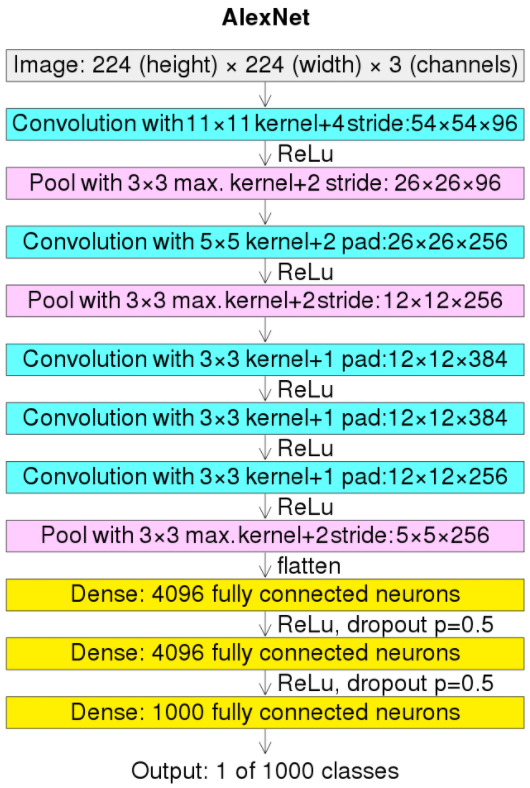

## AlexNet @2012.09

- 原論文
  - https://dl.acm.org/doi/pdf/10.1145/3065386

- 概要
  - 画像認識がDeep Learningモデルに移行するきっかけとなったモデル。
  - 5層のCNNと3層のLinearから構成される。
  - 名前はfirst authorのAlex Krizhevskyからとられている。
  - なお、Alex KrizhevskyはCIFAR-10やCIFAR-100を作成した人物でもある。
  - 以下のような今日でも見られる主要な方法は、この時点で実施されている。
    - ReLU
    - 活性化関数後の正規化処理(LRN: Local Response Normalization)
    - Data Augmentation
    - dropout
    - GPUを利用した学習の高速化

- アーキテクチャ図

  
  (出典: https://ja.wikipedia.org/wiki/AlexNet#/media/%E3%83%95%E3%82%A1%E3%82%A4%E3%83%AB:Comparison_image_neural_networks.svg)

- 実装例
  - pytorch公式
    - https://pytorch.org/hub/pytorch_vision_alexnet
    - ただし、LRNは実装されてないように見える。

- 参考
  - LRNについて
    - 詳細はこちら
      - https://agirobots.com/blog-lrn-cnn/
      - 同じポジションにある近傍チャンネルの数値を使って正規化する。