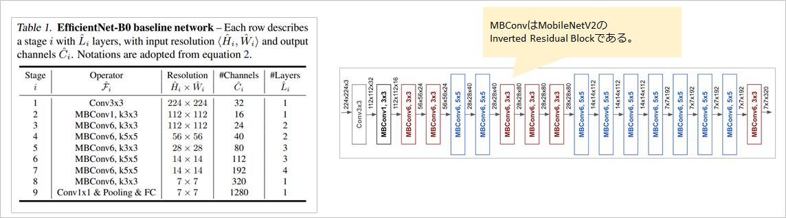

## EfficientNet @2019.05

- 原論文
  - EfficientNet: Rethinking Model Scaling for Convolutional Neural Networks
  - https://arxiv.org/pdf/1905.11946.pdf

- 概要
  - 現在でもその汎用性と性能の高さから、主流となっているCNNモデル。
  - 大筋としては効率よく精度を上げるためには、モデルをどのように複雑にしていけばよいかという研究。
  - 結論としては、以下３点を独立して上昇させるのではなく、同時に拡張するのが最も効果的(Efficient)。
    - 層数の増大
    - チャネル数の増大
    - 入力画像の高解像化
  - B0からB7まで存在し、基準のB0に対して上記をそれぞれどのような比率で増大させるかが与えられている。
  - B0は、Neural Architecture Searchという探索で得られた構造。
  - 活性化関数にはSwishが用いられる。
    - Swishの原論文はこちら。
      - https://arxiv.org/pdf/1710.05941.pdf
    - Swishはあらゆるタスクで精度が上昇するが、関数が複雑であるため、計算速度の面では低下する。
  - 拡張率の実験など、詳細はこちらなどを参照。
    - https://kikaben.com/efficientnet

- アーキテクチャ図(B0のみ)
  - B0の構造のみを示す。層数は18個相当に加え、Linear層が1個である。
  - MBConv6は、MobileNetV2のInverted residual blockの拡張6のみのもの(つまりMobileNetV2とほぼ同じ)。
  - 規模もほぼMobileNetV2と同等。

(出典: 原論文より。注釈等は中村が追加。)

- 実装例
  - pytorch公式
    - https://github.com/pytorch/vision/blob/main/torchvision/models/efficientnet.py
  - NVIDIA公式
    - https://github.com/NVIDIA/DeepLearningExamples/tree/master/PyTorch/Classification/ConvNets/efficientnet

  - 実装してみた
    - https://tzmi.hatenablog.com/entry/2020/02/06/183314

