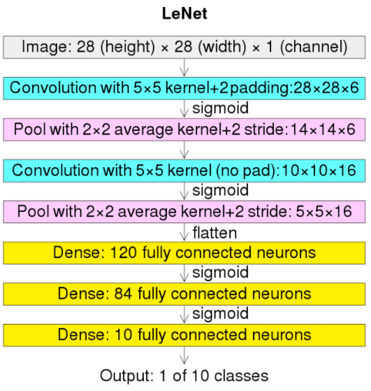

## LeNet @1989

- 原論文
  - https://direct.mit.edu/neco/article-abstract/1/4/541/5515/Backpropagation-Applied-to-Handwritten-Zip-Code?redirectedFrom=fulltext

- 概要
  - 元祖CNN論文。
  - LeNetと言えばLeNet-5を指し、2層のCNNと3層のLinearから構成される。
  - 名前はこのネットワークを研究したYann LeCunの名前から取られているが、当時はこの呼び名ではなかったと考えられる。

- アーキテクチャ図

  
  (出典: https://ja.wikipedia.org/wiki/AlexNet#/media/%E3%83%95%E3%82%A1%E3%82%A4%E3%83%AB:Comparison_image_neural_networks.svg)