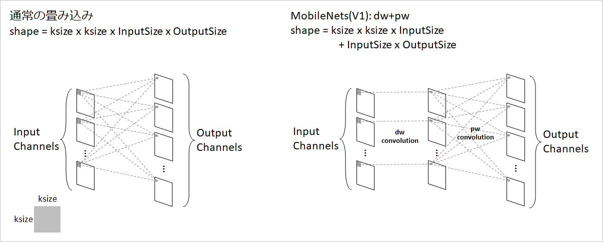
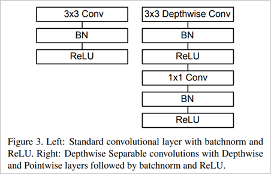
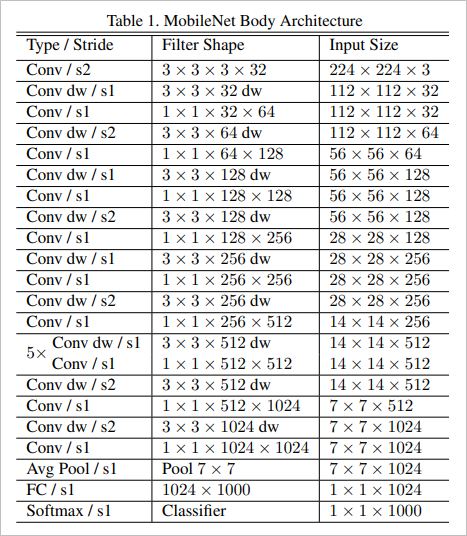

## MobileNet @2017.04

- 原論文
  - MobileNets: Efficient Convolutional Neural Networks for Mobile Vision Applications(Google Inc.)
  - https://arxiv.org/pdf/1704.04861

- 概要
  - Mobileアプリケーション向けに効率的なNetworkを研究したアーキテクチャ。
  - CNNをdepthwise(dw)とpointwise(pw)に分割して効率的な畳み込みを実現した。
    - 通常の畳み込みのパラメータ数
      - ksize x ksize x InputChannelSize x OutputChannelSize
    - dw + pw
       - ksize x ksize x InputChannelSize + InputChannelSize x OutputChannelSize
  - 層数は、CNNが14個相当(モジュールとしては、dwとpwなので28個ある)、Linear層が1個である。

  
  (出典: 中村が作成)

- アーキテクチャ図
  - 以下のブロックをスタックすることで実現する。
  - CNN以外には、BatchNormalizationとReLUが使われている。

  
  (出典: 原論文より)

  - 上記のブロックを最終的なスタックは以下のようになっている。

  
  (出典: 原論文より)

- 実装例
  - pytorch非公式
    - https://github.com/wjc852456/pytorch-mobilenet-v1
