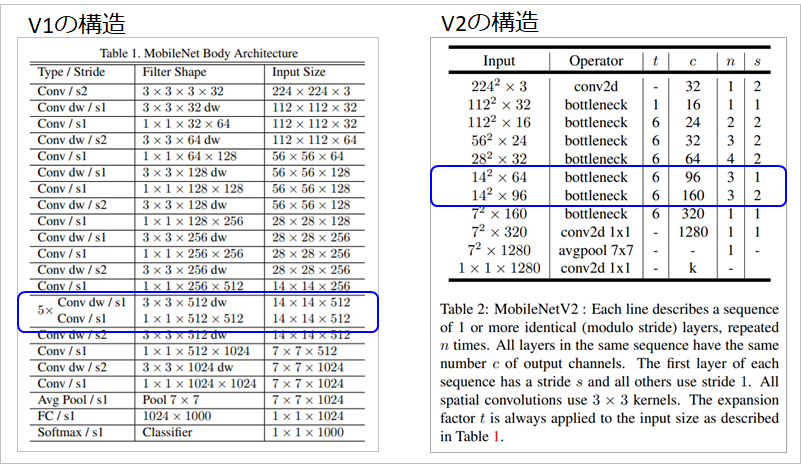

## MobileNetV2 @2018.01

- 原論文
  - MobileNetV2: Inverted Residuals and Linear Bottlenecks(Google Inc.)
  - https://arxiv.org/pdf/1801.04381.pdf

- 概要
  - MobileNetV1のさらなる効率化のために、pwのチャンネル数を削減する工夫が施されている。
  - 具体的には、ResNetに登場したResidual blockを応用し、Inverted residual blockを実装した。

    
    (出典: 原論文より。注釈等は中村が追加。)

  - (a)より(b)の方が計算量が多いように見えるが、これは考え方の話である。
    - (a)が実装されたResNetは、中間のConvはpwではなく普通のConvである。
  - 実際は、V1の計算量を削減するためにpwのチャンネル数を減らしたいが、単純に減らすと、表現力が失われるため、一旦内部で拡張してdwを実施した後に圧縮する。
    - 表現力が失われる仕組みは、多様体仮説に基づいており、詳細は以下を参考。
      - https://deepsquare.jp/2020/06/mobilenet-v2/
      - https://metrica-tech.hatenablog.jp/entry/2019/08/03/000000
  - これにより最終的に出力channelの数が減っても、表現力が維持できる。
  - また、ResNetと同様に入力を出力に加算するskip connectionも存在する。
  - 層数は、CNNが19個相当(モジュールとしては、dwとpwとdwなのでもっと多い)、最終層がLinearの代わりにCNNが1個となっている。
  - 活性化関数にはReLU6と上限付きReLUとなっているが、低頻度だが大きな値に引っ張られないようなロバスト性向上のために上限付きで行われている。
    - 詳細はここら辺を参考
      - https://yoheikikuta.github.io/relu6/

- アーキテクチャ図
  - V1とV2の比較は以下の通り。

  
  (出典: 原論文より。注釈等は中村が追加。)

  - 最終的な構造が違うため比較が難しいが、V1が14x14の画像の時にchannel数が512なのに対し、V2は14x14の画像の時に、channel数が96もしくは160で収まっている。
  - 通常、CNNの層数を増やすにつれてchannel数が増える構造となるが、拡張により表現力を落とさずにスタックすることが可能なため、V2のほうが層数が多くても、チャンネル数が減っている。

- 実装例
  - pytorch公式
    - https://github.com/pytorch/vision/blob/main/torchvision/models/mobilenetv2.py
    - 最終層がLinearになっているので、厳密には論文と異なる。