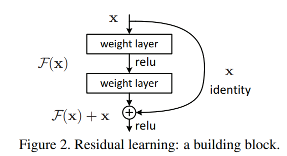
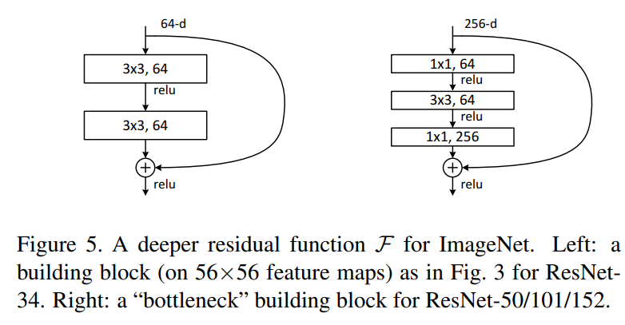
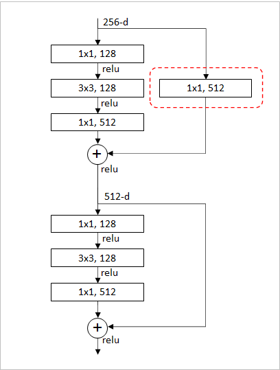

## ResNet @2015.12

- 原論文
  - https://arxiv.org/pdf/1512.03385.pdf

- 概要
  - ポイントはshortcut connection(skip connectionとも)によるresidual learning(残差学習)と、bottleneckアーキテクチャ。
  - residual learningは、以下のように入力を加算することで、weight layerに差分を学習させる仕組みである。
    - これにより、残差のみを学習していくため、深い層を構成しても情報がつぶれにくくなる。
    - BatchNormalizationも実装されており、Convの直後に必ず実施する。(加算前には実施しない)
    - 加算後に活性化関数を適用することにも要注意。

  
  (出典: 原論文より)

  
  - 次にこのweight layer側の構成が考えられ、その中で現在採用されているのがbottleneckアーキテクチャである。
    - 下図右側がbottleneck。ちなみに左側は plain アーキテクチャと論文内で呼ばれる。

  
  (出典: 原論文より)

  - これらにより従来と比べて、50～152層など大規模化したネットワークの学習が可能となった。
  - 種類としては、ResNet50, ResNet101, ResNet152などがある。
  - VGGよりパラメータ数が少ないのは、最終段で4096のLinear層が挟まらないこと、1000層のLinearの前にGlobalAveragePoolingにより大きく削減されていることの影響が大きい。

- アーキテクチャ図
  - 50-layerがいわゆるResNet50そこから右に、ResNet101、ResNet152が記載されている。
  - conv3_1, 4_1, 5_1はstride=2で実行され、そこでdownsampleが機能する。(poolingでdownsampleしない)

  
  (出典: 原論文より)

  - 原論文で図示されていないが、各ブロックの切れ目では、加算するときのチャンネル数が合わない。
    - 例えばconv3_xの入力は256だが、出力は512なので、加算できない。
  - この場合は以下のように入力側に 1x1 のConvを導入することにより、チャネルを合わせる必要がある。
    - このConvにももちろん、BatchNormalizationが後続する。

  
  (出典: 中村が作成)

- 実装例
  - pytorch公式
    - https://github.com/pytorch/vision/blob/main/torchvision/models/resnet.py
