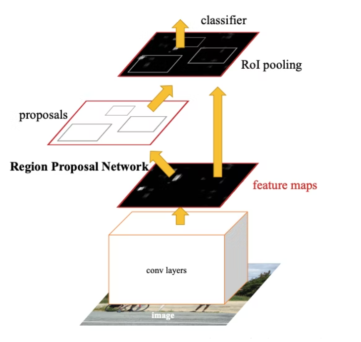
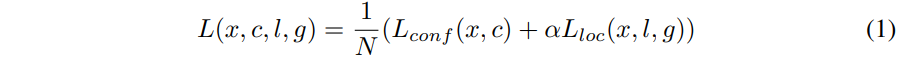

# Object detection

## 概要

- 物体検出とはclassificationに加えて、localizationが必要なタスクである。
- 物体を囲む矩形領域をbounding boxと呼ぶ。
- 物体検出は以下を予測値として学習する。
  - classification
  - 物体の中心座標x,y(連続値)
  - bounding boxのheightとwidth(連続値)
- 学習の際、正解がない場所についてはback propagationをしないなど工夫をして学習が必要。

- 上記の基本的な手法のままでは、以下の課題がある
  - Convの最終層の画像サイズに依存した個数しか検出できない。(最終層が8x8ならば64個が上限)
  - 中心が同じ領域にあるものを検出できない。(学習時の正解も一つしか設定できない)

- 上記を解決するために、anchor boxを準備する。
  - anchor boxはいろんなサイズ、縦横比のbounding box候補のようなイメージ。
  - anchor boxの種類毎に、上記の基本的な手法で学習を実施する。
  - anchor boxの種類はクラスタリングなどにより求める。
  - anchor boxの種類毎に、最終層の出力解像度を分けるアプローチのモデルもある。

- NMS(Non-maximum Supressions)で候補を削減。
  - anchor boxを用いると、重なりの大きな物体が複数検出されるので、IoUが一定以上の場合は、その中で一番大きいスコアの領域のみを採用する。

- これらの手順は煩雑なので、anchor boxを使わない方法も近年人気である。
  - 最終層を元画像の1/4程度に収めて、高解像で出力するCenterNetなど。

## 主要なモデル一覧

<table>
  <thead>
    <tr>
     <th>名前</th>
     <th>発表年</th>
     <th>概要(3～5行)</th>
     <th>BB</th>
     <th>論文 実装例</th>
     <th>詳細</th>
    </tr>
  </thead>
  <tbody>
    <tr>
      <td>HOG + SVM</td>
      <td>2005</td>
      <td>
        <li>CNN誕生前のモデル</li>
        <li>HOGはセル内のpixel変化をとらえた特徴量</li>
        <li>それをSVMで多クラス分類する</li>
        <li>重複した検出はNMSで抑制する</li>
      </td>
      <td></td>
      <td><a href="http://lear.inrialpes.fr/people/triggs/pubs/Dalal-cvpr05.pdf">論文</a></td>
      <td><a href="#hog_and_svm">詳細</a></td>
    </tr>
    <tr>
      <td>R-CNN</td>
      <td>2013.11</td>
      <td>
        <li>CNNを物体検知に適用した先駆け</li>
        <li>領域候補を古典的な手法(selective search)で領域候補を抽出</li>
        <li>領域候補をリサイズしてCNN(AlexNetなど)に入力して特徴量を計算</li>
        <li>特徴量は後続の1クラスSVMとbounding boxの回帰モデルに入力する</li>
      </td>
      <td></td>
      <td><a href="https://arxiv.org/abs/1311.2524">論文</a></td>
      <td><a href="#r_cnn">詳細</a></td>
    </tr>
    <tr>
      <td>SPP-net</td>
      <td>2014.06</td>
      <td>
        <li>R-CNNはリサイズが必要で画像が歪む</li>
        <li>また、領域候補(最大2000枚)すべてをCNNで処理する必要があって重い</li>
        <li>そこで入力画像での領域候補に該当する部分のCNNの特徴量マップを使う</li>
        <li>この特徴量マップをSPPで処理し、固定長の特徴量に変換</li>
        <li>その後は、R-CNNと同様</li>
      </td>
      <td></td>
      <td><a href="https://arxiv.org/abs/1406.4729">論文</a></td>
      <td><a href="#spp_net">詳細</a></td>
    </tr>
    <tr>
      <td>Fast R-CNN</td>
      <td>2015.04</td>
      <td>
        <li>Multi task lossによりクラス分類とbouding boxの位置推定を同時学習</li>
        <li>またSPP-netのSPPの代わりとしてRoI Poolingを使用して固定長に変換</li>
      </td>
      <td></td>
      <td><a href="https://arxiv.org/abs/1504.08083">論文</a></td>
      <td><a href="#fast_r_cnn">詳細</a></td>
    </tr>
    <tr>
      <td>Faster R-CNN</td>
      <td>2015.06</td>
      <td>
        <li>領域候補計算用のRPN(Region proposal Network)を提案し全体をNNにした
        <li>これをEnd-to-Endモデルと呼ぶ)</li>
        <li>anchor box固定長(128x128)でアスペクト比を変更し9個準備</li>
        <li>anchor box毎に出力特徴量マップの各点で領域の有無とbounding boxの位置を推定</li>
        <li>FPNとFast-R CNNは別々に学習する必要がある</li>
      </td>
      <td></td>
      <td><a href="https://arxiv.org/abs/1506.01497">論文</a></td>
      <td><a href="#faster_r_cnn">詳細</a></td>
    </tr>
    <tr>
      <td>YOLO</td>
      <td>2015.06</td>
      <td>
        <li>領域推定とクラス分類を同時学習を実現した(You only look once)</li>
        <li>入力画像をグリッド分割(S x S)してそこにbounding boxがB個あると仮定</li>
        <li>各グリッドについてboxの信頼度(conf)と位置(h,w,x,y)、C個の各クラスの確率を計算</li>
        <li>上記を出力チャンネル数がS x S x ( B x 5 + C )のConvで実現</li>
        <li>1グリッドに対しB個しか検出できないず、速度優先のため性能はFaster R-CNNに劣る</li>
      </td>
      <td></td>
      <td><a href="https://arxiv.org/abs/1506.02640">論文</a></td>
      <td><a href="#yolo">詳細</a></td>
    </tr>
    <tr>
      <td>SSD</td>
      <td>2015.12</td>
      <td>
        <li>出力層だけでなく様々な解像度での特徴量マップを使用することで</li>
        <li>backboneとなるCNNの途中層や追加層で様々な解像度を実現</li>
      </td>
      <td></td>
      <td><a href="https://arxiv.org/abs/1512.02325">論文</a></td>
      <td><a href="#ssd">詳細</a></td>
    </tr>
    <tr>
      <td>R-FCN</td>
      <td>2016.05</td>
      <td></td>
      <td></td>
      <td><a href="https://arxiv.org/abs/1605.06409">論文</a></td>
      <td></td>
    </tr>
    <tr>
      <td>FPN</td>
      <td>2016.12</td>
      <td></td>
      <td></td>
      <td><a href="https://arxiv.org/abs/1612.03144">論文</a></td>
      <td></td>
    </tr>
    <tr>
      <td>YOLOv2(YOLO0900)</td>
      <td>2016.12</td>
      <td></td>
      <td></td>
      <td><a href="https://arxiv.org/abs/1612.08242">論文</a></td>
      <td></td>
    </tr>
    <tr>
      <td>RetinaNet</td>
      <td>2017.08</td>
      <td></td>
      <td></td>
      <td><a href="https://arxiv.org/abs/1708.02002">論文</a></td>
      <td></td>
    </tr>
    <tr>
      <td>Mask R-CNN</td>
      <td>2017.03</td>
      <td></td>
      <td></td>
      <td><a href="https://arxiv.org/abs/1703.06870">論文</a></td>
      <td></td>
    </tr>
    <tr>
      <td>RefineDet</td>
      <td>2017.11</td>
      <td></td>
      <td></td>
      <td><a href="https://arxiv.org/abs/1711.06897">論文</a></td>
      <td></td>
    </tr>
    <tr>
      <td>PANet</td>
      <td>2018.03</td>
      <td></td>
      <td></td>
      <td><a href="https://arxiv.org/abs/1803.01534v4">論文</a></td>
      <td></td>
    </tr>
    <tr>
      <td>YOLOv3</td>
      <td>2018.04</td>
      <td></td>
      <td></td>
      <td><a href="https://arxiv.org/abs/1804.02767">論文</a></td>
      <td></td>
    </tr>
    <tr>
      <td>M2Det</td>
      <td>2018.11</td>
      <td></td>
      <td></td>
      <td><a href="https://arxiv.org/abs/1811.04533">論文</a></td>
      <td></td>
    </tr>
    <tr>
      <td>CenterNet</td>
      <td>2019.04</td>
      <td></td>
      <td></td>
      <td><a href="https://arxiv.org/abs/1904.07850">論文</a></td>
      <td></td>
    </tr>
    <tr>
      <td>EfficientDet</td>
      <td>2019.11</td>
      <td></td>
      <td></td>
      <td><a href="https://arxiv.org/abs/1911.09070">論文</a></td>
      <td></td>
    </tr>
    <tr>
      <td>YOLOv4</td>
      <td>2020.04</td>
      <td></td>
      <td></td>
      <td><a href="https://arxiv.org/abs/2004.10934">論文</a></td>
      <td></td>
    </tr>
    <tr>
      <td>DETR</td>
      <td>2020.05</td>
      <td></td>
      <td></td>
      <td><a href="https://arxiv.org/abs/2005.12872">論文</a></td>
      <td></td>
    </tr>
    <tr>
      <td>YOLOv5</td>
      <td>2020.06</td>
      <td></td>
      <td></td>
      <td>未公開</td>
      <td></td>
    </tr>
    <tr>
      <td>YOLOF</td>
      <td>2021.03</td>
      <td></td>
      <td></td>
      <td><a href="https://arxiv.org/abs/2103.09460">論文</a></td>
      <td></td>
    </tr>
    <tr>
      <td>YOLOX</td>
      <td>2021.07</td>
      <td></td>
      <td></td>
      <td><a href="https://arxiv.org/abs/2107.08430">論文</a></td>
      <td></td>
    </tr>
    <tr>
      <td>YOLOP</td>
      <td>2021.08</td>
      <td></td>
      <td></td>
      <td><a href="https://arxiv.org/abs/2108.11250">論文</a></td>
      <td></td>
    </tr>
  </tbody>
</table>

## HOG + SVM @2005
- 原論文
  - http://lear.inrialpes.fr/people/triggs/pubs/Dalal-cvpr05.pdf

- 概要
  - HOG特徴量を使ったSVM識別を矩形窓をスライドさせながら認識する。
  - 計算コストが低いため、リアルタイムで動作させることができる。
  - HOGはHistogram of Oriented Gradients。

- 手順
  - 固定サイズ窓サイズで抽出し、それを 8x8 pixelのcellに分割。
  - 各セルのHOG特徴量を計算する。
    - HOG特徴量は、cell内のpixelについて勾配強度を求め、それを8方向のヒストグラムで表したもの。
    - 詳細は下記参照。
      - https://qiita.com/chama0623/items/76568e7f16bc5e46d9c5#hog%E7%89%B9%E5%BE%B4%E9%87%8F
      - https://japimage.blogspot.com/2016/07/hog.html
  - HOG特徴量からSVMでclassificationを行う。(他クラス分類の非線形SVM)
  - 重複領域は、NMSで削除する。

## R-CNN @2013.11

- 原論文
  - https://arxiv.org/pdf/1311.2524.pdf

- 概要
  - CNNをobject detectionに適用する先駆けとなった論文。
  - 入力画像から領域候補(region proposal)を2000個まで切り出す。
  - それをリサイズ(224x224など)してCNNした特徴量で、classification(SVM)やbounding box推定を行う。

  

  

  - 領域候補は、古典的なアルゴリズムを使ったselective searchで抽出する。

  - CNNには、AlexNet(T-Netと論文では呼ぶ)とVGG16(O-Netと論文では呼ぶ)を使っており、VGG16の方が高精度であった。
    - arxiv初版は、VGGより前なのでv5までの1年間の改版の過程で、大きく論文が変わっている。

  - selective searchは、Felzenszwalb法でセグメンテーションした結果(region)をもとに、
  regionの色、テクスチャ、サイズ、オーバーラップしている領域の４つで類似度を計算してマージしていくことで領域候補(region proposal)を計算する。
  (テクスチャは模様のことで、LBPを用いて計算する。)
    - 詳細は以下に解説あり。
      - https://blog.shikoan.com/selective-search-rcnn/
    - Felzenszwalb法は以下を参照。
      - https://irohalog.hatenablog.com/entry/2014/10/05/213948
      

    - LBPについては以下を参照。
      - https://qiita.com/tancoro/items/959ae9c14048c06bea8e

- 手順
  - CNN(AlexNetやVGG16など)をILSVRC2012のデータセットでpre-trainingする。
  - Domain specificなfine-tuningを実施。データはselective searchで得たregion proposalを使う。
    - 最終層のみ物体検出したいクラス数N+1の層に変更して学習。
    - region proposalで得られた領域と正解領域とのIoUが0.5以上のところをpositive, それ以下をnegativeとして学習。
  - CNNで得た特徴量を元に、N個の1-class linear SVMを学習する。その際、正解領域とのIoUが0.3以下は負例として学習する。
    - CNNとSVMsで正解のIoU閾値が異なるが、現在の調整値が最も良い結果だったようである。
    - CNN単体での学習も考えたようだが、性能が低下したとのこと。調整をすれば性能が近づきシンプルになる可能性も言及している。(Appendix B.)
  - またlocalizationの改善のため、bounding-boxの推定を、CNNで得た特徴量を元に行う。
    - x,y,w,hの線形回帰問題(リッジ回帰)として学習する。
    - モデルとしては、region proposalからground truthまでの変換式を準備し、その変換式の係数を学習する。(Appendix C.)
    - SVMと同様、N個のクラス毎に学習する。その際、正解領域とのIoUが0.6以上のregion proposalの中で
    最もIoUが大きいもののみを学習データとする。
    - このbounding-box推定とSVMs学習を繰り返すループも実現できるが、改善しなかったとのこと。
  - 重複領域は、NMSで削除する。
    - NMSのIoU閾値は0.3である。

## SPP-net @2014.06

- 原論文
  - https://arxiv.org/pdf/1406.4729v4.pdf

- 概要
  - 入力画像に対する1回のCNNで画像内のすべてのregion proposalを処理できるようにした物体認識モデル。
  - R-CNNは最大で2000枚の画像をCNNで処理する必要があったが、これを1枚で可能とした。
  - 入力画像のregion proposalに対応する、出力層の特徴量マップを使い、これをSPP(spatial pyramid pooling)で固定長の特徴量に変換する。
  - その後は、R-CNNと同様にone-class SVMとbownding boxの回帰モデルで、処理をする。

  

  - SPP(spatial pyramid pooling)部分の詳細は下記。

  
  
  - CNN(AlexNet等、いくつか種類あり)のpre-trainingをR-CNNと同様に行うが、パラメータを更新するのは、SPP以降のみとした。
    - Fast R-CNNの論文では、CNNが多層ではない場合はこれで十分だが、多層の場合はすべてのパラメータをfine-tuningした方がよいと言及している。
  - R-CNNと異なり画像のリサイズ等は不要で処理が可能。
  - region proposalの領域は、出力層でつぶれない程度に大きさに下限が設けられている。

- 手順
  - 原論文参照。

## Fast R-CNN @2015.04

- 原論文
  - https://arxiv.org/pdf/1504.08083.pdf

- 概要
  - SPP-netのSPPの代わりにRoI PoolingというPoolingを使用。
  - loss計算にMulti-task Lossを使用し、classificationとbounding box regressorを同時に学習。

  

  - RoI PoolingはSPPよりもシンプルであり、RoI領域(出力層におけるregion proposalの領域)をグリッド分割し、各グリッド毎にmax poolingを実施する方式である。
  - グリッドサイズはH, WのHyper parameterで、前段のCNNのアーキテクチャにより変わる。
    - VGG16の場合、linear直前のmax poolingが7x7なので、H=W=7となる。
  - CNNをFast R-CNN向けに変換する場合、以下のステップを経る。
    - 最後のmax pooling処理を、RoI poolingに置き換える。
    - その後、いくつかのlinear層を得て、classification用のlinear+softmaxとbounding box用のlinear層に分岐させる。
  - Multi-tasl lossは、cross entropy + lamda * regression errorで計算する。
    - ここで、regression errorは、backgroundの場合は使わない。
    - 回帰モデルに使う損失関数もR-CNNのときから変わっている。
      - L2損失からL1損失となり、外れ値に強いロス関数となっている。
    - lambdaは1として実験されている。

  

  - 高速化の工夫として、mini-batchの作成方法にも階層的サンプリングという工夫をしている。
    - R-CNNやSPPは、ROIレベルでサンプリングを実施した。つまりbatch size=128の場合、128個の入力画像を使う。
    - Fast R-CNNは、まず入力画像をN個サンプリングし、N個の画像からbatch size/N個のROIをサンプリングすることで、mini-batchを作る。
    - Nを小さくすることで、CNN部のfeedfowardする回数が少なくて済む。
    - N=2、batch size=128で良好な結果を得ることができている。
  - その他、サンプリングはmini-batch内の25%を正例とし、IoUが0.5以上を正例、IoUが0.1以上0.5未満を負例とする。
  - 更にlinear層の高速化手段としてSVDでの低ランク行列への近似を行う。

  

## Faster R-CNN @2015.06

- 原論文
  - https://arxiv.org/pdf/1506.01497.pdf

- 概要
  - region proposalをCNNで実現し、全体で初めてEnd-to-Endの物体検出を実現。

  

  - region proposal用のCNNはRPN(Region Proposal Networks)と呼び以下のような形式となる。
    - 入力は入力画像でベースとなるCNNで特徴量を抽出する。
      - ベースモデルはZFNet(AlexNetの改良版)、VGGなどを使う。
    - 出力は以下の2系統となる。
      - (anchor box数k x 2(0,1判定) ,h ,w)
      - (anchor box数k x 4(ground truthからのx,y,h,wの誤差) ,h ,w)
    - anchor boxの中心位置は、特徴量マップの各pixelとなるため、特徴量マップのサイズ分(h,w)の出力を持つ。
    - 上記の出力系統を実現するために以下をベースモデルに対して追加する。
      - conv3x3のConv層(channel数はベースの最終層と同じでVGGならば512)
        - その際最後のlinear層手前のmax poolingは削除する。
      - その後以下の二系統のconv1x1のConv層に分岐する。
        - チャンネル数がk x 2のConv
        - チャンネル数がk x 4のConv
    - anchor boxの数は以下の9個が使われる。
      - アスペクト比1:1の場合に3つのサイズ 128x128, 256x256, 512x512(画素単位は元画像レベル)
      - 上記に対して、pixel数を一定としたままで、アスペクト比を1:2, 2:1でそれぞれ作成
    - anchor boxが元画像からはみ出す場合は削除される。
    - RPN学習時は、ground truthとのIoUに応じて、以下のラベリングを使う。
      - ground truthとのIoUが0.3以下のanchor boxを負例
      - ground truthとのIoUが0.7以上、またはground truthとのIoUが最大のanchor boxを正例
        - そのため2つのanchor boxが正例となる場合がある。
      - どちらでもないanchor boxは学習に貢献しないデータとなる。
    - RPNの損失関数は、以下のようにanchor boxのclassifierとregressionの線形和となる。

    

    - 推論時は変わらずnon-maximum suppressionで削減する。
    - 学習の際は、以下のステップで行う。
      - ImageNetなどでpre-training済みのCNNを用いて、RPNを学習する。
        - この際、ZFNetはすべてを、VGGはconv3以降を更新対象とするなど工夫する。
      - RPNの結果を使って、Fast R-CNNの方を更新する。この際、RPNとは重みを共有しない。
      - RPNを再学習する。この際、Fast R-CNNと構成が共有の部分は、Fast R-CNNの重みを使い、RPN特有の層飲みを学習する。
      - 最後にFast R-CNNを、共有された重みを固定したままその他のパラメータを学習する。
    - 上記を繰り返すこともできるが、わずかにしか改善しなかった。

## YOLO @2015.06

- 原論文
  - https://arxiv.org/pdf/1506.02640.pdf

- 概要
  - Faster R-CNNまではlocalizationとclassificationするモデルが別々であった。
  - それを一つのモデルで推定可能とした。
  - 以下がそのフローである。
    - 画像全体をSxSのグリッドで分割(論文では、S=7)。
    - グリッド毎にB個(論文では、B=2)のbounding boxがあるとして、その中心座標x,yとw,hと信頼度を以下で求める。
      - x,yはグリッド境界を基準とした位置
      - w,hは画像全体に対する相対値
      - 信頼度は、ground truthとの差
    - 物体のクラス数C個分(論文では、C=20)の確率値もこのグリッド単位で求める。
    - 信頼度と各確率値の掛け算でbounding box毎の各クラスの信頼度が得られる。
  - これらを同じCNNモデル出力のchannelとして以下のように表現する。

  

  - これを出力するCNNモデルには以下のようなものが使用される。

  

  - 出力channelには複数の指標が混ざっているため、ロス関数は以下のような工夫がされている。

  

  - 最終的には、信頼度を元にNMSで重複を削除する。
  - 1つのグリッドに対して2つのboundingboxと1つのクラスしか予測できないため、小さい物体などが複数ある場合には検出できない。
  - また速度優先であるため、Faster R-CNNより識別性能が劣る。

- 実装
  - 著者実装はDarkNet(Cライブラリ)となる。
    - https://pjreddie.com/darknet/yolo/
  - 理解のための非公式のpytorch実装はこちらを参照。
    - https://github.com/motokimura/yolo_v1_pytorch/blob/master/darknet.py

## SSD @2015.12

- 原論文
  - https://arxiv.org/pdf/1512.02325.pdf

- 概要
  - YOLOと異なり、ベースのCNNの出力層ではなく、様々な解像度の特徴量マップを使用する。
    - VGG16の場合、conv4_3を使用。この特徴量マップは元画像が300x300の場合、38x38となる。
    - その後、VGG16のconv5_3まで処理し、Convを2層重ねて、これも特徴量マップとして使う。
    - あとはその後に2層重ねて、特徴量マップを抽出して、これを繰り返し、合計６層からの特徴量マップを使う。
    - この追加する層をextra layerと呼んでいる。

  

  - 特徴量マップの層毎にdefault boxというbounding boxの候補を考える。
  - default boxの数は層毎に以下のように違うので注意が必要。
    - VGG16の場合、以下で合計8732個のdefault boxとなる。
      - (38,38, 512) ... 4個, 38x38x4で5776個のdefault box
      - (19,19,1024) ... 6個, 19x19x6で2166個のdefault box
      - (10,10, 512) ... 6個, 10x10x6で 600個のdefault box
      - ( 5, 5, 256) ... 6個,  5x 5x4で 150個のdefault box
      - ( 3, 3, 256) ... 4個,  3x 3x4で  36個のdefault box
      - ( 1, 1, 256) ... 4個,  1x 1x4で   4個のdefault box

  - 各default boxについて正解bounding boxまでのoffset(localization)と、クラス数分の信頼度(confidence)を計算する。
    - 各特徴量マップ単位に、localization用のconvとconfidence用のconvを接続する。
      - 普通の3x3のconvでlocalization用の出力チャンネル数が、default box数 x 4、confidence用の出力チャンネル数がdefault box数 x クラス数となる。
      - confidence側は信頼度を連続値として推定するのでこちらもregressorになる。
    - YOLOは、boxの信頼度と各クラス確率を独立に推定していた。
    - SSDは、box毎にクラス確率を持っている点も異なる。

  - default boxは深い部分ほど大きくなるよう設計されている。
    - wkとhkは元画像を1.0とした場合の相対的なwidthとheightとなる。
    - つまり300x300の場合で、一番深いレイヤによるdefault boxは、ar=1の時で270x270のサイズとなるイメージ。

  

  - ロス関数は、localization lossとconfidence lossの線形和である。
    - 最終的なロス関数
    

    - localizationのロス関数は、Faster R-CNNと同様の下式。

    

    - confidence lossは、softmax lossとなる。

    
  
  - Hard negative mining
    - box数はかなり多いため、そのまま実行すると負例がとても大規模となる。
    - そのため、confidence lossを降順にソートして、上位から正例：負例が1:3となるよう抽出。
      - より負例らしいものを負例として扱う。

- 実装例
  - pytorch公式
    - https://github.com/pytorch/vision/blob/main/torchvision/models/detection/ssd.py

## 参考

- 概要がわかる
  - https://www.youtube.com/watch?v=5nmVHoA-A2E

- 物体検出についての歴史まとめ
  - https://qiita.com/mshinoda88/items/9770ee671ea27f2c81a9
  - https://qiita.com/mshinoda88/items/c7e0967923e3ed47fee5

- 物体検出モデルの進展
  - 物体検出モデルの進展 Part1 R-CNNからFaster R-CNNまで
    - https://qiita.com/TaigaHasegawa/items/b05110a2571a5289cbab
  - 物体検出モデルの進展 Part2 YOLOからR-FCNまで
    - https://qiita.com/TaigaHasegawa/items/a3cb98fb27cc7a9307b4
  - 物体検出モデルの進展 Part3 FPNとRetinaNet
    - https://qiita.com/TaigaHasegawa/items/653abc81ac4ee1f0d7b8

- Faster R-CNNはこれが一番分かりやすい。
  - https://medium.com/lsc-psd/faster-r-cnn%E3%81%AB%E3%81%8A%E3%81%91%E3%82%8Brpn%E3%81%AE%E4%B8%96%E7%95%8C%E4%B8%80%E5%88%86%E3%81%8B%E3%82%8A%E3%82%84%E3%81%99%E3%81%84%E8%A7%A3%E8%AA%AC-dfc0c293cb69

- SSDの解説は@xu1718191411さんのQiita記事がもっとも丁寧
  - 物体検出SSD詳しく紹介
    - https://qiita.com/xu1718191411/items/6ffdd2a65329b5b11704
    - https://qiita.com/xu1718191411/items/997190c6183114fcb343
    - https://qiita.com/xu1718191411/items/442e58f24e6608b6173c
    - https://qiita.com/xu1718191411/items/56002e07fe7618aef1d6
    - https://qiita.com/xu1718191411/items/cac5dd4e6d60038aaffb

- YOLOシリーズ徹底解説
  - https://deepsquare.jp/2020/09/yolo/
  - YOLOv1からv3まで。解説が分かりやすい。

- ディープラーニングによる一般物体検出アルゴリズムまとめ | NegativeMindException
  - https://blog.negativemind.com/portfolio/deep-learning-generic-object-detection-algorithm/

- YOLOのv1～v5まで
  - https://qiita.com/tfukumori/items/519d84bf3feb8d246924

- YOLO9000
  - https://qiita.com/miyamotok0105/items/1aa653512dd4657401db

- 2021年時点での情報がいろいろ書いてある。
  - https://www.slideshare.net/ren4yu/you-only-look-onelevel-feature

- DETR
  - https://club.informatix.co.jp/?p=1265
  - https://qiita.com/DeepTama/items/937e13f6beda79be17d8