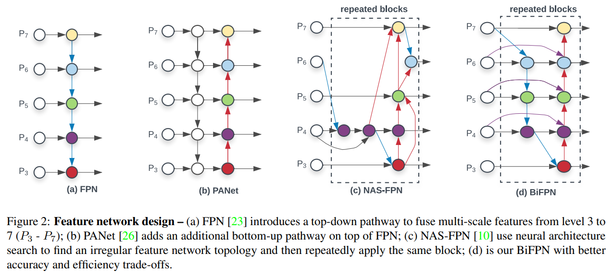
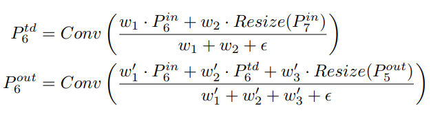
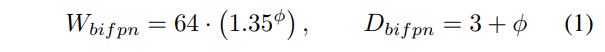
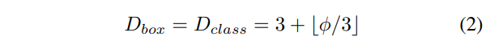
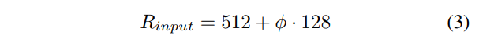
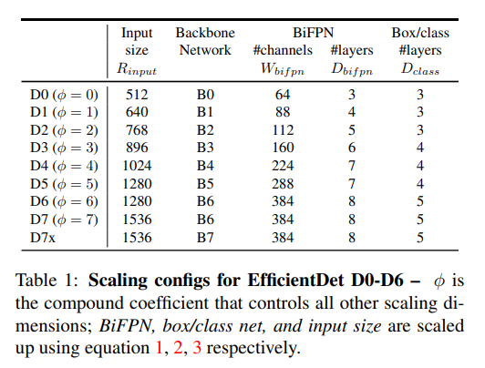
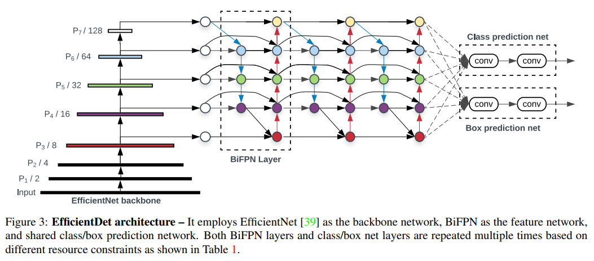
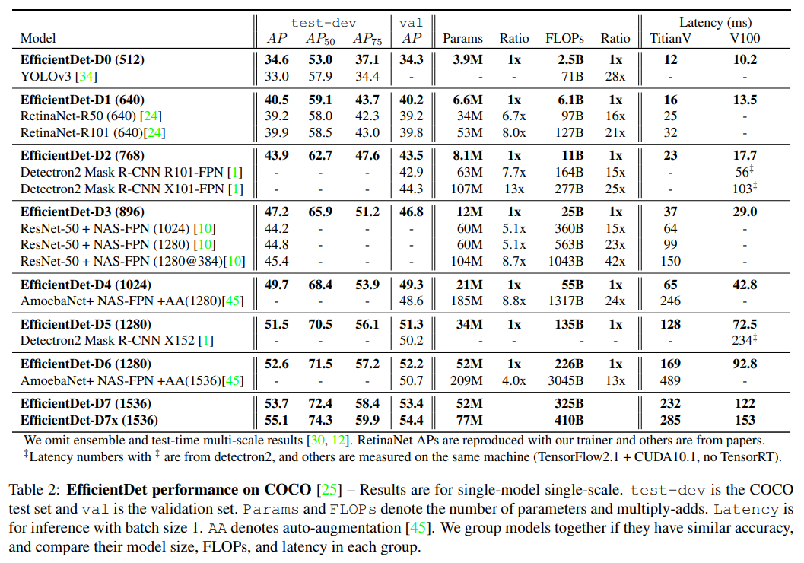
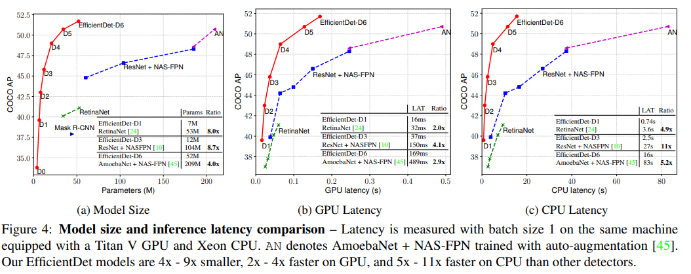

# EfficientDet

- 題名: EfficientDet: Scalable and Efficient Object Detection
- 論文: [https://arxiv.org/abs/1911.09070](https://arxiv.org/abs/1911.09070)
- 公式実装: [https://github.com/google/automl/tree/master/efficientdet](https://github.com/google/automl/tree/master/efficientdet)

## 概要

- FPN系のアーキテクチャ(PANet, NAS-FPNなど)を整理しより最適なBiFPNを提案。
- EfficientNetの考え方を取り入れ、backboneの複雑さと同期してその他の部分も複雑にする複合スケールを提案。
- 1stageモデルであり、focal lossなどを用いており、提案部分以外はRetinaNetに近いと推測。
- かなり精度と速度のバランスがよく高性能に見える。

## 導入

- 物体検出の精度は飛躍的に向上しているものの計算コストがとても高い
  - NAS-FPN
    - 167M Parameters
    - 3045B FLOPs(RetinaNetの30倍)
- 効率的なモデルとして、1stageモデルやアンカーレス方式があるが、精度が犠牲になっている。
- 効率的なアーキテクチャを検討するため、以下２点の課題設定をした。
- 課題1: multi-scaleな特徴量マップの融合方法
  - FPNが通常用いられ、PANet, NAS-FPNと進化した。
  - しかし最終結果に対する寄与は不均衡であることがわかっている。
  - これに対してtop-downとbottom-upのmulti-scale特徴量を融合を繰り返しながら、異なる入力特徴量の重要度の重みを導入したBiFPNを提案する。
- 課題2: モデル全体のスケーリング
  - 物体検知モデルは、backboneの規模拡大やより大きな入力画像により性能向上する傾向にある。
  - しかしその後段のネットワーク部分は同じ規模のものを使っていた。
    - 後段の特徴量ネットワーク
    - その後のbounding box回帰、クラス予測のネットワーク
  - これらは、EfficientNet同様、同時にスケールした方が最も効果が高いはずである。
  - すべてを共同でスケールアップする複合スケールアップを提案する。

## 特徴

### BiFPN

- BiFPNと比較ため、FPN以降の主要なネットワークの比較図が以下である。
  - NAS-FPNについて補足
    - 高性能であるが、NAS(Neural architecture search)で自動で選択されるため解釈が難しい。
    - 加えて最適な接続を見つけるためにかなりの学習が必要。
    - 完成物は、PANetよりは高速

- BiFPNはこのblockをrepeatすることで、スケールする。
- BiFPNの接続は、P6を例にとると以下のような計算式となる。
  - 融合時はどこの入力を優先するかを選択するような形式を意図している。
  - 本来は、softmax-based fusionで融合したかったが計算が低速になる。
  - そこでsoftmax-based fusionを模擬したFast normalized fusionという以下の式を用いている。
  - εは0.0001とし、数値的不安定性を避けるための処理である。

- ここで、畳み込みが登場しているがこれは、depthwise separable convである(MobileNet参照)。
- 畳み込みと同時にbnと活性化関数を伴う。
- これは、P6以外も同様の式となる。
  - ただしP7とP3は異なる式となる。

### 複合スケーリング

- backboneはそのままEfficientNetの複合度モデルを用いる
- BiFPNは以下のようにL(繰り返し数)とW(convのチャンネル数)をスケールさせる。
  - 1.35はgrid searchにより見つけ出した数値である。

- bounding box回帰とclassification用のconvは、層数を以下の式で増やす。channel数はBiFPNと同じとする。

- 入力解像度は、2^7で割り切れる必要があるため、以下のように128ずつ増加させる。

- 最終的な複合スケーリングの結果は以下となる。

- またアーキテクチャをD0の場合で整理するとこのようになる。

### backbone

- バックボーンはEfficientNetを用いる。
- これはImageNetでpre-training済みのものを使用する。

### ロス関数

- focal lossを用いている。（2stageなのになぜなのかちょっと分からない。。。）

### RPNは？

- FPNと同様、Region Proposal Networkは、BiFPNと同じ構成でやるのだろうか？
  - 1stageなため、存在しない。

### anchor box

- anchor boxの設計については詳細がないが、実装例ではanchor box数が9つ。
- RetinaNetと同じ数であるため、これを踏襲しているのではと推測される。

## 実験結果

## 参考

- 解説
  - https://qiita.com/takoroy/items/2850c06e15bb7dfd8e9c
