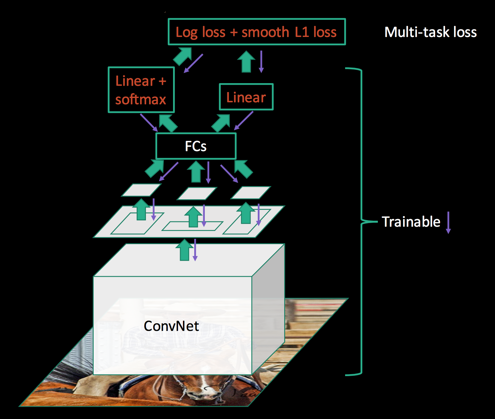
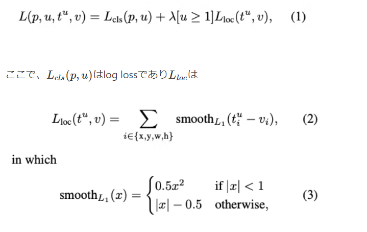
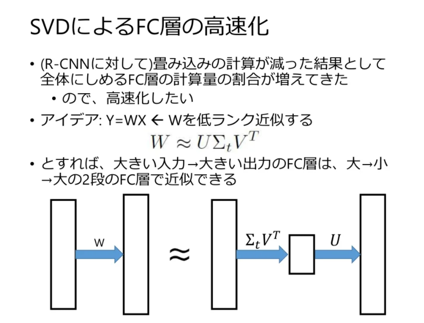

## Fast R-CNN @2015.04

- 原論文
  - https://arxiv.org/pdf/1504.08083.pdf

- 概要
  - SPP-netのSPPの代わりにRoI PoolingというPoolingを使用。
  - loss計算にMulti-task Lossを使用し、classificationとbounding box regressorを同時に学習。

  

  - RoI PoolingはSPPよりもシンプルであり、RoI領域(出力層におけるregion proposalの領域)をグリッド分割し、各グリッド毎にmax poolingを実施する方式である。
  - グリッドサイズはH, WのHyper parameterで、前段のCNNのアーキテクチャにより変わる。
    - VGG16の場合、linear直前のmax poolingが7x7なので、H=W=7となる。
  - CNNをFast R-CNN向けに変換する場合、以下のステップを経る。
    - 最後のmax pooling処理を、RoI poolingに置き換える。
    - その後、いくつかのlinear層を得て、classification用のlinear+softmaxとbounding box用のlinear層に分岐させる。
  - Multi-tasl lossは、cross entropy + lamda * regression errorで計算する。
    - ここで、regression errorは、backgroundの場合は使わない。
    - 回帰モデルに使う損失関数もR-CNNのときから変わっている。
      - L2損失からL1損失となり、外れ値に強いロス関数となっている。
    - lambdaは1として実験されている。

  

  - 高速化の工夫として、mini-batchの作成方法にも階層的サンプリングという工夫をしている。
    - R-CNNやSPPは、ROIレベルでサンプリングを実施した。つまりbatch size=128の場合、128個の入力画像を使う。
    - Fast R-CNNは、まず入力画像をN個サンプリングし、N個の画像からbatch size/N個のROIをサンプリングすることで、mini-batchを作る。
    - Nを小さくすることで、CNN部のfeedfowardする回数が少なくて済む。
    - N=2、batch size=128で良好な結果を得ることができている。
  - その他、サンプリングはmini-batch内の25%を正例とし、IoUが0.5以上を正例、IoUが0.1以上0.5未満を負例とする。
  - 更にlinear層の高速化手段としてSVDでの低ランク行列への近似を行う。

  