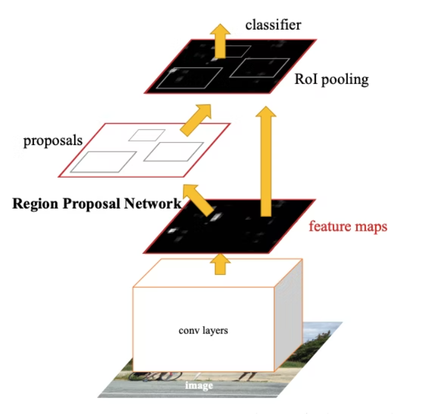
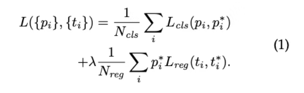
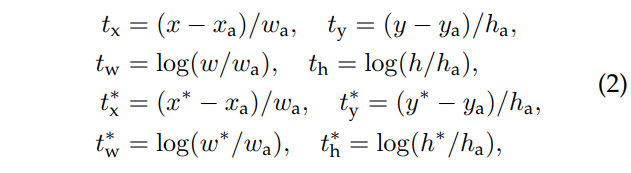

## Faster R-CNN @2015.06

- 原論文
  - https://arxiv.org/pdf/1506.01497.pdf

- 概要
  - region proposalをCNNで実現し、全体で初めてEnd-to-Endの物体検出を実現。

  

  - region proposal用のCNNはRPN(Region Proposal Networks)と呼び以下のような形式となる。
    - 入力は入力画像でベースとなるCNNで特徴量を抽出する。
      - ベースモデルはZFNet(AlexNetの改良版)、VGGなどを使う。
    - 出力は以下の2系統となる。
      - (anchor box数k x 2(0,1判定) ,h ,w)
      - (anchor box数k x 4(ground truthからのx,y,h,wの誤差) ,h ,w)
    - anchor boxの中心位置は、特徴量マップの各pixelとなるため、特徴量マップのサイズ分(h,w)の出力を持つ。
    - 上記の出力系統を実現するために以下をベースモデルに対して追加する。
      - conv3x3のConv層(channel数はベースの最終層と同じでVGGならば512)
        - その際最後のlinear層手前のmax poolingは削除する。
      - その後以下の二系統のconv1x1のConv層に分岐する。
        - チャンネル数がk x 2のConv
        - チャンネル数がk x 4のConv
    - anchor boxの数は以下の9個が使われる。
      - アスペクト比1:1の場合に3つのサイズ 128x128, 256x256, 512x512(画素単位は元画像レベル)
      - 上記に対して、pixel数を一定としたままで、アスペクト比を1:2, 2:1でそれぞれ作成
    - anchor boxが元画像からはみ出す場合は削除される。
    - RPN学習時は、ground truthとのIoUに応じて、以下のラベリングを使う。
      - ground truthとのIoUが0.3以下のanchor boxを負例
      - ground truthとのIoUが0.7以上、またはground truthとのIoUが最大のanchor boxを正例
        - そのため2つのanchor boxが正例となる場合がある。
      - どちらでもないanchor boxは学習に貢献しないデータとなる。
    - RPNの損失関数は、以下のようにanchor boxのclassifierとregressionの線形和となる。

    

    - bounding boxのregressionは下式の推定となる。

    

    - 推論時は変わらずnon-maximum suppressionで削減する。
    - 学習の際は、以下のステップで行う。
      - ImageNetなどでpre-training済みのCNNを用いて、RPNを学習する。
        - この際、ZFNetはすべてを、VGGはconv3以降を更新対象とするなど工夫する。
      - RPNの結果を使って、Fast R-CNNの方を更新する。この際、RPNとは重みを共有しない。
      - RPNを再学習する。この際、Fast R-CNNと構成が共有の部分は、Fast R-CNNの重みを使い、RPN特有の層飲みを学習する。
      - 最後にFast R-CNNを、共有された重みを固定したままその他のパラメータを学習する。
    - 上記を繰り返すこともできるが、わずかにしか改善しなかった。

## 参考

- Faster R-CNNはこれが一番分かりやすい。
  - https://medium.com/lsc-psd/faster-r-cnn%E3%81%AB%E3%81%8A%E3%81%91%E3%82%8Brpn%E3%81%AE%E4%B8%96%E7%95%8C%E4%B8%80%E5%88%86%E3%81%8B%E3%82%8A%E3%82%84%E3%81%99%E3%81%84%E8%A7%A3%E8%AA%AC-dfc0c293cb69