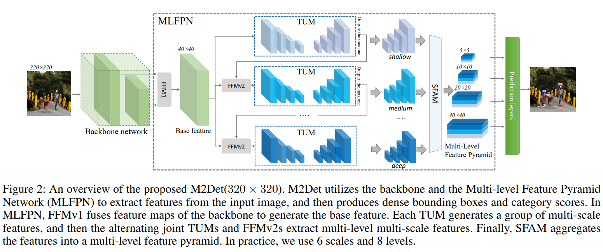
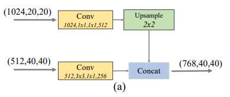
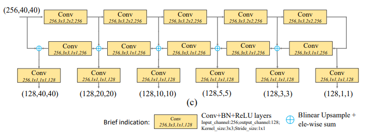
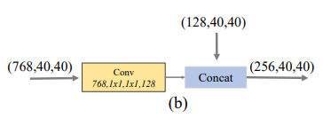

# M2Det

- 題名: M2Det: A Single-Shot Object Detector based on Multi-Level Feature Pyramid Network
- 論文: [https://arxiv.org/abs/1811.04533](https://arxiv.org/abs/1811.04533)
- 公式実装: [https://github.com/VDIGPKU/M2Det](https://github.com/VDIGPKU/M2Det)

## 概要

- SSDをベースとしたアーキテクチャ。
- backboneの特徴量マップをそのまま使わず、object detection用にネットワークを構築した点がポイント。
- これをMLFPN: Multi-Level Feature Pyramid Networkと呼んでいる。
- 論文と公式実装に乖離があり、カスタムデータの学習などは結構難しいという声もある。

## 特徴

- MLFPNが大きなポイント。
- anchor boxやloss、学習方法などはSSDを踏襲していると思われる。
- MLFPNの設計が結構複雑でbackbone並みになっていることがポイント。

## アーキテクチャ

### backbone

- VGG16もしくはResNet101を使用して実験している。
- 公式実装ではResNet50も選択可能。
- 以下によると厳密には少し手を入れている可能性がある。
  - https://laboro.ai/activity/column/engineer/m2det/

### for detection (MLFPN: Multi-level Feature Pyramid Network)

- 全体は以下のような構成
- 入力は320x320となっている。

### FFMv1 (Feature Fusion Module)

- 最終層はchannel数を削減した後、アップサンプルし、途中層に合うようにする。
- 途中層のデータもchannel数を削減する。
- 上記２つをチャネル方向でconcatする。
- 結果として40x40, 768次元のベース特徴量が得られる。

### TUM (Thinned U-shape Module)

- FFMv1で抽出された特徴量は、TUMに入力される。

- TUMはU-Netのような構造を持っており、それぞれのアップサンプルして対応する層と加算された結果が出力となる。
  - 40x40, 20x20, 10x10, 5x5, 3x3, 1x1の特徴量が128次元で得られる。

- 実装例では、このTUMの深さはnum_scalesパラメータとしてconfig化されている。

- またTUM内のchannel数は256固定で実施されているがこれもplanesパラメータとしてconfig化されている。

- このTUMは実装例では少し構成が異なる。
  - 折り返し側のconvはなくて、skip接続側にconvがある。
  - (+)で実施されるupsampleの補間は`bilinear`ではなく`nearest`となっている。

- TUMの出力前のconvは、smoothという名前がついており、smoothパラメータとしてconfig化されて、有効無効を設定できる。

- TUMのピラミッド状の出力はSFAMで処理される。

### FFMv2

- 今度は前段のTUMの最終出力と、FFMv1の出力をマージする。

- このマージされた出力は、次のTUMの入力となる。

### repeat TUM and FFMv2

- これらは、1024次元の特徴量になるまで繰り返される。
- つまり8回繰り返すこととなる。
- 実装例では、この繰り返し回数はnum_levelsパラメータとしてconfig化されている。
- num_levelsと前述のplanesは比較検証されている。

### SFAM (Scale-wise Feature Aggregation Module)

- 各TUMの出力を解像度毎にconcatする。
  - 40x40, 20x20, 10x10, 5x5, 3x3, 1x1の特徴量が1024次元で得られる。
  - 128次元のものを8個concatして1024次元にする。
- conatしたものをse_blockで処理しattentionする。
  - se_ratioは低めの0.0625
- SFAMはsfamパラメータとしてconfig化されており、有効無効を変更できる。

### 推論

- SSDのdefault boxの仕組みを再利用している。

- 各スケールで6つのdefault boxを使用する。
  - 1:1, 1:2, 1:3, 2:1, 3:1, 1:1の大きいもの。

- 各boxについて4つの位置情報とconfidenceを推定する。
  - 6x5 = 30channels
  - うーん、ここはconfidenceではなくクラス数分の確率かもしれないが？

### 学習方法・ロス関数

- ほぼSSDと同様と思われる。

- Hard Negative Miningも実施するものと推測される。(論文ではあまり言及がない)

- NMSはやるっぽい。

## 参考

- 理論と実装例含めて解説
  - https://laboro.ai/activity/column/engineer/m2det/
