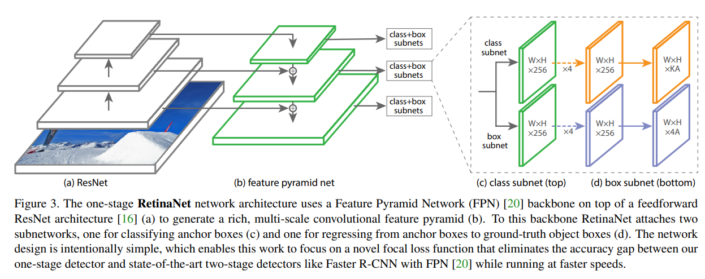

# Mask R-CNN

- 題名: Mask R-CNN
- 論文: [https://arxiv.org/abs/1703.06870](https://arxiv.org/abs/1703.06870)

## ポイント

- RoI Poolingの改良として、RoI Alignを導入。

- RoI PoolingはRoI領域に対して特徴量のマッピング方法が粗いかったため、補完などでもっともらしいものを使う

- 以下が非常に詳しい(実装例まで紹介されている)。
  - https://qiita.com/yu4u/items/5cbe9db166a5d72f9eb8

- 後はこれに対して、Instance Segmentation用のsubnetworkを接続する。

  - これはFaster R-CNN。

  

  - こちらが、Mask R-CNN。

  

## アーキテクチャ

- backboneには、ResNet50, ResNet101, ResNeXtを使用する。

- また、効果の高いFPN(Feature pyramid network)も使用する。
  - FPNもまた、RoI Poolingを用いている。

## 参考

- Jonathan Hui氏の解説
  - https://jonathan-hui.medium.com/image-segmentation-with-mask-r-cnn-ebe6d793272

- これは概要しかないかな？
  - https://blog.negativemind.com/2019/04/27/general-object-detection-and-instance-segmentation-mask-r-cnn/
