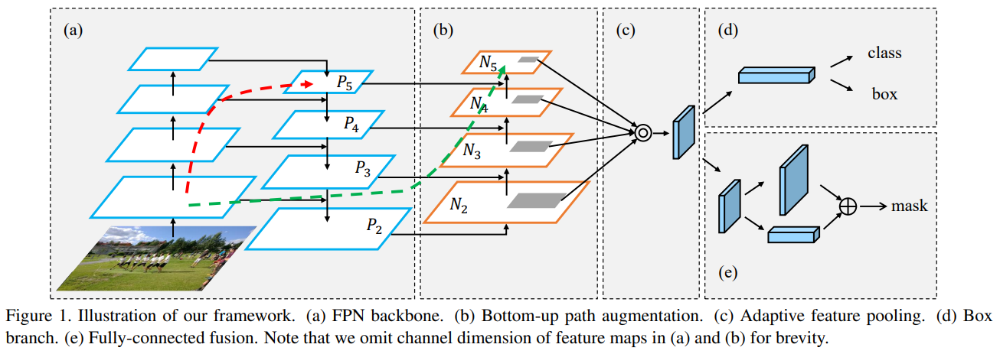
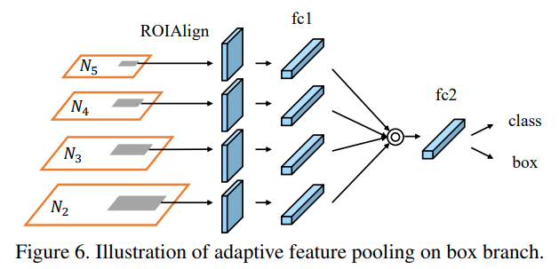

# PANet

- 題名: Path Aggregation Network for Instance Segmentation
- 論文: [https://arxiv.org/abs/1803.01534](https://arxiv.org/abs/1803.01534)
- 実装例: [https://github.com/ShuLiu1993/PANet](https://github.com/ShuLiu1993/PANet)

## 概要

- より正確なInstance Segmentationのために、低レイヤの情報を使うことを検討した。

- FPNなどでも低レイヤ情報は利用はされているが、全ての特徴量階層では利用されていない。

- またRoIのサイズによって、使う特徴量マップが決定されるためそれ以外の特徴量マップの情報が使われない。
この情報を使うためにadaptive feature poolingを提案する。

- これらの提案は、Segmentationだけでなく、物体検出の高精度化にも有効である。

- またsegmentation用のsubnetに補完的なパスを追加する。

## アーキテクチャ

## Augmented Buttom-up Structure

- (b)という拡張されたボトムアップ構造を用いることで、高解像情報を深いレイヤにも伝搬させる。
  - 赤線は、ResNet等を経由するため50層や100層などの畳み込みを経由する。
  - 緑線は、図的には同じかそれ以上に経由するように見えるが、実際は10層程度の畳み込みしかない。
  - そのため、緑線は高解像情報を伝えるshortcutとして機能する。

- (b)の具体的な構成は以下の通り。
  - P2はN2と全く同じであり、N2をdownsampleしてP3と足し合わせ、N3を構成する。
  - downsampleには、stride=2のconv3x3を使用する。
  - N2～N5は一貫して、256dの畳み込みである。

- その後の処理は、N2～N5の特徴量マップからpoolingされる。

## Adaptive feature pooling

- N2～N5それぞれに対して、Mask R-CNNで定義されるRoI Alignを使用して固定長の情報にする。
  - 7x7のグリッドであれば、7x7 256dの特徴量にpoolingされる。

- それぞれは即座には融合されず、subnetworkの最初の層を通過した後に融合される。

- 融合はgrid単位で行われる。つまり同じグリッドにある特徴量情報を集め、その中から最大あるいは合計を計算することで融合する。

## Mask Prediction Structure

- segmentationを調べる際に、詳細を記載予定。

## 参考

- スライド解説
  - https://www.slideshare.net/DeepLearningJP2016/dlfocal-loss-for-dense-object-detection

- こちらにも詳しくまとまっている。
  - https://deepsquare.jp/2020/10/retinanet/
  - 実装例も良い感じ
    - https://deepsquare.jp/2020/10/retinanet-handson/

- 公式実装はdetectronとしてある。
  - https://github.com/facebookresearch/Detectron