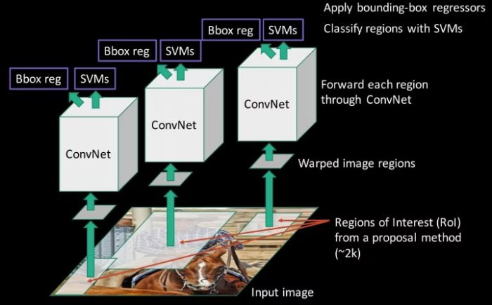
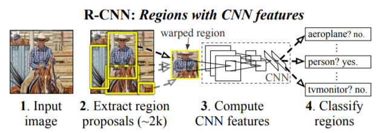
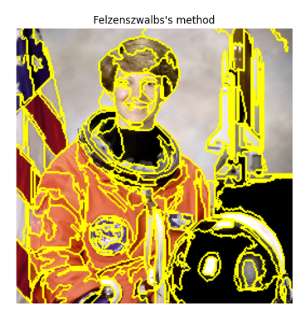

## R-CNN @2013.11

- 原論文
  - https://arxiv.org/pdf/1311.2524.pdf

- 概要
  - CNNをobject detectionに適用する先駆けとなった論文。
  - 入力画像から領域候補(region proposal)を2000個まで切り出す。
  - それをリサイズ(224x224など)してCNNした特徴量で、classification(SVM)やbounding box推定を行う。

  

  

  - 領域候補は、古典的なアルゴリズムを使ったselective searchで抽出する。

  - CNNには、AlexNet(T-Netと論文では呼ぶ)とVGG16(O-Netと論文では呼ぶ)を使っており、VGG16の方が高精度であった。
    - arxiv初版は、VGGより前なのでv5までの1年間の改版の過程で、大きく論文が変わっている。

  - selective searchは、Felzenszwalb法でセグメンテーションした結果(region)をもとに、
  regionの色、テクスチャ、サイズ、オーバーラップしている領域の４つで類似度を計算してマージしていくことで領域候補(region proposal)を計算する。
  (テクスチャは模様のことで、LBPを用いて計算する。)
    - 詳細は以下に解説あり。
      - https://blog.shikoan.com/selective-search-rcnn/
    - Felzenszwalb法は以下を参照。
      - https://irohalog.hatenablog.com/entry/2014/10/05/213948
      

    - LBPについては以下を参照。
      - https://qiita.com/tancoro/items/959ae9c14048c06bea8e

- 手順
  - CNN(AlexNetやVGG16など)をILSVRC2012のデータセットでpre-trainingする。
  - Domain specificなfine-tuningを実施。データはselective searchで得たregion proposalを使う。
    - 最終層のみ物体検出したいクラス数N+1の層に変更して学習。
    - region proposalで得られた領域と正解領域とのIoUが0.5以上のところをpositive, それ以下をnegativeとして学習。
  - CNNで得た特徴量を元に、N個の1-class linear SVMを学習する。その際、正解領域とのIoUが0.3以下は負例として学習する。
    - CNNとSVMsで正解のIoU閾値が異なるが、現在の調整値が最も良い結果だったようである。
    - CNN単体での学習も考えたようだが、性能が低下したとのこと。調整をすれば性能が近づきシンプルになる可能性も言及している。(Appendix B.)
  - またlocalizationの改善のため、bounding-boxの推定を、CNNで得た特徴量を元に行う。
    - x,y,w,hの線形回帰問題(リッジ回帰)として学習する。
    - モデルとしては、region proposalからground truthまでの変換式を準備し、その変換式の係数を学習する。(Appendix C.)
    - SVMと同様、N個のクラス毎に学習する。その際、正解領域とのIoUが0.6以上のregion proposalの中で
    最もIoUが大きいもののみを学習データとする。
    - このbounding-box推定とSVMs学習を繰り返すループも実現できるが、改善しなかったとのこと。
  - 重複領域は、NMSで削除する。
    - NMSのIoU閾値は0.3である。