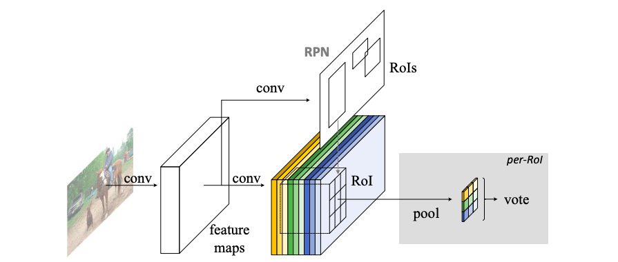

## R-FCN

- 説明
  - Faster R-CNNと同様、RPN(Region proposal network)と識別(classification)を組み合わせた2ステージのアプローチ。
  - classification側のRoI Pooling後の全結合層を廃止し、CNN backbone後の畳み込みに、k x k x (C+1)チャンネルの畳み込みを実施。
    - この出力をposition sensitive score mapsと読んでいる。
  - mapsにおけるRoIをk x kのグリッドに分割し、各グリッドに割り当てたチャンネルでaverage poolingを実施する。
  - これにより、k x kサイズで(C+1)チャンネルの出力を得る。
  - これを各クラスで合計し、softmax処理することで識別クラスを得る。
  
  
  
  - これにより、RoI以後にはpooling処理しかないため、学習すべき層や処理が重たいものがなくなり高速に処理が可能となる。

  - bounding box側
    - 同様に、k x k x 4のチャンネルを、position sensitive score mapsとして使います。

  - ロス関数
    - Faster R-CNNと同様、classifierロスとregressorのロスの線形和を使います。

  - OHEM: Online hard sample mining
    - 損失が最も大きい上位のRoIのみを用いてトレーニングします。

  - training step
    - Faster R-CNNと同様、RPN -> FCN -> RPN -> FCNの学習の4stepで行います。

  - NMS
    - IoU 0.3を重複とみなして削除します。

- 参考
  - https://ichi.pro/rebyu-r-fcn-pojithibusenshithibusukoamappu-obujyekuto-kenshutsu-160310250517596
  - https://qiita.com/TaigaHasegawa/items/a3cb98fb27cc7a9307b4#r-fcn
