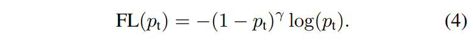

# RetinaNet

- 題名: Focal Loss for Dense Object Detection
- 論文: [https://arxiv.org/abs/1708.02002](https://arxiv.org/abs/1708.02002)

## 問題提起

- 2stageモデル(Faster R-CNNなど)は推論速度やモデルの複雑さが課題
- 1stageモデル(YOLO, SSDなど)は精度がまだまだ
- 精度を維持したまま1stageモデルを構築したい

- 1stageモデルの精度が悪いのは、クラス間の不均衡問題が影響しているのではないかと考えた。
  - 2stageモデルは、RPNの段階でバランスをとってサンプリングしている。
  - OHEM(Online hard example mining)などが代表的。
    - hard exampleからサンプリングする(easy negativeを学習に含めない)。

- これを解決するために、一般的なCE(Cross Entropy)誤差とは異なる損失関数を提案。これがFocal Loss。

## Focal Loss

- CEをサンプルの難易度によって動的に変化させる損失関数。

- 論文では簡単のためにbinary classificationの問題で、loss関数について説明されています。

- CEについて
  - 基本のCEはの通り。

  

  - これはこのように書ける。

  

  - 実際はこれらを正解ラベルとかけ合わせた和がCE誤差となる。

  

    
  

- balanced CE
  - 不均衡問題のために重みづけしたCEも一般的に使われる。

  

  - このαには、クラス数の逆数などがつかわれることがある。

- focal loss
  - balanced CEでは不均衡問題に対応しているが、easy sampleとhard sampleを区別しない。
  - そのため以下のような式を提案する。

  

  - この関数は以下のような形状となる。
    - 左側(ptが0に近い)の時は、CEとFLは同じ値。
    - 右側(ptが1に近い)の時は、FLの方が小さくなり重要視されなくなる。

  

  - 実験によれば、γ=2の場合が最も結果が見られた。

  - また実際には、balancedも組み合わせた以下で最も良い結果が得られている。

  

  - 実際にfocal lossを用いる場合は、pを計算するためのsigmoid演算をloss関数に組み合わせることで数値的に安定性を高めている。

## アーキテクチャ

- 以下のように１つのバックボーンに対して、２つのサブネットワークを接続する。

- FPNでは、P2～P6を使ったが、RetinaNetではP3～P7を使う。
  - P7をどうやって作る？？
    - 実装例によれば、stride=2の畳み込みによって作るみたい。

- サブネットのKはクラス数、Aは後述するアンカーボックスの数である。

## アンカーボックス

- FPNと同様、32x32～512x512の範囲のanchor boxをP3～P7に割り当てる。
  - P3 ... 32x32
  - P4 ... 64x64
  - P5 ... 128x128
  - P6 ... 256x256
  - P7 ... 512x512

- anchor boxは以下の9つとする。(A=9)
  - aspect ratioは、{1:2, 1:1, 2:1}を使う。
  - これに加えて、それぞれ2^0, 2^(1/3), 2^(2/3)のサイズを追加する。

- ground truthとのIoUが0.5以上のanchor boxが正例に、0.4以下のanchor boxが負例に割り当てられる。

- anchor boxは最大１つのobjectに割り当てられる。
  - 複数ある場合は、IoUの大きい方だけ？

- anchorがどちらにも割り当てられない場合、0.4～0.5に存在する場合は、学習データから無視する。

## class subnet

- subnetのパラメータは、すべてのpyramidのレベルで共有される(FPNの論文と同様)。

- subnetの構成は、conv3x3, 256-channelの畳み込みを4回、conv3x3, KA-channelの畳み込みを1回実施する。
- 途中のconv3x3はReLUの活性化を用い、最後のconv3x3はsigmoidを用いる(前述の通りFocal lossの安定性のため)。

## box subnet

- ほぼclass subnetと同様の構成で、最終の畳み込みが4A-channelとなる。

- class subnetと同様の構成ではあるが、パラメーターの共有は行わない。

- boxパラメータは、R-CNNのstandard box parameterizationを用いる。
  - 最近の研究とは異なり、より少ないパラメーターを使った class-agnostic bounding box regressorを使用する、とのこと。

## focal lossの正規化

- 既に紹介したfocal lossの総和が誤差関数となる。

- 総和の際の正規化として、大多数のanchorはeasy negativeであり、focal lossでは無視できるlossとなることから、正規化には、anchorの総数ではなく、ground truthに割り当てられたanchorの総数で正規化する。

- またαとγは同時に調整がひつようであり、γ=2の場合はα=0.25が最適である。

## NMS

- inference時に、IoU=0.5以上の検出は信頼度が高い方にマージされる。

## Initialize

- backboneとなるResNet50,101はImageNet1kで学習される。

- top downのFPN構造は、FPN論文と同様の初期化が実施される。

- subnetは最後のconvをのぞき、bias=0, σ=0.01のガウス分布で初期化される。

- subnetの最後のconvは、 bias=-log((1-π)/π)で初期化し、π=0.01を用いる。これは不均衡問題における初期学習を安定化させる効果がある。
  - 希少クラスの事前分布を低く設定することで、安定的になる効果がある。

## 参考

- スライド解説
  - https://www.slideshare.net/DeepLearningJP2016/dlfocal-loss-for-dense-object-detection

- こちらにも詳しくまとまっている。
  - https://deepsquare.jp/2020/10/retinanet/
  - 実装例も良い感じ
    - https://deepsquare.jp/2020/10/retinanet-handson/

- 公式実装はdetectronとしてある。
  - https://github.com/facebookresearch/Detectron