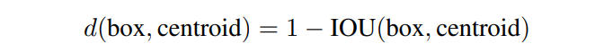

## YOLOv2(YOLO9000)

- YOLOに対して以下の改良を加えています。
  - batch normalizationの導入
  - classifierの高解像度学習
    - v1では、224x224で事前学習していました。
    - v2では、448x448のImageNetのフル解像度で学習。
  - anchor box導入と特徴量マップの高解像な設計
    - 従来のネットワークからpoolingを一つ削除し、最終が奇数となるように416x416の入力に変更。
      - これにより、特徴量マップは13x13となった。
    - anchor boxの導入
      - anchor box毎にクラスとobjectnessを予測する。
        - objectnessはYOLOv1でいうところのconfidenceか?
      - objectness予測は、ground truthとanchor boxのIoUを予測する。
      - クラス予測は、objectがあると仮定した場合の条件付き確率となる。
      - anchor boxをk個とすると、最終出力を以下のチャンネル数となるように構成
  - anchor boxの決定方法
    - v1では手動で個数を選択していたが、今回はk-meansクラスタリングで個数を検討した。
    - またクラスタリングには距離指標として以下を用いた。

    

    - 結果として、モデルの複雑さと再現率のトレードオフとしてk=5を選択。

## 参考

- https://deepsquare.jp/2020/09/yolo/

- https://qiita.com/miyamotok0105/items/1aa653512dd4657401db

- https://github.com/AlexeyAB/darknet