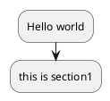

# PlantUML

## 概要

- UML図を、プレーンテキストで作成できる。
- それにより、画像と違い、バージョン管理がgitで可能となるので便利。
- ただしGithubでは、画像にPreviewされないので画像で埋め込む必要がある。
  - PlantUMLのVSCodeプラグインで、画像を出力できる。
  - 出力先はデフォルトはoutになるが、以下の設定で変更できる。
  ```json
  "plantuml.exportOutDir": "plantuml"
  ```
- Github Actionsで設定することも可能


## サンプル

### Markdownに埋め込む

- コード


- 出力される図


### Markdownに外部ファイルを埋め込み

- 以下のように、!includeで取り込む。
```
!include sample.pu
```

## 参考

- チームで機能設計するためのPlantUML標準化
  - https://future-architect.github.io/articles/20200203/
- PlantUML使い方メモ
  - https://qiita.com/opengl-8080/items/98c510b8ca060bdd2ea3
- markdownで書いたドキュメントにPlantUMLの図を挿入する方法
  - https://compute-cucco.hatenablog.com/entry/2020/05/23/174643
